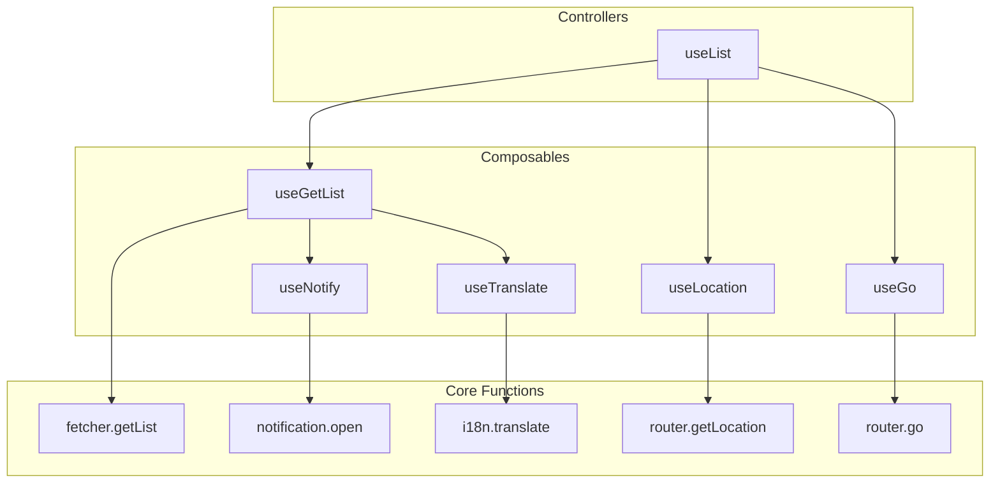

## What is Ginjou?

Ginjou is a headless, framework-agnostic library for building admin panels, dashboards, and data-intensive applications. Inspired by [refine](https://github.com/refinedev/refine) and [react-admin](https://github.com/marmelab/react-admin), Ginjou provides a composable architecture that adapts to your project's needs.

## Core Features

- **Framework-Agnostic:** Use Ginjou with Vue, Nuxt, or integrate it with any framework.
- **Backend Flexibility:** Connect to any backend using pre-built providers for REST APIs, Supabase, and Directus.
- **Authentication & Authorization:** Manage user sessions and control resource access with built-in support.
- **Real-time Streaming:** Automatically sync state when content changes across all clients.

## Integrations

:::card-group

::card
---
title: Vue
icon: i-logos-vue
to: ../integrations/vue
---
::

::card
---
title: Nuxt
icon: i-logos-nuxt-icon
to: ../integrations/nuxt
---
::

::card
---
title: Svelte
icon: i-logos-svelte-icon
---
Coming Soon
::

:::

## Backend

::card-group

:::card
---
title: Directus
icon: i-simple-icons-directus
to: ../backend/directus
ui: {
  icon: 'text-[#6F4EFF]',
}
---
:::

:::card
---
title: Supabase
icon: i-logos-supabase-icon
to: ../backend/supabase
---
:::

:::card
---
title: RESTful API
icon: i-lucide-file-braces
to: ../backend/rest-api
---
:::

::
## Conception

Ginjou is built on two core principles: **Flexibility** and **Composition**. You work with small, reusable building blocks that you combine to create exactly what your application needs.

Think of Ginjou like building with LEGOs. You receive individual function "bricks" that snap together. Combine them to construct the exact application architecture you need.

### Using Ginjou: Two Approaches

Choose the approach that matches your needs based on your project's complexity and timeline.

- **Controllers (Fast Development)**
  - Ready-to-use helpers like `useList` that handle common tasks. Controllers combine multiple low-level functions to deliver complete features automatically.
  - **Best for:** Building standard pages quickly, such as data lists, forms, or detail views.

- **Composables (Full Control)**
  - Small, focused functions that each handle a single task, like `useGetList` or `useGo`.
  - Compose them however you need to build custom features or integrate into existing applications.
  - **Best for:** Building unique features or integrating Ginjou into established codebases.

### How It Fits Together

Ginjou's diagram shows how simple functions combine to create progressively more powerful tools. This structure lets you choose between convenience and control:

### Three Layers of the Architecture

The power of Ginjou comes from three complementary layers. Higher layers build upon lower layers, letting you work at the abstraction level that suits your needs.

1. **Core Functions:** The foundation. These are simple, stateless functions for tasks like fetching data (`fetcher.getList`) or changing the page URL (`router.go`). Core functions handle a single responsibility without managing state.

2. **Composables:** Wrapper functions around Core Functions. Composables like `useGetList` handle data loading, caching, and state management using Tanstack Query automatically.

3. **Controllers:** Complete solutions built from Composables. Controllers like `useList` provide all the logic for a full page, ready to use immediately.

### Example: Building a List Page with `useList`

The `useList` Controller demonstrates the composition pattern in action. It bundles several specialized composables to deliver a complete solution for list pages:

- **Data fetching:** `useGetList` retrieves data from your backend
- **Pagination and filtering:** `useGo` and `useLocation` sync with the URL
- **User feedback:** `useNotify` shows success and error messages
- **Localization:** `useTranslate` handles i18n automatically

Use `useList` for quick development. When you need something different, step down to lower-level composables like `useGetList` and combine them with your own logic to build a custom solution.

This flexibility means you never outgrow Ginjou. You choose between **fast development** with Controllers and **full control** with Composables, depending on your current needs.
