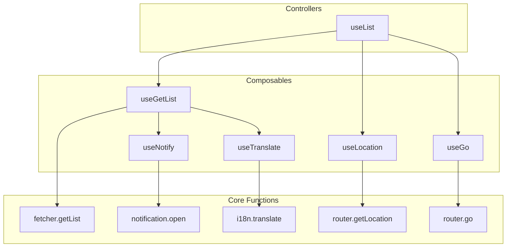

## What is Ginjou?

Ginjou is a headless, framework-agnostic library for building admin panels, dashboards, and other applications that handle a lot of data. It is inspired by [refine](https://github.com/refinedev/refine) and [react-admin](https://github.com/marmelab/react-admin).

## Features

*   **Framework-Agnostic:** Use it with Vue, Nuxt, or bring your own framework.
*   **Any Backend:** Connect to any backend with ease. Pre-built providers for REST APIs, Supabase, and Directus are available.
*   **Authentication & Authorization:** Manage user sessions and control access to resources.
*   **Real-time Updates:** Automatically update state when content changes.

## Integrations

:::card-group

::card
---
title: Vue
icon: i-logos-vue
to: ../integrations/vue
---
::

::card
---
title: Nuxt
icon: i-logos-nuxt-icon
to: ../integrations/nuxt
---
::

::card
---
title: Svelte
icon: i-logos-svelte-icon
---
Coming Soon
::

:::

## Backend

::card-group

:::card
---
title: Directus
icon: i-simple-icons-directus
to: ../backend/directus
ui: {
  icon: 'text-[#6F4EFF]',
}
---
:::

:::card
---
title: Supabase
icon: i-logos-supabase-icon
to: ../backend/supabase
---
:::

:::card
---
title: RESTful API
icon: i-lucide-file-braces
to: ../backend/rest-api
---
:::

::
## Conception

Ginjou is built on two main ideas: **Flexibility** and **Composition**.

Think of it like LEGOs. Ginjou gives you different function "bricks." You can combine these bricks to build the exact application you need.

### Two Ways to Use Ginjou

You can use Ginjou in two ways, depending on the level of control you want.

- **Fast Way: Use Controllers**
  - Ready-to-use helpers like `useList` that handle common tasks. They combine multiple small functions to provide features automatically.
  - **Best for:** Quickly building standard pages, such as data lists or forms.

- **Custom Way: Use Composables**
  - Small functions focused on a single task, like `fetcher.getList` or `router.go`.
  - Full control to compose them however you need.
  - **Best for:** Building unique features or integrating Ginjou into an existing application.

### How It Fits Together

Ginjou is powerful because these parts work together. The high-level Controllers are made from smaller Composables.

This diagram shows how simple functions are combined to create more powerful tools:

### How It Works

1.  **Core Functions**: The most basic level. These are simple functions for tasks like fetching data (`getList`) or changing the page URL (`go`). They do not manage state.

2.  **Composables**: These functions (like `useGetList`) are wrappers around Core Functions. They use Tanstack Query to automatically handle data loading, caching, and state for you.

3.  **Controllers**: The highest level. These are ready-made solutions for common pages. For example, `useList` gives you all the logic for a data list page, ready to use.

### Example: The `useList` Controller

`useList` is a great example of how this works. It bundles several smaller composables to create a full solution for a list page, including:

- Data fetching (`useGetList`)
- URL-based pagination and filtering (`useGo`, `useLocation`)
- Automatic success and error messages (`useNotify`)
- Text translation (i18n) (`useTranslate`)

You can use `useList` to build your app quickly. But if you need something different, you can use the next level down (`useGetList`) and add your own logic to build a custom solution.

This design gives you the freedom to choose between **fast development** and **full control**.
