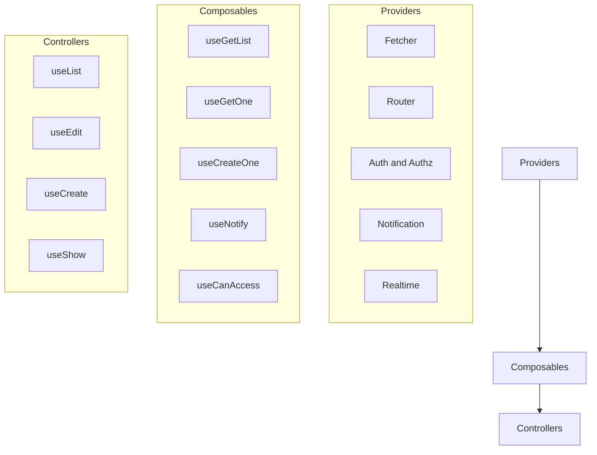

Ginjou is a headless framework for building admin panels, dashboards, and other data-driven applications with Vue or Nuxt. It gives you data, routing, auth, authorization, notifications, and realtime building blocks without forcing a component library or page scaffold.

## What Ginjou Is Good At

Ginjou fits best when you want the productivity of an admin framework but still want to own your UI and application structure.

| Situation | Why Ginjou Fits |
| :--- | :--- |
| You already have a design system. | Ginjou is headless, so it works with your existing components instead of replacing them. |
| You need to mix backends. | A resource can point to a different fetcher through `meta.fetcherName`. |
| You want progressive adoption. | You can start with `useGetList` or `useGetOne`, then adopt controllers like `useList` or `useEdit` later. |
| You need auth or realtime, but not on day one. | Context registration is capability-based. Add only the providers your app actually uses. |

## How The Docs Are Organized

- `Guides` explain the core concepts and day-to-day flows.
- `Integrations` show how to register Ginjou in Vue and Nuxt.
- `Backend` covers the built-in providers and the custom fetcher contract.

If you are evaluating the project, read this page, then [Data](/guides/data), [List](/guides/list), and [Form](/guides/form). If you are implementing immediately, jump to [Vue](/integrations/vue) or [Nuxt](/integrations/nuxt).

## Quick Start

This example shows the smallest useful Vue setup with a REST fetcher and a query client.

::code-group
---
sync: package-manager
---

```bash [pnpm]
pnpm add @ginjou/vue @ginjou/with-rest-api @tanstack/vue-query
```

```bash [yarn]
yarn add @ginjou/vue @ginjou/with-rest-api @tanstack/vue-query
```

```bash [npm]
npm install @ginjou/vue @ginjou/with-rest-api @tanstack/vue-query
```

```bash [bun]
bun add @ginjou/vue @ginjou/with-rest-api @tanstack/vue-query
```

::

::code-group

```vue [Vue]
<script setup lang="ts">
import { defineFetchersContext, defineQueryClientContext } from '@ginjou/vue'
import { createFetcher } from '@ginjou/with-rest-api'
import { QueryClient } from '@tanstack/vue-query'

defineQueryClientContext(new QueryClient())

defineFetchersContext({
	default: createFetcher({
		url: 'https://jsonplaceholder.typicode.com',
	}),
})
</script>

<template>
	<RouterView />
</template>
```

```svelte [Svelte]
<!-- WIP -->
```

::

::code-group

```vue [Vue]
<script setup lang="ts">
import { useGetList } from '@ginjou/vue'

const { records, isFetching } = useGetList({
	resource: 'posts',
	pagination: {
		current: 1,
    perPage: 5,
	},
})
</script>

<template>
	<div v-if="isFetching">
		Loading...
	</div>
	<ul v-else>
		<li v-for="post in records" :key="post.id">
			{{ post.title }}
		</li>
	</ul>
</template>
```

```svelte [Svelte]
<!-- WIP -->
```

::

## The Core Model

Ginjou is built from three layers.

1. Providers define how your app talks to the outside world.
2. Composables wrap those providers with TanStack Query state and framework-specific helpers.
3. Controllers compose several composables into page-level flows.


```mermaid
flowchart TD
    A[Providers] --> B[Composables]
    B --> C[Controllers]

    subgraph Providers
      A1[Fetcher]
      A2[Router]
      A3[Auth and Authz]
      A4[Notification]
      A5[Realtime]
    end

    subgraph Composables
      B1[useGetList]
      B2[useGetOne]
      B3[useCreateOne]
      B4[useNotify]
      B5[useCanAccess]
    end

    subgraph Controllers
      C1[useList]
      C2[useEdit]
      C3[useCreate]
      C4[useShow]
    end
```

### Providers

Providers are plain contracts. A fetcher knows how to query a backend. An auth provider knows how to log in and check a session. A notification provider knows how to open and close a toast.

### Composables

Composables are the main working surface. They give you cached records, pending state, errors, invalidation, and optional realtime behavior.

### Controllers

Controllers are convenience layers for common pages. They do not hide the lower-level parts. If a controller does too much or too little, you can step down to composables and wire the flow yourself.

## Controllers Are Composed, Not Magical

This is the most important idea in the project. A controller is not a separate system. It is a predefined composition of smaller pieces.

For example, `useEdit` combines:

- `useResource` to resolve the current resource and fetcher name
- `useGetOne` to read the current record
- `useUpdateOne` to save changes
- navigation helpers to move the user after success

That means you can adopt controllers when they are helpful, then override the edges manually when you need a different UX.

## Where To Go Next

- Read [Data](/guides/data) to understand fetchers, queries, and mutations.
- Read [List](/guides/list) if your first page is a table or search result.
- Read [Form](/guides/form) if you are building create, edit, or show pages.
- Read [Resources](/guides/resources) once you want route-aware controllers.
