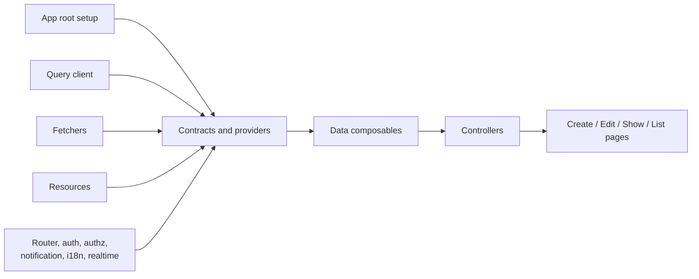

Ginjou is a headless app model for building data-heavy applications across different frontend frameworks.

It combines shared contracts at the app root, cache-aware data composables in the middle, and page-level controllers on top.

This page gives the big picture. It does not cover API details, UI patterns, or backend-specific setup.

Read Guides for core patterns, Integrations for framework-specific setup such as Vue and Nuxt, and Backends for provider-specific behavior.

## Architecture

Ginjou works in three layers: contracts and providers define what the app can do, data composables run reads and writes, and controllers turn that work into page flows.

```mermaid
flowchart LR
		A[App root setup] --> B[Contracts and providers]
		B --> C[Data composables]
		C --> D[Controllers]
		D --> E[Create / Edit / Show / List pages]

		A1[Query client] --> B
		A2[Fetchers] --> B
		A3[Resources] --> B
		A4[Router, auth, authz,<br/>notification, i18n, realtime] --> B
```

| Layer | Role | Typical APIs |
| --- | --- | --- |
| Contracts and providers | Define capabilities and register implementations at the app root. | `defineQueryClientContext`, `defineFetchersContext`, `defineControllerContext`, `defineRouterContext` |
| Data composables | Run queries and mutations, manage request state, and integrate with cache-driven behaviors. | `useGetOne`, `useGetList`, `useCreateOne`, `useUpdateOne` |
| Controllers | Compose data work, resource resolution, and navigation into page-oriented flows. | `useShow`, `useList`, `useCreate`, `useEdit`, `useSelect` |

The flow starts at app setup. Register providers once, then let composables and controllers consume them everywhere else.

## Contracts and Providers

Root providers define what the rest of the app can use.

| Capability | What it gives you | Use it when |
| --- | --- | --- |
| Query Client | Query lifecycle, cache storage, hydration, and invalidation. | Required for all built-in data queries and mutations. |
| Fetchers | Concrete data methods such as list, one, create, update, delete, and custom requests. | Required for all built-in data queries and mutations. |
| Resource | Named resource definitions, action patterns, and resource metadata. | Needed when you want resource resolution based on the current route or generated resource paths. |
| Router | Current location, navigation, and path resolution. | Needed for controllers and navigation helpers that read the current route. |
| Auth | Login, logout, auth checks, session error handling, and identity lookup. | Needed for authenticated applications and auth-related request flows. |
| Authz | Access checks and permission lookup. | Needed when UI or routes depend on permissions. |
| Notification | Success, error, and progress messages. | Needed when you want built-in hook notifications or a shared notification contract. |
| I18n | Translation and locale management. | Needed when messages and UI text should be localized. |
| Realtime | Subscribe, unsubscribe, publish, and shared realtime options. | Needed for live queries and mutation-triggered events. |

These are contracts, not fixed implementations.

Query client and fetchers are the baseline. The rest are opt-in layers that only matter when the app needs them.

Resource details are covered in the Resources guide.

## Data Composables

Data composables are built on top of TanStack Query. Ginjou keeps TanStack Query's cache, hydration, invalidation, and fresh/stale behavior, then adds resource-based rules on top.

| Composable | Kind | What it is for |
| --- | --- | --- |
| `useGetOne` | Query | Read a single record. |
| `useGetMany` | Query | Read a known set of records by id. |
| `useGetList` | Query | Read a paginated or filtered collection. |
| `useGetInfiniteList` | Query | Read a collection through an infinite-query flow. |
| `useCustom` | Query | Read data that does not fit the standard CRUD shape. |
| `useCreateOne` | Mutation | Create one record. |
| `useCreateMany` | Mutation | Create many records in one flow. |
| `useUpdateOne` | Mutation | Update one record. |
| `useUpdateMany` | Mutation | Update many records in one flow. |
| `useDeleteOne` | Mutation | Delete one record. |
| `useDeleteMany` | Mutation | Delete many records in one flow. |
| `useCustomMutation` | Mutation | Write data for non-standard actions or workflows. |

This layer also handles auth errors, notifications, and realtime hooks when those contracts exist.

Use it when a page needs direct control over requests, caching, and mutation timing.

## Controllers

Controllers are helpers for common CRUD pages.

They resolve resource and route context, choose the fetcher, and handle the page-level glue around redirects and defaults.

Use them for standard CRUD screens. Use low-level composables when a page needs a custom shape.

| Controller | Best fit | What it adds |
| --- | --- | --- |
| `useCreate` | Create forms and create pages | A `save` helper plus redirect-aware create flow. |
| `useEdit` | Edit forms and edit pages | Record loading, `id` lookup from the current route, a `save` helper, and redirects. |
| `useShow` | Detail pages and record drawers | Gets the default `id` from the current route and fetches one record. |
| `useList` | Standard list pages | Pagination, filters, sorters, totals, and optional route sync. |
| `useInfiniteList` | Load-more and infinite-scroll pages | Infinite list state with filters, sorters, and optional route sync. |
| `useSelect` | Select inputs and relation pickers | Search state, option mapping, and current-value hydration. |

## Packages

The package layout follows the same layers as the runtime model.

### Core

`@ginjou/core` contains the framework-agnostic contracts, types, query logic, and controller primitives. It is the stable center of the system.

### Integrations

Integration packages bring the same model into a specific framework.

:::card-group

::card
---
title: Vue
icon: i-logos-vue
to: /integrations/vue
---
`@ginjou/vue` Vue support for providers, composables, and controllers.
::

::card
---
title: Nuxt
icon: i-logos-nuxt-icon
to: /integrations/nuxt
---
`@ginjou/nuxt` Nuxt support with module setup and async composables.
::

::card
---
title: Svelte
icon: i-logos-svelte-icon
to: /integrations/svelte
---
`@ginjou/svelte` Svelte 5 support with rune-based composables and controllers.
::

:::

### Backend

Backend packages connect real services to the same fetcher and auth contracts.

:::card-group

::card
---
title: RESTful API
icon: i-lucide-server
to: /backend/rest-api
---
`@ginjou/with-rest-api` Fetcher support for generic REST-style backends.
::

::card
---
title: Directus
icon: i-simple-icons-directus
to: /backend/directus
---
`@ginjou/with-directus` Directus fetcher and auth adapters.
::

::card
---
title: Supabase
icon: i-logos-supabase-icon
to: /backend/supabase
---
`@ginjou/with-supabase` Supabase fetcher and auth adapters.
::

:::

If none of them fits, you can implement the same contracts yourself.

### Ecosystem

Ecosystem packages connect existing framework libraries to Ginjou contracts.

#### Vue

:::card-group

::card
---
title: Vue Router
to: /guides/router
---
`@ginjou/with-vue-router` Connect Vue Router to Ginjou's router contract.
::

::card
---
title: Vue I18n
to: /guides/i18n
---
`@ginjou/with-vue-i18n` Connect Vue I18n to Ginjou's i18n contract.
::

:::
