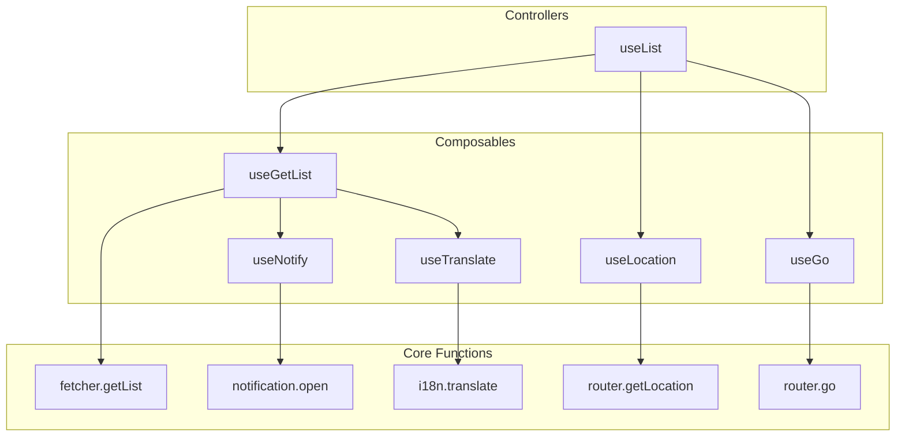

## What is Ginjou?

Ginjou is a headless, framework-agnostic library for building admin panels, dashboards, and data-intensive applications. Inspired by [refine](https://github.com/refinedev/refine) and [react-admin](https://github.com/marmelab/react-admin), Ginjou provides a composable architecture that adapts to your project's needs.

## Core Features

- **Framework-Agnostic:** Use Ginjou with Vue, Nuxt, or integrate it with any framework.
- **Backend Flexibility:** Connect to any backend using pre-built providers for REST APIs, Supabase, and Directus.
- **Authentication & Authorization:** Manage user sessions and control resource access with built-in support.
- **Real-time Streaming:** Automatically sync state when content changes across all clients.

## When to Choose Ginjou

Ginjou is designed for teams that want the productivity of an admin framework without giving up control over application structure.

| Situation | Why Ginjou Fits |
| :--- | :--- |
| You want to build an admin panel quickly, but still own the UI architecture. | Ginjou is headless. It provides data, auth, routing, and controller logic without forcing a component library. |
| You need to mix multiple backends in one app. | Resources can point to different fetchers, so one screen can use REST while another uses Supabase or Directus. |
| You prefer progressive adoption over a full rewrite. | Start with low-level composables such as `useGetList`, then adopt high-level controllers such as `useList` or `useEdit` where they help. |
| You already have an existing Vue or Nuxt codebase. | Ginjou follows an adapter pattern and context-based setup, so it can be introduced a capability at a time. |

If you want a highly opinionated UI framework with batteries-included page components, Ginjou may feel lower-level. That tradeoff is intentional: the project favors composition over convention-heavy scaffolding.

## Quick Start

This minimal example sets up a Vue application that fetches and displays a list of posts from a REST API.

**1. Install the packages:**

::code-group
---
sync: package-manager
---

```bash [pnpm]
pnpm add @ginjou/vue @ginjou/with-rest-api @tanstack/vue-query
```

```bash [yarn]
yarn add @ginjou/vue @ginjou/with-rest-api @tanstack/vue-query
```

```bash [npm]
npm install @ginjou/vue @ginjou/with-rest-api @tanstack/vue-query
```

```bash [bun]
bun add @ginjou/vue @ginjou/with-rest-api @tanstack/vue-query
```

::

**2. Configure providers in your root component:**

Ginjou uses root-level context registration instead of a single global plugin. Each `define*Context` call registers one capability for the current application tree.

```vue [App.vue]
<script setup lang="ts">
import { defineFetchersContext, defineQueryClientContext } from '@ginjou/vue'
import { createFetcher } from '@ginjou/with-rest-api'
import { QueryClient } from '@tanstack/vue-query'

defineQueryClientContext(new QueryClient())

defineFetchersContext({
	default: createFetcher({ url: 'https://jsonplaceholder.typicode.com' }),
})
</script>

<template>
	<RouterView />
</template>
```

::tip
Register contexts in `App.vue` for Vue or `app/app.vue` for Nuxt. This keeps the configuration close to the root component tree and avoids SSR inconsistencies caused by conditional provider setup.
::

**3. Use a composable to fetch data:**

```vue [PostList.vue]
<script setup lang="ts">
import { useGetList } from '@ginjou/vue'

const { records, isFetching } = useGetList({
	resource: 'posts',
	pagination: { current: 1, pageSize: 5 },
})
</script>

<template>
	<div v-if="isFetching">
		Loading...
	</div>
	<ul v-else>
		<li v-for="post in records" :key="post.id">
			{{ post.title }}
		</li>
	</ul>
</template>
```

That is all the code required. Ginjou handles caching, loading states, and error management automatically. From here you can add [authentication](/guides/authentication), [realtime updates](/guides/realtime), or switch to a different [backend provider](/backend/supabase).

## Integrations

:::card-group

::card
---
title: Vue
icon: i-logos-vue
to: ../integrations/vue
---
::

::card
---
title: Nuxt
icon: i-logos-nuxt-icon
to: ../integrations/nuxt
---
::

::card
---
title: Svelte
icon: i-logos-svelte-icon
---
Coming Soon
::

:::

## Backend

::card-group

:::card
---
title: Directus
icon: i-simple-icons-directus
to: ../backend/directus
ui: {
  icon: 'text-[#6F4EFF]',
}
---
:::

:::card
---
title: Supabase
icon: i-logos-supabase-icon
to: ../backend/supabase
---
:::

:::card
---
title: RESTful API
icon: i-lucide-file-braces
to: ../backend/rest-api
---
:::

::

## Architecture

Ginjou is built on two core principles: **Flexibility** and **Composition**. You work with small, reusable building blocks that you combine to create exactly what your application needs.

Think of Ginjou like building with LEGOs. You receive individual function "bricks" that snap together. Combine them to construct the exact application architecture you need.

### Using Ginjou: Two Approaches

Choose the approach that matches your needs based on your project's complexity and timeline.

| Approach | What You Get | Best For |
| :--- | :--- | :--- |
| Controllers | Higher-level flows such as list pages, edit pages, redirects, cache invalidation, and success handling. | Fast delivery of common CRUD pages. |
| Composables | Focused primitives such as `useGetOne`, `useGetList`, `useGo`, and `useNotify`. | Custom dashboards, unusual workflows, or gradual adoption into an existing app. |

- **Controllers (Fast Development)**
  - Ready-to-use helpers like `useList` that handle common tasks. Controllers combine multiple low-level functions to deliver complete features automatically.
  - **Best for:** Building standard pages quickly, such as data lists, forms, or detail views.

- **Composables (Full Control)**
  - Small, focused functions that each handle a single task, like `useGetList` or `useGo`.
  - Compose them however you need to build custom features or integrate into existing applications.
  - **Best for:** Building unique features or integrating Ginjou into established codebases.

### How It Fits Together

Ginjou's architecture consists of three complementary layers. Higher layers build upon lower layers, letting you work at the abstraction level that suits your needs.


```mermaid
graph TD
    subgraph Core Functions
        getList[fetcher.getList]
        getLocation[router.getLocation]
        go[router.go]
        notify[notification.open]
        translate[i18n.translate]
    end

    subgraph Composables
        useGetList[useGetList]
        useNotify[useNotify]
        useTranslate[useTranslate]
        useLocation[useLocation]
        useGo[useGo]
    end

    subgraph Controllers
        useList[useList]
    end

    useList --> useGetList & useLocation & useGo
    useGetList --> getList & useNotify & useTranslate
    useLocation --> getLocation
    useGo --> go
    useNotify --> notify
    useTranslate --> translate
```

1. **Core Functions:** The foundation. These are simple, stateless functions for tasks like fetching data (`fetcher.getList`) or changing the page URL (`router.go`). Core functions handle a single responsibility without managing state.

2. **Composables:** Wrapper functions around Core Functions. Composables like `useGetList` handle data loading, caching, and state management using Tanstack Query automatically.

3. **Controllers:** Complete solutions built from Composables. Controllers like `useList` provide all the logic for a full page, ready to use immediately.

### Example: Building a List Page with `useList`

The `useList` Controller demonstrates the composition pattern in action. It bundles several specialized composables to deliver a complete solution for list pages:

- **Data fetching:** `useGetList` retrieves data from your backend
- **Pagination and filtering:** `useGo` and `useLocation` sync with the URL
- **User feedback:** `useNotify` shows success and error messages
- **Localization:** `useTranslate` handles i18n automatically

Use `useList` for quick development. When you need something different, step down to lower-level composables like `useGetList` and combine them with your own logic to build a custom solution.

This flexibility means you never outgrow Ginjou. You choose between **fast development** with Controllers and **full control** with Composables, depending on your current needs.
