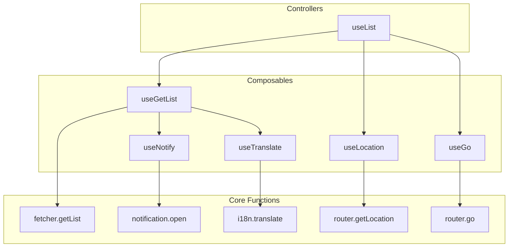

Ginjou is designed with two key ideas in mind: **Flexibility** and **Composition**.

Think of it like building with LEGOs. Ginjou provides different types of bricks (functions) that you can stack and combine to build exactly the solution you need.

## Two Ways to Use Ginjou

You can use Ginjou in two main ways, depending on how much control you need.

- **The Fast Way: Use Controllers**
  - These are powerful helpers like `useList` that handle complex tasks for you. They combine many smaller functions to take care of common features out of the box.
  - **Best for:** Quickly building the logic for standard pages, like data lists or forms.

- **The Custom Way: Use Composables**
  - These are small, single-purpose functions like `fetcher.getList` or `router.go`. Each one does just one job.
  - You have complete control to combine them as you wish, but you'll need to manage the state and logic yourself.
  - **Best for:** When you need to do something very specific or integrate Ginjou into an existing, complex application.

## How It Fits Together

Ginjou's power comes from how these pieces compose. High-level Controllers are built from low-level Composables and utilities.

This diagram shows how basic functions are combined to create more powerful tools:

### How It Works

1.  **Core Functions**: The most basic level. These are simple, raw functions that handle tasks like fetching data (`getList`) or changing the URL (`go`). They don't manage any state.

2.  **Composables**: These functions (like `useGetList`) wrap the core functions. They use Tanstack Query to automatically handle data loading, caching, and state management for you.

3.  **Controllers**: The highest level. These are complete solutions for common scenarios. For example, `useList` is a controller that gives you all the logic needed for a data list page right out of the box.

### Example: The `useList` Controller

`useList` is the perfect example of composition. It combines several smaller composables to give you a complete list page solution, including:

- Data fetching (`useGetList`)
- Pagination and filtering synced with the URL (`useGo`, `useLocation`)
- Automatic success/error notifications (`useNotify`)
- Internationalization (i18n) for text (`useTranslate`)

You can use `useList` for rapid development. But if it doesn't fit your exact needs, you can drop down a level and use `useGetList` with your own custom logic to create a tailored solution.

This design gives you the freedom to choose between **development speed** and **custom control**.
