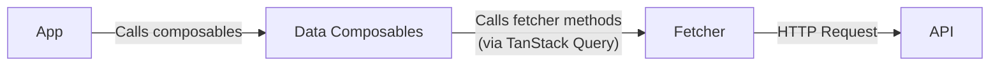
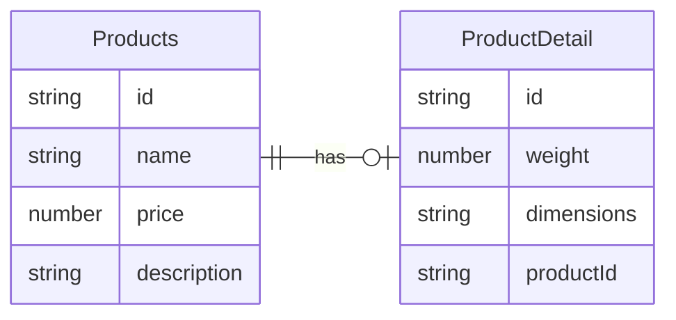
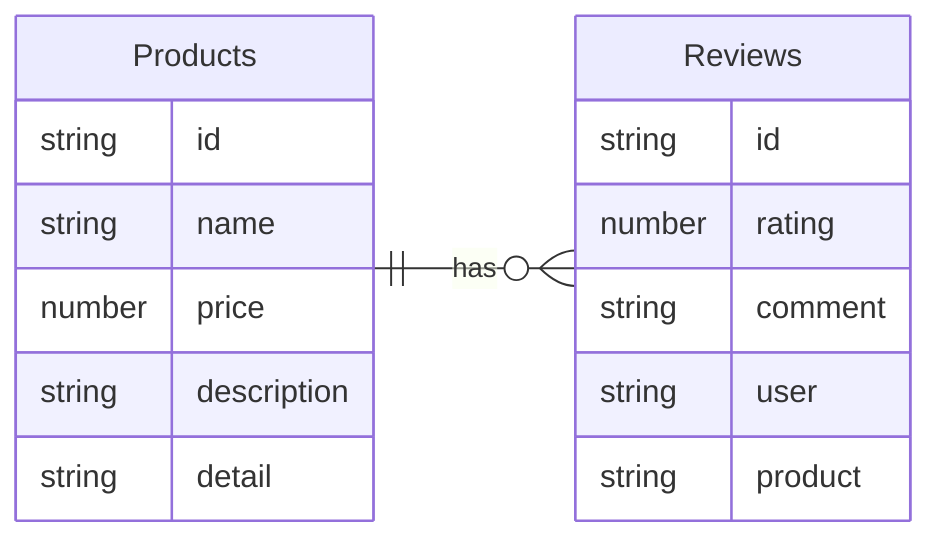
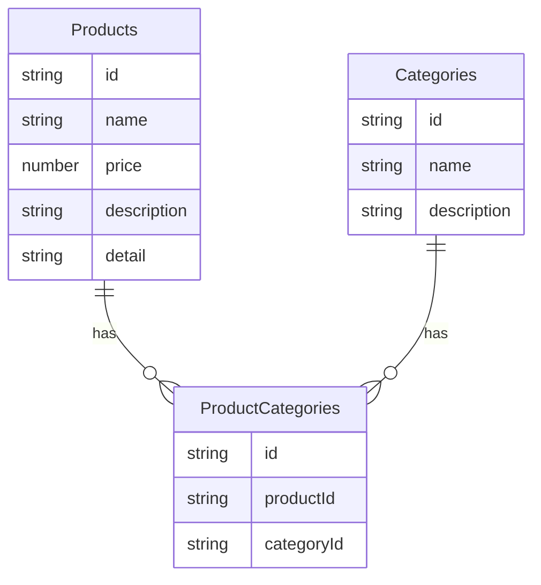

Data is the most important part of any app. It lets users see and update information from a database or API.

## Fetcher Provider

Use a `Fetcher` provider to communicate with your backend. Think of it as a translator between your app and your API.

The `Fetcher` interface defines the contract:

```typescript
interface Fetcher {
  getList: (props: GetListProps) => Promise<GetListResult>
  getMany: (props: GetManyProps) => Promise<GetManyResult>
  getOne: (props: GetOneProps) => Promise<GetOneResult>
  createOne: (props: CreateOneProps) => Promise<CreateResult>
  createMany: (props: CreateManyProps) => Promise<CreateManyResult>
  updateOne: (props: UpdateOneProps) => Promise<UpdateResult>
  updateMany: (props: UpdateManyProps) => Promise<UpdateManyResult>
  deleteOne: (props: DeleteOneProps) => Promise<DeleteOneResult>
  deleteMany: (props: DeleteManyProps) => Promise<DeleteManyResult>
  custom: (props: CustomProps) => Promise<CustomResult>
}
```

After setting up the Fetcher, you can use **Data Composables** (like `useGetOne`, `useGetList`) to work with your data. The framework handles the details, like telling the provider which data to get (using `resource` or `id`).

You can also use more than one Fetcher at the same time. For example, you can get products from a **REST API** and users from a **GraphQL API**.



## Fetching Data

Let's say we want to get a record with ID `123` from the `products` list. We can use the `useGetOne` composable. It simply calls the `fetcher.getOne` method for you.

::code-group
---
sync: guide-example
---


```vue [vue]
<script setup lang="ts">
import { useGetOne } from '@ginjou/vue'

const { record, isFetching } = useGetOne({
  resource: 'products',
  id: '123',
})
</script>

<template>
  <div v-if="isFetching">Loading...</div>
  <div v-else>
    <h1>{{ record?.name }}</h1>
    <p>{{ record?.price }}</p>
  </div>
</template>
```

```svelte [svelte]
<!-- WIP -->
<script>
  // ...
</script>
```

::

## Updating Data

To update a record with ID `123` in `products`, use the `useUpdateOne` composable. This calls the `fetcher.updateOne` method.

::code-group
---
sync: guide-example
---


```vue [vue]
<script setup lang="ts">
import { useUpdateOne } from '@ginjou/vue'

const { mutate: update } = useUpdateOne({
  resource: 'products',
  id: '123',
})

function save() {
  update({
    params: { price: 2000 },
  })
}
</script>
```

```svelte [svelte]
<!-- WIP -->
<script>
  // ...
</script>
```

::

## Listing Data

If you need a list of records from `products`, use `useGetList` or `useGetInfiniteList`. These call `fetcher.getList` and give you the `data` and total count (`total`).

::code-group
---
sync: guide-example
---


```vue [vue]
<script setup lang="ts">
import { useGetList } from '@ginjou/vue'

const { records, isFetching } = useGetList({
  resource: 'products',
})
</script>

<template>
  <ul>
    <li v-for="item in records" :key="item.id">
      {{ item.name }}
    </li>
  </ul>
</template>
```

```svelte [svelte]
<!-- WIP -->
<script>
  // ...
</script>
```

::

### Filters, Sorters and Pagination

Usually, you don't want to load *all* the data. You probably want just some of it.

Ginjou lets you use `filters`, `sorters`, and `pagination` in your data composables. These are passed to your `fetcher`, which then asks the API for exactly what you need.

Let's look at a more realistic example. Suppose we want to:

- Get 5 products.
- Where the `material` is `wooden`.
- Sorted by `ID` (newest to oldest).

We can do this by passing `filters`, `sorters`, and `pagination` to `useGetList`.

`useGetList` then calls `fetcher.getList` with these settings, and your API request is updated accordingly.

You can also build more complex queries. For example, finding products that:

- Are made of wood.
- Belong to category ID 45.
- **OR** have a price between 1000 and 2000.

::code-group
---
sync: guide-example
---


```vue [vue]
<script setup lang="ts">
import { useGetList } from '@ginjou/vue'

const { records } = useGetList({
  resource: 'products',
  pagination: {
    current: 1,
    pageSize: 5,
  },
  filters: [
    {
      field: 'material',
      operator: 'eq',
      value: 'wooden',
    },
  ],
  sorters: [
    {
      field: 'id',
      order: 'desc',
    },
  ],
})
</script>
```

```svelte [svelte]
<!-- WIP -->
<script>
  // ...
</script>
```

::

## Multiple Fetchers

In Ginjou, you can use multiple fetchers in one app. This is great if you have different APIs.

Each fetcher has its own settings. This makes it easy to handle complex data.

For example, you might want to fetch:

- `products` from `https://api.products.example.com`
- `users` from `https://api.users.example.com`.

In the example below:

- We define multiple fetchers.
- We use `fetcherName` to tell the composable which one to use.

::code-group
---
sync: guide-example
---


```vue [vue]
<script setup lang="ts">
import { useGetList } from '@ginjou/vue'

const { records: products } = useGetList({
  resource: 'products',
  fetcherName: 'products-api',
})

const { records: users } = useGetList({
  resource: 'users',
  fetcherName: 'users-api',
})
</script>
```

```svelte [svelte]
<!-- WIP -->
<script>
  // ...
</script>
```

::

## Relationships

Ginjou helps you manage connections between data using composables like `useGetOne` and `useGetMany`. This gives you a flexible way to handle relationships.

### One-to-One

This is when one item matches exactly one other item. Like a partnership.

For example, a **Product** has only one **Product Detail**.



Use `useGetOne` to get the details for a product.

::code-group
---
sync: guide-example
---


```vue [vue]
<script setup lang="ts">
import { useGetOne } from '@ginjou/vue'

// Get the main product
const { record: product } = useGetOne({
  resource: 'products',
  id: '123',
})

// Get the related detail
const { record: detail } = useGetOne({
  resource: 'product_details',
  id: '123', // Assuming shared ID strategy
})
</script>
```

```svelte [svelte]
<!-- WIP -->
<script>
  // ...
</script>
```

::

### One-to-Many

This is when one item is connected to many others. Like a parent with many children.

For example, a **Product** can have many **Reviews**.



Use `useGetList` and filter by the product ID to get its reviews.

::code-group
---
sync: guide-example
---

```vue [vue]
<script setup lang="ts">
import { useGetList } from '@ginjou/vue'

const { records: reviews } = useGetList({
  resource: 'reviews',
  filters: [
    {
      field: 'productId',
      operator: 'eq',
      value: '123',
    },
  ],
})
</script>
```

```svelte [svelte]
<!-- WIP -->
<script>
  // ...
</script>
```

::

### Many-to-Many

This is when items from one group can match many items in another group, and vice versa.

For example, **Products** can have many **Categories**, and **Categories** can have many **Products**.



Here, use `useGetMany` twice: once to get the categories for a product, or once to get the products for a category.

::code-group
---
sync: guide-example
---


```vue [vue]
<script setup lang="ts">
import { useGetMany } from '@ginjou/vue'

// Assuming you have a list of category IDs from a product
const categoryIds = ['cat1', 'cat2', 'cat3']

const { records: categories } = useGetMany({
  resource: 'categories',
  ids: categoryIds,
})
</script>
```

```svelte [svelte]
<!-- WIP -->
<script>
  // ...
</script>
```

::

## Data Composables

| Composable | Method | Description |
| :--- | :--- | :--- |
| `useGetOne` | `getOne` | Get a single record. |
| `useUpdateOne` | `updateOne` | Update an existing record. |
| `useCreateOne` | `createOne` | Create a new record. |
| `useDeleteOne` | `deleteOne` | Delete a single record. |
| `useGetList` | `getList` | Get a list of records. |
| `useGetInfiniteList` | `getList` | Get a list of records with infinite scroll. |
| `useGetMany` | `getMany` | Get multiple records. |
| `useCreateMany` | `createMany` | Create multiple records. |
| `useDeleteMany` | `deleteMany` | Delete multiple records. |
| `useUpdateMany` | `updateMany` | Update multiple records. |
| `useCustom` | `custom` | Make custom API requests. |
| `useCustomMutation` | `custom` | Make custom API mutation requests. |
