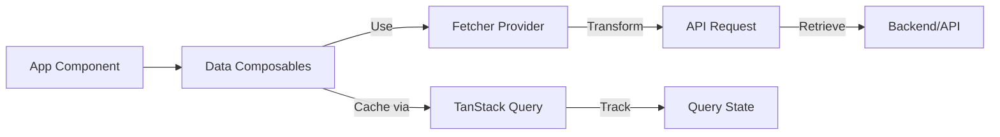
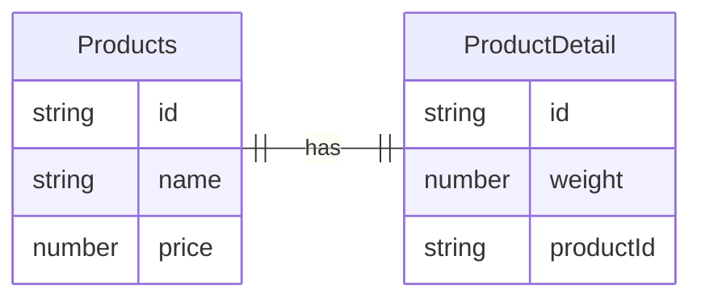
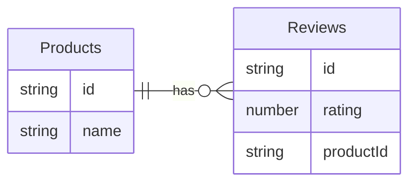
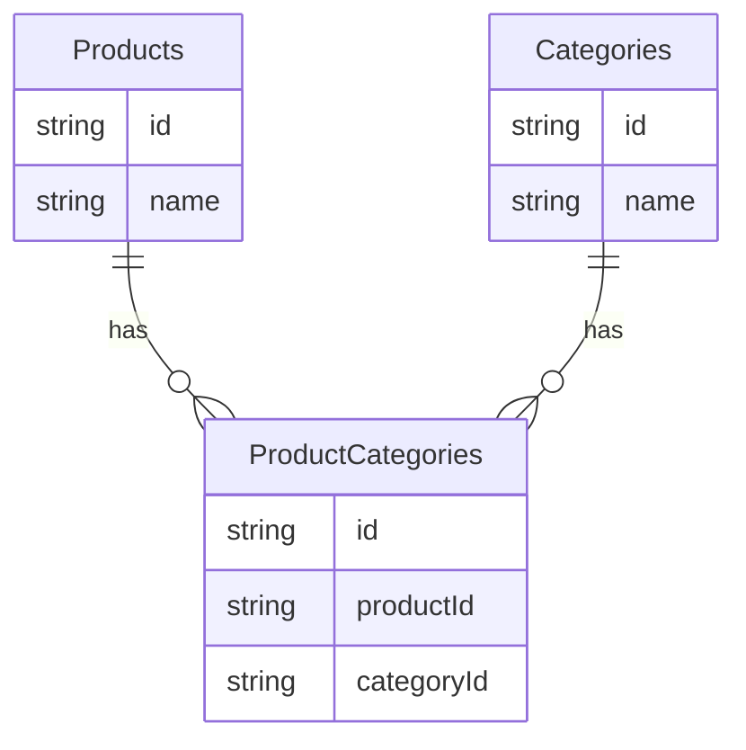

Data is the foundation of your application. Ginjou provides composables to fetch, update, and synchronize data from your backend with minimal boilerplate. These composables handle caching, state management, and real-time synchronization automatically using TanStack Query.

## The Fetcher Provider

A `Fetcher` provider acts as a translation layer between your application and any backend API. By implementing a standard `Fetcher` interface, you enable Ginjou to work with REST APIs, GraphQL, Supabase, Directus, or any other backend system without changing your application code.

The `Fetcher` interface defines these methods:

```typescript
interface Fetcher {
	getList: (props: GetListProps) => Promise<GetListResult>
	getMany: (props: GetManyProps) => Promise<GetManyResult>
	getOne: (props: GetOneProps) => Promise<GetOneResult>
	createOne: (props: CreateOneProps) => Promise<CreateResult>
	createMany: (props: CreateManyProps) => Promise<CreateManyResult>
	updateOne: (props: UpdateOneProps) => Promise<UpdateResult>
	updateMany: (props: UpdateManyProps) => Promise<UpdateManyResult>
	deleteOne: (props: DeleteOneProps) => Promise<DeleteOneResult>
	deleteMany: (props: DeleteManyProps) => Promise<DeleteManyResult>
	custom: (props: CustomProps) => Promise<CustomResult>
}
```

Once you configure a Fetcher, use **Data Composables** like `useGetOne` and `useGetList` to work with your data. These composables handle the details like specifying which resource and ID to fetch, freeing you to focus on your application logic.

::tip
Ginjou supports multiple fetchers in a single application. This lets you fetch different resources from different backends simultaneously (for example, products from a REST API and users from a GraphQL API).
::



### How Composables Work with Fetchers

Data composables follow a consistent pattern:

1. Accept configuration (resource, ID, filters, etc.)
2. Create a query key that uniquely identifies the data
3. Call the corresponding Fetcher method
4. Use TanStack Query to manage caching and state
5. Handle success/error notifications automatically
6. Support real-time synchronization via WebSocket

## Data Operations

Ginjou provides composables for Create, Read, Update, and Delete (CRUD) operations. Each operation supports working with single or multiple records.

### Creating Records

Use `useCreateOne` to create a single record. This composable manages mutation state, cache invalidation, and notifications automatically.

::code-group
---
sync: guide-example
---

```vue [vue]
<script setup lang="ts">
import { useCreateOne } from '@ginjou/vue'

const { mutate: create, isPending, isError } = useCreateOne({
	resource: 'products',
})

async function addProduct(formData: any) {
	try {
		await create({ params: formData })
	}
	catch (error) {
		console.error('Create failed:', error)
	}
}
</script>

<template>
	<button
		:disabled="isPending"
		@click="addProduct({ name: 'New Product', price: 999 })"
	>
		{{ isPending ? 'Creating...' : 'Create Product' }}
	</button>
	<div v-if="isError" class="error">
		Failed to create product
	</div>
</template>
```

```svelte [svelte]
<!-- WIP -->
<script>
  // ...
</script>
```

::

The `useCreateOne` composable:
- Accepts `resource` as the required parameter during initialization
- Accepts creation `params` when calling `mutate()` or `mutateAsync()`
- Automatically invalidates related caches (list queries) after successful creation
- Shows success/error notifications automatically (customizable)

#### Creating Multiple Records

Use `useCreateMany` to create multiple records in a single operation. This is useful for bulk imports or batch creation.

::code-group
---
sync: guide-example
---

```vue [vue]
<script setup lang="ts">
import { useCreateMany } from '@ginjou/vue'

const { mutate: createBatch, isPending } = useCreateMany({
	resource: 'products',
})

async function importProducts(items: any[]) {
	await createBatch({ params: items })
}
</script>

<template>
	<button
		:disabled="isPending"
		@click="importProducts([
			{ name: 'Product 1', price: 100 },
			{ name: 'Product 2', price: 200 },
		])"
	>
		{{ isPending ? 'Importing...' : 'Import Products' }}
	</button>
</template>
```

```svelte [svelte]
<!-- WIP -->
<script>
  // ...
</script>
```

::

The `useCreateMany` composable:
- Accepts `resource` as the required parameter
- Accepts an array of creation `params` when calling `mutate()` or `mutateAsync()`
- Automatically invalidates list queries after successful creation
- Shows success/error notifications automatically (customizable)

### Reading Records

Use `useGetOne` to fetch a single record by ID. The composable creates a unique query key based on the resource and ID, caches the result, and automatically reuses cached data across your application.

::code-group
---
sync: guide-example
---

```vue [vue]
<script setup lang="ts">
import { useGetOne } from '@ginjou/vue'

const { record, isFetching, isError, error } = useGetOne({
	resource: 'products',
	id: '123',
})
</script>

<template>
	<div v-if="isFetching">
		Loading...
	</div>
	<div v-else-if="isError">
		Error: {{ error?.message }}
	</div>
	<div v-else>
		<h1>{{ record?.name }}</h1>
		<p>Price: ${{ record?.price }}</p>
	</div>
</template>
```

```svelte [svelte]
<!-- WIP -->
<script>
  // ...
</script>
```

::

The `useGetOne` composable:
- Accepts `resource` and `id` as required parameters
- Returns a `record` ref containing the fetched data
- Handles loading states (`isFetching`) and error states automatically
- Enables the query only when `id` is provided and non-empty
- Supports optional real-time synchronization via WebSocket

#### Reading List Records

Use `useGetList` to fetch multiple records with pagination. This composable is best for displaying data in tables, lists, or other paginated views.

::code-group
---
sync: guide-example
---

```vue [vue]
<script setup lang="ts">
import { useGetList } from '@ginjou/vue'

const { records, isFetching, total } = useGetList({
	resource: 'products',
})
</script>

<template>
	<div v-if="isFetching">
		Loading products...
	</div>
	<div v-else>
		<p>Total: {{ total }} products</p>
		<ul>
			<li v-for="item in records" :key="item.id">
				{{ item.name }} - ${{ item.price }}
			</li>
		</ul>
	</div>
</template>
```

```svelte [svelte]
<!-- WIP -->
<script>
  // ...
</script>
```

::

The `useGetList` composable:
- Accepts a `resource` name as the required parameter
- Returns `records` (an array of items) and `total` (the server-reported total count)
- Supports filtering, sorting, and pagination parameters (explained below)
- Automatically caches individual records from the list (subsequent `useGetOne` calls reuse this cache)
- Handles pagination metadata automatically

##### Filtering, Sorting, and Pagination

Most applications need to filter, sort, and paginate data instead of fetching everything at once. Pass these parameters to `useGetList` and Ginjou delegates the processing to your backend, reducing client-side overhead.

::tip
Backend-driven filtering and sorting are more efficient than client-side processing. They reduce network payload, leverage database indexes, and handle large datasets elegantly.
::

**Example: Fetch 5 wooden products, sorted by ID descending**

::code-group
---
sync: guide-example
---

```vue [vue]
<script setup lang="ts">
import { useGetList } from '@ginjou/vue'

const { records, total } = useGetList({
	resource: 'products',
	pagination: {
		current: 1,
		pageSize: 5,
	},
	filters: [
		{
			field: 'material',
			operator: 'eq',
			value: 'wooden',
		},
	],
	sorters: [
		{
			field: 'id',
			order: 'desc',
		},
	],
})
</script>

<template>
	<p>Showing 5 of {{ total }} wooden products</p>
	<ul>
		<li v-for="item in records" :key="item.id">
			{{ item.name }}
		</li>
	</ul>
</template>
```

```svelte [svelte]
<!-- WIP -->
<script>
  // ...
</script>
```

::

**Building Complex Queries**

Combine multiple filter conditions to create complex queries. For example, find products that are wooden OR have a price between 1000 and 2000:

```vue
const { records } = useGetList({
	resource: 'products',
	filters: [
		{
			field: 'material',
			operator: 'eq',
			value: 'wooden',
		},
		{
			field: 'categoryId',
			operator: 'eq',
			value: '45',
		},
		{
			field: 'price',
			operator: 'between',
			value: [1000, 2000],
		},
	],
})
```

**Filter Operators**

The available operators depend on your Fetcher implementation (REST providers, Supabase, Directus, etc.). Common operators include:

- `eq`: Equal
- `ne`: Not equal
- `gt`: Greater than
- `gte`: Greater than or equal
- `lt`: Less than
- `lte`: Less than or equal
- `in`: In array
- `nin`: Not in array
- `contains`: Contains string
- `between`: Between range

##### Using Infinite Scroll

Use `useGetInfiniteList` to support infinite scroll patterns. This composable automatically handles pagination by appending new records as the user scrolls.

::code-group
---
sync: guide-example
---

```vue [vue]
<script setup lang="ts">
import { useGetInfiniteList } from '@ginjou/vue'

const { records, isFetching, hasNextPage, fetchNextPage } = useGetInfiniteList({
	resource: 'products',
	pagination: {
		pageSize: 20,
	},
})
</script>

<template>
	<div>
		<ul>
			<li v-for="item in records" :key="item.id">
				{{ item.name }} - ${{ item.price }}
			</li>
		</ul>
		<button
			v-if="hasNextPage"
			:disabled="isFetching"
			@click="fetchNextPage"
		>
			{{ isFetching ? 'Loading...' : 'Load More' }}
		</button>
	</div>
</template>
```

```svelte [svelte]
<!-- WIP -->
<script>
  // ...
</script>
```

::

The `useGetInfiniteList` composable:
- Accepts a `resource` name and pagination configuration
- Returns `records` (accumulated array of all fetched items across pages)
- Provides `hasNextPage` to determine if more data is available
- Provides `fetchNextPage()` function to load the next page of results
- Automatically concatenates results from multiple pages into a single array

#### Reading Multiple Records by IDs

Use `useGetMany` to fetch multiple specific records by their IDs. This is useful when you already know which records you need and want to fetch them in a single operation, rather than applying filters to a list.

::code-group
---
sync: guide-example
---

```vue [vue]
<script setup lang="ts">
import { useGetMany } from '@ginjou/vue'
import { computed } from 'vue'

// IDs might come from a parent product or user selection
const recordIds = computed(() => ['id1', 'id2', 'id3'])

const { records, isFetching, isError } = useGetMany({
	resource: 'products',
	ids: recordIds,
})
</script>

<template>
	<div v-if="isFetching">
		Loading...
	</div>
	<div v-else-if="isError">
		Error loading records
	</div>
	<div v-else>
		<ul>
			<li v-for="item in records" :key="item.id">
				{{ item.name }} - ${{ item.price }}
			</li>
		</ul>
	</div>
</template>
```

```svelte [svelte]
<!-- WIP -->
<script>
  // ...
</script>
```

::

The `useGetMany` composable:
- Accepts `resource` and `ids` as required parameters
- Returns `records` (an array of fetched items in the order of provided IDs)
- Handles loading and error states automatically
- Supports optional real-time synchronization via WebSocket
- Useful for loading specific sets of records without applying filters

**Common Use Cases for `useGetMany`:**

- **Many-to-Many Relationships:** Load categories for a product from a junction table
- **Related Data:** Fetch multiple related records after receiving parent details
- **User Selection:** Load specific records the user selected from a list or form
- **Batch Operations:** Fetch records before performing bulk updates or deletions

### Updating Records

Use `useUpdateOne` to update a single record. This composable manages mutation state, cache invalidation, and notifications automatically.

::code-group
---
sync: guide-example
---

```vue [vue]
<script setup lang="ts">
import { useUpdateOne } from '@ginjou/vue'

const { mutate: update, isPending, isError } = useUpdateOne({
	resource: 'products',
	id: '123',
})

async function saveProduct(updatedData: any) {
	try {
		await update({ params: updatedData })
	}
	catch (error) {
		console.error('Update failed:', error)
	}
}
</script>

<template>
	<button
		:disabled="isPending"
		@click="saveProduct({ price: 2000 })"
	>
		{{ isPending ? 'Saving...' : 'Save' }}
	</button>
	<div v-if="isError" class="error">
		Failed to save product
	</div>
</template>
```

```svelte [svelte]
<!-- WIP -->
<script>
  // ...
</script>
```

::

The `useUpdateOne` composable:
- Accepts partial update properties (`resource`, `id`) during initialization
- Accepts update `params` when calling `mutate()` or `mutateAsync()`
- Automatically invalidates related caches (list queries, other queries for the same record)
- Supports three mutation modes: Pessimistic, Optimistic, and Undoable (explained below)
- Shows success/error notifications automatically (customizable)

#### Updating Multiple Records

Use `useUpdateMany` to update multiple records in a single operation. This is useful for bulk updates.

::code-group
---
sync: guide-example
---

```vue [vue]
<script setup lang="ts">
import { useUpdateMany } from '@ginjou/vue'

const { mutate: updateBatch, isPending } = useUpdateMany({
	resource: 'products',
})

async function updateProducts(updates: any[]) {
	await updateBatch({ params: updates })
}
</script>

<template>
	<button
		:disabled="isPending"
		@click="updateProducts([
			{ id: '123', price: 1500 },
			{ id: '456', price: 2000 },
		])"
	>
		{{ isPending ? 'Updating...' : 'Update Selected' }}
	</button>
</template>
```

```svelte [svelte]
<!-- WIP -->
<script>
  // ...
</script>
```

::

The `useUpdateMany` composable:
- Accepts `resource` as the required parameter
- Accepts an array of update objects (typically including IDs) as `params` when calling `mutate()` or `mutateAsync()`
- Automatically invalidates list queries and related caches after successful update
- Shows success/error notifications automatically (customizable)

### Deleting Records

Use `useDeleteOne` to delete a single record. This composable manages mutation state, cache invalidation, and notifications automatically.

::code-group
---
sync: guide-example
---

```vue [vue]
<script setup lang="ts">
import { useDeleteOne } from '@ginjou/vue'

const { mutate: deleteRecord, isPending, isError } = useDeleteOne({
	resource: 'products',
	id: '123',
})

async function removeProduct() {
	try {
		await deleteRecord()
	}
	catch (error) {
		console.error('Delete failed:', error)
	}
}
</script>

<template>
	<button
		:disabled="isPending"
		@click="removeProduct"
	>
		{{ isPending ? 'Deleting...' : 'Delete Product' }}
	</button>
	<div v-if="isError" class="error">
		Failed to delete product
	</div>
</template>
```

```svelte [svelte]
<!-- WIP -->
<script>
  // ...
</script>
```

::

The `useDeleteOne` composable:
- Accepts `resource` and `id` as required parameters during initialization
- Does not require additional `params` when calling `mutate()` or `mutateAsync()`
- Automatically invalidates related caches (list queries, other queries for the same record)
- Supports three mutation modes: Pessimistic, Optimistic, and Undoable (same as `useUpdateOne`)
- Shows success/error notifications automatically (customizable)

#### Deleting Multiple Records

Use `useDeleteMany` to delete multiple records in a single operation. This is useful for bulk deletions.

::code-group
---
sync: guide-example
---

```vue [vue]
<script setup lang="ts">
import { useDeleteMany } from '@ginjou/vue'

const { mutate: deleteBatch, isPending } = useDeleteMany({
	resource: 'products',
})

async function removeProducts(ids: string[]) {
	await deleteBatch({ params: ids })
}
</script>

<template>
	<button
		:disabled="isPending"
		@click="removeProducts(['123', '456', '789'])"
	>
		{{ isPending ? 'Deleting...' : 'Delete Selected' }}
	</button>
</template>
```

```svelte [svelte]
<!-- WIP -->
<script>
  // ...
</script>
```

::

The `useDeleteMany` composable:
- Accepts `resource` as the required parameter
- Accepts an array of IDs as `params` when calling `mutate()` or `mutateAsync()`
- Automatically invalidates list queries after successful deletion
- Shows success/error notifications automatically (customizable)

## Multiple Fetchers

You can use multiple fetchers in a single application. Each fetcher has its own configuration and connects to a different backend. Use the `fetcherName` parameter to specify which fetcher to use.

This pattern is useful when:
- Your application uses multiple APIs or backends
- Different resources live on different servers
- You need to migrate gradually from one API to another

**Example: Fetch from two different APIs**

::code-group
---
sync: guide-example
---

```vue [vue]
<script setup lang="ts">
import { useGetList } from '@ginjou/vue'

// Fetch products from the products API
const { records: products } = useGetList({
	resource: 'products',
	fetcherName: 'products-api',
})

// Fetch users from the users API (different backend)
const { records: users } = useGetList({
	resource: 'users',
	fetcherName: 'users-api',
})
</script>

<template>
	<div>
		<h2>Products ({{ products.length }})</h2>
		<ul>
			<li v-for="p in products" :key="p.id">
				{{ p.name }}
			</li>
		</ul>

		<h2>Users ({{ users.length }})</h2>
		<ul>
			<li v-for="u in users" :key="u.id">
				{{ u.name }}
			</li>
		</ul>
	</div>
</template>
```

```svelte [svelte]
<!-- WIP -->
<script>
  // ...
</script>
```

::

Set up multiple fetchers during application initialization (in `app.vue` for Nuxt or your root component for Vue), then reference them by name in any composable.

## Mutation Modes

When you update, create, or delete data, Ginjou offers three strategies for handling the mutation and updating the cache. Choose the strategy that best fits your use case.

### Pessimistic Mode (Default)

Updates happen **on the server first**, then the cache updates. If the server request fails, the cache remains unchanged and you can retry.

**Pros:**
- Data is always consistent with the server
- Simple to understand and debug
- Perfect for critical operations

**Cons:**
- Users see loading states while waiting for the server
- Slower perceived performance

```typescript
const { mutate: update } = useUpdateOne({
	resource: 'products',
	id: '123',
	mutationMode: 'pessimistic', // Default
})

function save() {
	update({ params: { price: 2000 } })
	// UI shows loading... until server responds
}
```

### Optimistic Mode

Updates happen **immediately in the cache**, while the server request runs in the background. If the server request fails, the cache is rolled back to the previous state.

**Pros:**
- Instant UI feedback - feels responsive
- Better user experience for fast networks
- Success notification appears before server confirms

**Cons:**
- Brief inconsistency if the server rejects the change
- More complex to implement correctly
- Rollback might confuse users

```typescript
const { mutate: update } = useUpdateOne({
	resource: 'products',
	id: '123',
	mutationMode: 'optimistic',
})

function save() {
	update({ params: { price: 2000 } })
	// UI updates immediately, then confirms with server
}
```

### Undoable Mode

Updates happen **immediately in the cache** with a success notification that includes an "undo" button. Users can undo within a timeout window (default 5 seconds) before the server request is finalized.

**Pros:**
- Instant feedback with safety net
- Users can recover from mistakes easily
- Excellent UX for non-critical operations

**Cons:**
- Requires enough context to undo
- Brief server latency visible to user
- More UI complexity

```typescript
const { mutate: update } = useUpdateOne({
	resource: 'products',
	id: '123',
	mutationMode: 'undoable',
	undoableTimeout: 5000, // Milliseconds
})

function save() {
	update({ params: { price: 2000 } })
	// UI updates, notification shows "Undo" button for 5 seconds
}
```

**Comparison: User Experience Timeline**

| Timeline | Pessimistic | Optimistic | Undoable |
|----------|-------------|-----------|----------|
| **Click Save** | ⏳ Loading state shows | ✅ UI updates instantly | ✅ UI updates instantly |
| **500ms after** | ⏳ Still loading | ✅ Data displayed | ⏳ "Undo" button visible |
| **Server responds (success)** | ✅ UI updates | ✅ No change (already updated) | ⏳ "Undo" expires in 4.5s |
| **Server rejects** | ❌ Error shown, cache unchanged | ↩️ Rollback happens silently | ↩️ Rollback to previous value |
| **Best for** | Critical operations (payments, deletes) | Content updates, fast networks | Non-critical changes (tags, titles) |

## Managing Relationships

Ginjou composables like `useGetOne`, `useGetList`, and `useGetMany` provide flexible ways to manage relationships between data entities.

### One-to-One Relationships

A one-to-one relationship connects one record to exactly one other record. For example, each **Product** has exactly one **ProductDetail**.



Fetch related data using separate `useGetOne` calls:

::code-group
---
sync: guide-example
---

```vue [vue]
<script setup lang="ts">
import { useGetOne } from '@ginjou/vue'

// Get the main product
const { record: product } = useGetOne({
	resource: 'products',
	id: '123',
})

// Get the related detail
const { record: detail } = useGetOne({
	resource: 'product_details',
	id: '123', // Same ID or use a foreign key
})
</script>

<template>
	<div>
		<h1>{{ product?.name }}</h1>
		<p>Weight: {{ detail?.weight }}kg</p>
		<p>Dimensions: {{ detail?.dimensions }}</p>
	</div>
</template>
```

```svelte [svelte]
<!-- WIP -->
<script>
  // ...
</script>
```

::

### One-to-Many Relationships

A one-to-many relationship connects one record to multiple other records. For example, a **Product** has many **Reviews**.



Fetch related records by filtering the list query:

::code-group
---
sync: guide-example
---

```vue [vue]
<script setup lang="ts">
import { useGetList } from '@ginjou/vue'

const productId = '123'

const { records: reviews, total } = useGetList({
	resource: 'reviews',
	filters: [
		{
			field: 'productId',
			operator: 'eq',
			value: productId,
		},
	],
})
</script>

<template>
	<div>
		<h2>Reviews ({{ total }})</h2>
		<div v-for="review in reviews" :key="review.id" class="review">
			<div class="rating">
				★{{ review.rating }}
			</div>
			<p>{{ review.comment }}</p>
		</div>
	</div>
</template>
```

```svelte [svelte]
<!-- WIP -->
<script>
  // ...
</script>
```

::

### Many-to-Many Relationships

A many-to-many relationship connects records from one entity to multiple records in another entity, and vice versa. For example, **Products** can have many **Categories**, and **Categories** can have many **Products**.



Fetch multiple records by ID using `useGetMany`. This is useful when you already have the related IDs from a junction table or relationship field:

::code-group
---
sync: guide-example
---

```vue [vue]
<script setup lang="ts">
import { useGetMany, useGetOne } from '@ginjou/vue'
import { computed } from 'vue'

// Get the main product
const { record: product } = useGetOne({
	resource: 'products',
	id: '123',
})

// Extract category IDs from the product
const categoryIds = computed(() => product.value?.categoryIds ?? [])

// Fetch the category records
const { records: categories } = useGetMany({
	resource: 'categories',
	ids: categoryIds,
})
</script>

<template>
	<div>
		<h1>{{ product?.name }}</h1>
		<h3>Categories</h3>
		<ul>
			<li v-for="cat in categories" :key="cat.id">
				{{ cat.name }}
			</li>
		</ul>
	</div>
</template>
```

```svelte [svelte]
<!-- WIP -->
<script>
  // ...
</script>
```

::

When using `useGetMany` for many-to-many relationships:
- Store the related IDs in the parent record or fetch them from a junction table
- Pass the IDs array to `useGetMany` to fetch the actual records
- The composable returns records in the order of provided IDs
- Combine with other read operations to build complete relationship data

## Cache Invalidation

When you create, update, or delete data, the cached query results become outdated. Ginjou automatically invalidates relevant caches so they refetch from your backend, keeping your UI synchronized with your data.

### How Invalidation Works

Invalidation marks queries as "stale" based on target criteria. The next time a component accesses that query, TanStack Query refetches the data automatically. This happens:

1. **During Mutation:** When a mutation succeeds, Ginjou examines which caches might be affected
2. **Target Matching:** Finds all cached queries matching the invalidation targets
3. **Marking Stale:** Marks those queries as stale without immediately refetching
4. **Automatic Refetch:** When components need the data, TanStack Query refetches only the stale queries
5. **Network Efficient:** Only active queries refetch (inactive queries refetch when needed)

### Invalidation Targets

Specify which cached queries to refresh using these target options:

| Target | Scope | Use Case |
| :--- | :--- | :--- |
| `all` | All queries for a fetcher | Reset entire data layer |
| `resource` | All queries for a specific resource | Resource-wide invalidation |
| `list` | List queries only | After creating/deleting items |
| `many` | "Many" queries for specific IDs | Batch operation changes |
| `one` | Single-item queries for specific IDs | Individual item changes |

### Default Invalidation Behavior

Most mutation composables automatically invalidate relevant caches based on the operation type. These defaults are usually correct for typical CRUD operations:

| Composable | Default Targets | Why |
| :--- | :--- | :--- |
| `useCreateOne`, `useCreateMany` | `['list', 'many']` | New items appear in lists and batch queries |
| `useUpdateOne`, `useUpdateMany` | `['list', 'many', 'one']` | Changed items appear everywhere they're displayed |
| `useDeleteOne`, `useDeleteMany` | `['list', 'many']` | Deleted items removed from lists and batches |

**Example: Invalidation Outcomes**

When you update a product with ID `123` from price `$100` to `$200`:

```typescript
// Before update:
useGetList() // Returns: [{ id: 123, price: 100 }, { id: 456, price: 50 }]
useGetOne({ id: 123 }) // Returns: { id: 123, price: 100 }
useGetMany({ ids: [123, 456] }) // Returns: [{ id: 123, price: 100 }, { id: 456, price: 50 }]

const { mutate: update } = useUpdateOne({
	resource: 'products',
	id: '123',
	invalidates: ['list', 'many', 'one'] // Default
})

update({ params: { price: 200 } })

// After update (mutations succeed):
useGetList() // ↩️ Refetches → Returns: [{ id: 123, price: 200 }, { id: 456, price: 50 }]
useGetOne({ id: 123 }) // ↩️ Refetches → Returns: { id: 123, price: 200 }
useGetMany({ ids: [123, 456] }) // ↩️ Refetches → Returns: [{ id: 123, price: 200 }, { id: 456, price: 50 }]
```

**Effect of Different Invalidation Targets:**

| Invalidation Target | List Query | One Query | Many Query |
|-----|-----------|-----------|-----------|
| `['one']` | ❌ Stale | ✅ Refetch | ❌ Stale |
| `['list', 'one']` | ✅ Refetch | ✅ Refetch | ❌ Stale |
| `['list', 'many', 'one']` | ✅ Refetch | ✅ Refetch | ✅ Refetch |
| `['resource']` | ✅ Refetch | ✅ Refetch | ✅ Refetch |

### Customize Invalidation

Override the default targets by passing the `invalidates` option. Only invalidate specific targets to improve performance:

::code-group
---
sync: guide-example
---

```vue [vue]
<script setup lang="ts">
import { useUpdateOne } from '@ginjou/vue'

// Only invalidate the specific item, not the list
// Use this when updates are frequent but list order/filters don't change
const { mutate: update } = useUpdateOne({
	resource: 'products',
	id: '123',
	invalidates: ['one'],
})

function save() {
	update({ params: { price: 2000 } })
}
</script>
```

```svelte [svelte]
<!-- WIP -->
<script>
  // ...
</script>
```

::

Choose invalidation targets based on your application's behavior:

- **Full sync:** Use defaults for most operations
- **List not affected:** Use `['one']` if updates don't change list order or visibility
- **Selective refresh:** Use `['one']` + manual list refresh for complex scenarios
- **Resource-wide:** Use `['resource']` when many operations affect the same resource

### Disable Automatic Invalidation

To disable automatic invalidation and manage it manually:

::code-group
---
sync: guide-example
---

```vue [vue]
<script setup lang="ts">
import { useQueryClientContext, useUpdateOne } from '@ginjou/vue'

const queryClient = useQueryClientContext()

const { mutate: update } = useUpdateOne({
	resource: 'products',
	id: '123',
	invalidates: false, // Disable automatic invalidation
})

async function save() {
	await update({ params: { price: 2000 } })

	// Manual invalidation - do exactly what you need
	await queryClient.invalidateQueries({
		queryKey: ['product-api', 'products'],
	})
}
</script>
```

```svelte [svelte]
<!-- WIP -->
<script>
  // ...
</script>
```

::

Manual invalidation is useful for:
- Complex scenarios with interdependent resources
- Conditional invalidation based on update content
- Coordinating invalidation across multiple mutations
- Performance optimization in large applications

## Data Composables Reference

A complete list of all data composables and their purposes:

| Composable | Operation | Use Case |
| :--- | :--- | :--- |
| `useGetOne` | Read | Fetch a single record by ID |
| `useGetList` | Read | Fetch multiple records with pagination |
| `useGetInfiniteList` | Read | Fetch records with infinite scroll |
| `useGetMany` | Read | Fetch multiple specific records by IDs |
| `useCreateOne` | Create | Create a new record |
| `useCreateMany` | Create | Create multiple records in batch |
| `useUpdateOne` | Update | Update a single record |
| `useUpdateMany` | Update | Update multiple records in batch |
| `useDeleteOne` | Delete | Delete a single record |
| `useDeleteMany` | Delete | Delete multiple records in batch |
| `useCustom` | Custom | Make custom read API requests |
| `useCustomMutation` | Custom | Make custom mutation API requests |

### Composable Lifecycle

All composables follow this lifecycle pattern:

1. **Initialization:** Accept configuration (resource, ID, filters, etc.)
2. **Query Key Creation:** Generate a unique cache key
3. **Fetcher Selection:** Determine which Fetcher to use (by name or default)
4. **Execution:** Call the appropriate Fetcher method
5. **Caching:** TanStack Query manages caching and updates
6. **State Management:** Provide reactive refs for loading, data, error states
7. **Notifications:** Automatically show success/error messages
8. **Invalidation:** On mutations, mark related caches as stale
9. **Real-time Sync:** Optionally subscribe to real-time updates
