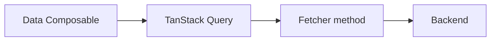

The data layer is where Ginjou reads and writes data.

This page focuses on fetchers, low-level composables, and the shared behaviors that sit underneath higher-level controllers.


```mermaid
flowchart LR
	A[Data Composable] --> B[TanStack Query]
	B --> C[Fetcher method]
	C --> D[Backend]
```

## Fetcher Context

Fetcher context is the center of this layer.

Each query or mutation composable eventually calls one fetcher method, so the fetcher is the contract between Ginjou and your backend.

### Interface

::code-group

```ts [Fetcher]
interface Fetcher<TRecord = any> {
	getList?: (props: {
		resource: string
		pagination?: { current: any, perPage: number }
		sorters?: Array<{ field: string, order: 'asc' | 'desc' }>
		filters?: unknown[]
		meta?: Record<string, any>
	}) => Promise<{ data: TRecord[], total: number }>

	getOne?: (props: {
		resource: string
		id: string | number
		meta?: Record<string, any>
	}) => Promise<{ data: TRecord }>

	getMany?: (props: {
		resource: string
		ids: Array<string | number>
		meta?: Record<string, any>
	}) => Promise<{ data: TRecord[] }>

	createOne?: (props: {
		resource: string
		params: Record<string, any>
		meta?: Record<string, any>
	}) => Promise<{ data: TRecord }>

	createMany?: (props: {
		resource: string
		params: Array<Record<string, any>>
		meta?: Record<string, any>
	}) => Promise<{ data: TRecord[] }>

	updateOne?: (props: {
		resource: string
		id: string | number
		params?: Record<string, any>
		meta?: Record<string, any>
	}) => Promise<{ data: TRecord }>

	updateMany?: (props: {
		resource: string
		ids: Array<string | number>
		params?: Record<string, any>
		meta?: Record<string, any>
	}) => Promise<{ data: TRecord[] }>

	deleteOne?: (props: {
		resource: string
		id: string | number
		params?: Record<string, any>
		meta?: Record<string, any>
	}) => Promise<{ data: TRecord }>

	deleteMany?: (props: {
		resource: string
		ids: Array<string | number>
		params?: Record<string, any>
		meta?: Record<string, any>
	}) => Promise<{ data: TRecord[] }>

	custom?: (props: {
		url: string
		method: 'get' | 'post' | 'put' | 'patch' | 'delete' | 'head' | 'options'
		query?: Record<string, any>
		payload?: Record<string, any>
		headers?: Record<string, any>
		meta?: Record<string, any>
	}) => Promise<{ data: TRecord }>
}
```

::

### Methods

| Method | Explanation | Composables |
| --- | --- | --- |
| getList | Read a collection | `useGetList`, `useGetInfiniteList` |
| getOne | Read one record | `useGetOne` |
| getMany | Read many records by ids | `useGetMany` |
| createOne | Create one record | `useCreateOne` |
| createMany | Create many records | `useCreateMany` |
| updateOne | Update one record | `useUpdateOne` |
| updateMany | Update many records | `useUpdateMany` |
| deleteOne | Delete one record | `useDeleteOne` |
| deleteMany | Delete many records | `useDeleteMany` |
| custom | Handle non-CRUD read or write | `useCustom`, `useCustomMutation` |

You do not need to implement every method on day one.

Start with the methods your app really uses, then add more as pages need them.

::code-group

```ts [Vue]
import { defineFetchersContext } from '@ginjou/vue'

defineFetchersContext({
	default: {
		async getList({ resource }) {
			const response = await fetch(`/api/${resource}`)
			const data = await response.json()

			return {
				data,
				total: data.length,
			}
		},
		async getOne({ resource, id }) {
			const response = await fetch(`/api/${resource}/${id}`)

			return {
				data: await response.json(),
			}
		},
		async createOne({ resource, params }) {
			const response = await fetch(`/api/${resource}`, {
				method: 'POST',
				headers: { 'Content-Type': 'application/json' },
				body: JSON.stringify(params),
			})

			return {
				data: await response.json(),
			}
		},
		async updateOne({ resource, id, params }) {
			const response = await fetch(`/api/${resource}/${id}`, {
				method: 'PUT',
				headers: { 'Content-Type': 'application/json' },
				body: JSON.stringify(params),
			})

			return {
				data: await response.json(),
			}
		},
		async deleteOne({ resource, id }) {
			const response = await fetch(`/api/${resource}/${id}`, {
				method: 'DELETE',
			})

			return {
				data: await response.json(),
			}
		},
	},
})
```

::

## Resource

`resource` names the record set.

`fetcherName` picks the data source.

Most calls only need `resource`. Add `fetcherName` when more than one backend is registered and a request should target a specific one.

::code-group

```ts [Vue]
import { useGetList, useGetOne, useUpdateOne } from '@ginjou/vue'

const postsList = useGetList({
	resource: 'posts',
})

const postDetail = useGetOne({
	resource: 'posts',
	id: 1,
})

const updatePost = useUpdateOne({
	resource: 'posts',
	id: 1,
})
```

::

## Get List

`useGetList` reads a collection.

It returns TanStack `useQuery` result.

| Extra | Meaning |
| --- | --- |
| `records` | Shortcut for the list records. |

::code-group

```vue [Vue]
<script setup lang="ts">
import { useGetList } from '@ginjou/vue'
import { computed } from 'vue'

const postsQuery = useGetList({
	resource: 'posts',
	pagination: {
		current: 1,
		perPage: 20,
	},
	sorters: [
		{ field: 'createdAt', order: 'desc' },
	],
	filters: [
		{ field: 'status', operator: 'eq', value: 'published' },
	],
})

const posts = computed(() => postsQuery.records.value ?? [])
const total = computed(() => postsQuery.data.value?.total ?? 0)
</script>
```

::

`useGetInfiniteList` also uses `fetcher.getList`. The difference is the TanStack Query mode.

It returns TanStack `useInfiniteQuery` result.

| Extra | Meaning |
| --- | --- |
| `records` | Loaded records grouped by page. |

::code-group

```vue [Vue]
<script setup lang="ts">
import { useGetInfiniteList } from '@ginjou/vue'
import { computed } from 'vue'

const feedQuery = useGetInfiniteList({
	resource: 'posts',
	pagination: {
		current: 1,
		perPage: 20,
	},
})

const pages = computed(() => feedQuery.records.value ?? [])
const flatPosts = computed(() => pages.value.flat())
</script>
```

::

### `filters`

Filters are a tree.

Use one rule for simple cases. Use `and` or `or` when the backend query needs grouped conditions.

Conditional Operator:

| Operator | Explanation |
| --- | --- |
| `and` | All child filters must match. |
| `or` | Any child filter can match. |

Logical Operator

| Operator | Explanation |
| --- | --- |
| `eq` | Equal to the value. |
| `ne` | Not equal to the value. |
| `lt` | Less than the value. |
| `gt` | Greater than the value. |
| `lte` | Less than or equal to the value. |
| `gte` | Greater than or equal to the value. |
| `in` | Match a value in a list. |
| `nin` | Exclude a value in a list. |
| `contains` | Text contains the value. |
| `ncontains` | Text does not contain the value. |
| `containss` | Case-sensitive contains. |
| `ncontainss` | Case-sensitive not contains. |
| `startswith` | Text starts with the value. |
| `nstartswith` | Text does not start with the value. |
| `startswiths` | Case-sensitive starts with. |
| `nstartswiths` | Case-sensitive not starts with. |
| `endswith` | Text ends with the value. |
| `nendswith` | Text does not end with the value. |
| `endswiths` | Case-sensitive ends with. |
| `nendswiths` | Case-sensitive not ends with. |
| `between` | Match a range. |
| `nbetween` | Exclude a range. |
| `null` | Value is null. |
| `nnull` | Value is not null. |

::code-group

```ts [Vue]
import { useGetList } from '@ginjou/vue'

const postsQuery = useGetList({
	resource: 'posts',
	filters: [
		{ field: 'status', operator: 'eq', value: 'published' },
		{
			operator: 'or',
			value: [
				{ field: 'title', operator: 'contains', value: keyword.value },
				{ field: 'summary', operator: 'contains', value: keyword.value },
			],
		},
	],
})
```

::

### `sorters`

Sorters are an ordered array.

The first sorter is the primary sort. The rest act as tie-breakers.

::code-group

```ts [Vue]
import { useGetList } from '@ginjou/vue'

const postsQuery = useGetList({
	resource: 'posts',
	sorters: [
		{ field: 'createdAt', order: 'desc' },
		{ field: 'id', order: 'desc' },
	],
})
```

::

### `pagination`

Pagination always uses `current` and `perPage`.

`current` can be a page number or another page token, depending on what the fetcher expects.

Page number example:

::code-group

```vue [Vue]
<script setup lang="ts">
import { useGetList } from '@ginjou/vue'

const postsQuery = useGetList({
	resource: 'posts',
	pagination: {
		current: 3,
		perPage: 20,
	},
})
</script>
```

::

Cursor example:

::code-group

```vue [Vue]
<script setup lang="ts">
import { useGetInfiniteList } from '@ginjou/vue'

const feedQuery = useGetInfiniteList({
	resource: 'posts',
	pagination: {
		current: 'cursor:0',
		perPage: 20,
	},
})
</script>
```

::

## Get One

`useGetOne` reads one record.

It returns TanStack `useQuery` result.

| Extra | Meaning |
| --- | --- |
| `record` | Shortcut for the single record. |

::code-group

```vue [Vue]
<script setup lang="ts">
import { useGetOne } from '@ginjou/vue'

const postQuery = useGetOne({
	resource: 'posts',
	id: 1,
})
</script>

<template>
	<div v-if="postQuery.isLoading">
		Loading...
	</div>
	<div v-else-if="postQuery.isError">
		Failed to load.
	</div>
	<article v-else-if="postQuery.record">
		<h1>{{ postQuery.record.title }}</h1>
	</article>
</template>
```

::

## Get Many

`useGetMany` reads many records from known ids.

If `fetcher.getMany` is missing, Ginjou falls back to repeated `fetcher.getOne`.

It returns TanStack `useQuery` result.

| Extra | Meaning |
| --- | --- |
| `records` | Shortcut for the returned records. |

::code-group

```ts [Vue]
import { useGetMany, useGetOne } from '@ginjou/vue'
import { computed } from 'vue'

const postQuery = useGetOne({
	resource: 'posts',
	id: 1,
})

const commentsQuery = useGetMany({
	resource: 'comments',
	ids: computed(() => postQuery.record.value?.commentIds ?? []),
})

const comments = computed(() => commentsQuery.records.value ?? [])
```

::

## Custom Query

`useCustom` is for read endpoints that do not fit CRUD.

Use it for reports, stats, or search endpoints.

It returns TanStack `useQuery` result.

| Extra | Meaning |
| --- | --- |
| `record` | Shortcut for the returned data record. |

::code-group

```ts [Vue]
import { useCustom } from '@ginjou/vue'
import { computed } from 'vue'

const reportQuery = useCustom({
	url: '/reports/monthly',
	method: 'get',
	query: {
		month: selectedMonth.value,
	},
})

const report = computed(() => reportQuery.record.value)
```

::

## Query Options

`queryOptions` comes from TanStack Query.

Use it for `enabled`, callbacks, `placeholderData`, retry, and other [TanStack Query](https://tanstack.com/query/latest/docs) settings.

::code-group

```ts [Vue]
import { useGetOne } from '@ginjou/vue'
import { computed } from 'vue'

const postId = computed(() => route.params.id)

const postQuery = useGetOne({
	resource: 'posts',
	id: postId,
	queryOptions: {
		enabled: computed(() => postId.value != null && postId.value !== ''),
		onSuccess: () => {
			isDrawerOpen.value = true
		},
	},
})
```

::

## Create One

`useCreateOne` creates one record.

It returns TanStack `useMutation` result.

| Extra | Meaning |
| --- | --- |
| `mutate` | Sync-style trigger with Ginjou mutation props. |
| `mutateAsync` | Promise-style trigger with Ginjou mutation props. |

::code-group

```ts [Vue]
import { useCreateOne } from '@ginjou/vue'

const createPost = useCreateOne({
	resource: 'posts',
})

await createPost.mutateAsync({
	params: {
		title: 'Hello Ginjou',
		status: 'draft',
	},
})
```

::

## Create Many

`useCreateMany` creates many records.

If `fetcher.createMany` is missing, Ginjou falls back to repeated `fetcher.createOne`.

It returns TanStack `useMutation` result.

| Extra | Meaning |
| --- | --- |
| `mutate` | Sync-style trigger with Ginjou mutation props. |
| `mutateAsync` | Promise-style trigger with Ginjou mutation props. |

::code-group

```ts [Vue]
import { useCreateMany } from '@ginjou/vue'

const createPosts = useCreateMany({
	resource: 'posts',
})

await createPosts.mutateAsync({
	params: csvRows.value.map(row => ({
		title: row.title,
		status: 'draft',
	})),
})
```

::

## Mutation Mode

`mutationMode` controls when update and delete feel committed.

Choose it based on the UX promise of the page, not just on backend speed.

| Mode | Meaning | Composables |
| --- | --- | --- |
| pessimistic | wait for the server | `useUpdateOne`, `useUpdateMany`, `useDeleteOne`, `useDeleteMany` |
| optimistic | update cache first | `useUpdateOne`, `useUpdateMany`, `useDeleteOne`, `useDeleteMany` |
| undoable | wait for a timeout before the real request | `useUpdateOne`, `useUpdateMany`, `useDeleteOne`, `useDeleteMany` |

### `pessimistic`

Use this when the UI should only change after the server confirms success.

::code-group

```vue [Vue]
<script setup lang="ts">
import { useUpdateOne } from '@ginjou/vue'

const updatePost = useUpdateOne({
	resource: 'posts',
	id: 1,
	mutationMode: 'pessimistic',
})
</script>
```

::

### `optimistic`

Use this when the UI should feel immediate and you can tolerate rollback if the request fails.

::code-group

```vue [Vue]
<script setup lang="ts">
import { useUpdateOne } from '@ginjou/vue'

const updatePost = useUpdateOne({
	resource: 'posts',
	id: 1,
	mutationMode: 'optimistic',
})
</script>
```

::

### `undoable`

The default undoable timeout is 5000 ms.

Use this when users should get a short window to cancel destructive actions.

::code-group

```vue [Vue]
<script setup lang="ts">
import { useDeleteOne } from '@ginjou/vue'

const deletePost = useDeleteOne({
	resource: 'posts',
	id: 1,
	mutationMode: 'undoable',
	undoableTimeout: 8000,
})
</script>
```

::

## Update One

`useUpdateOne` updates one record.

It returns TanStack `useMutation` result.

| Extra | Meaning |
| --- | --- |
| `mutate` | Sync-style trigger with Ginjou mutation props. |
| `mutateAsync` | Promise-style trigger with Ginjou mutation props. |

::code-group

```ts [Vue]
import { useUpdateOne } from '@ginjou/vue'

const publishPost = useUpdateOne({
	resource: 'posts',
	id: 1,
	mutationMode: 'optimistic',
})

await publishPost.mutateAsync({
	params: {
		status: 'published',
	},
})
```

::

## Update Many

`useUpdateMany` updates many records.

If `fetcher.updateMany` is missing, Ginjou falls back to repeated `fetcher.updateOne`.

It returns TanStack `useMutation` result.

| Extra | Meaning |
| --- | --- |
| `mutate` | Sync-style trigger with Ginjou mutation props. |
| `mutateAsync` | Promise-style trigger with Ginjou mutation props. |

::code-group

```ts [Vue]
import { useUpdateMany } from '@ginjou/vue'

const publishPosts = useUpdateMany({
	resource: 'posts',
	mutationMode: 'optimistic',
})

await publishPosts.mutateAsync({
	ids: selectedIds.value,
	params: {
		status: 'published',
	},
})
```

::

## Delete One

`useDeleteOne` deletes one record.

It returns TanStack `useMutation` result.

| Extra | Meaning |
| --- | --- |
| `mutate` | Sync-style trigger with Ginjou mutation props. |
| `mutateAsync` | Promise-style trigger with Ginjou mutation props. |

::code-group

```ts [Vue]
import { useDeleteOne } from '@ginjou/vue'

const deletePost = useDeleteOne({
	resource: 'posts',
	id: 1,
	mutationMode: 'undoable',
})

deletePost.mutate()
```

::

## Delete Many

`useDeleteMany` deletes many records.

If `fetcher.deleteMany` is missing, Ginjou falls back to repeated `fetcher.deleteOne`.

It returns TanStack `useMutation` result.

| Extra | Meaning |
| --- | --- |
| `mutate` | Sync-style trigger with Ginjou mutation props. |
| `mutateAsync` | Promise-style trigger with Ginjou mutation props. |

::code-group

```ts [Vue]
import { useDeleteMany } from '@ginjou/vue'

const deletePosts = useDeleteMany({
	resource: 'posts',
	mutationMode: 'undoable',
})

await deletePosts.mutateAsync({
	ids: selectedIds.value,
})
```

::

## Custom Mutation

`useCustomMutation` is for write actions that do not fit CRUD.

It does not bring CRUD invalidation presets or mutationMode.

It returns TanStack `useMutation` result.

| Extra | Meaning |
| --- | --- |
| `mutate` | Sync-style trigger with Ginjou mutation props. |
| `mutateAsync` | Promise-style trigger with Ginjou mutation props. |

::code-group

```ts [Vue]
import { useCustomMutation } from '@ginjou/vue'

const publishPost = useCustomMutation({
	url: '/posts/1/publish',
	method: 'post',
})

await publishPost.mutateAsync()
```

::

## Mutation Options

`mutationOptions` also comes from TanStack Query.

Use it for callbacks and lifecycle control. For details, read the [TanStack Query](https://tanstack.com/query/latest/docs).

::code-group

```ts [Vue]
import { useUpdateOne } from '@ginjou/vue'

const updatePost = useUpdateOne({
	resource: 'posts',
	id: 1,
	mutationOptions: {
		onSuccess: () => {
			isEditorOpen.value = false
		},
	},
})
```

::

## Multiple Fetchers

You can register more than one fetcher.

Use `fetcherName` to choose the source. If you omit it, Ginjou uses `default`.

::code-group

```ts [Vue]
import { defineFetchersContext, useGetList } from '@ginjou/vue'

defineFetchersContext({
	default: restFetcher,
	legacy: legacyFetcher,
})

const currentPosts = useGetList({
	resource: 'posts',
})

const legacyPosts = useGetList({
	resource: 'posts',
	fetcherName: 'legacy',
})
```

::

## Auth Error Handling

Built-in query and mutation composables already call `auth.checkError`.

That means most pages do not need to wire auth error handling by hand unless they are making custom requests outside the standard hooks.

## Cache Invalidation

`invalidates` controls which cached queries should refresh after a successful mutation.

Targets are `all`, `resource`, `list`, `many`, and `one`.

Default invalidates:

| Composable | Default invalidates |
| --- | --- |
| `useCreateOne` | list, many |
| `useCreateMany` | list, many |
| `useUpdateOne` | list, many, one |
| `useUpdateMany` | list, many, one |
| `useDeleteOne` | list, many |
| `useDeleteMany` | list, many |

::code-group

```ts [Vue]
import { useUpdateOne } from '@ginjou/vue'

const updatePost = useUpdateOne({
	resource: 'posts',
	id: 1,
	invalidates: ['one', 'list'],
})
```

::

## Notifications

Query and mutation composables can show default success and error messages.

Use `successNotify` or `errorNotify` to replace them. Use `false` to disable them.

## Realtime

When realtime is enabled, query composables subscribe and standard mutation composables publish.

The default channel is `resources/{resource}`. `useCustom` and `useCustomMutation` can use their own channel or event.

## Meta

`meta` is the backend-specific extension point.

Ginjou forwards it to the fetcher and includes it in query keys. Use it for backend details that do not belong in the shared contract. Keep it small, and read the backend guides for the exact shape.
