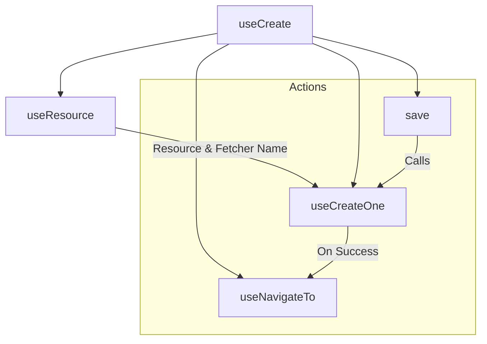
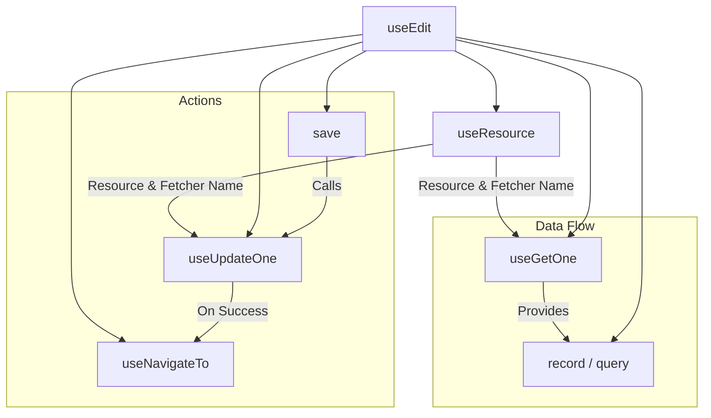
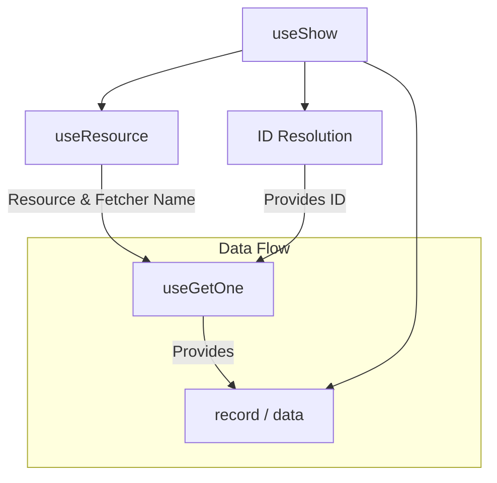
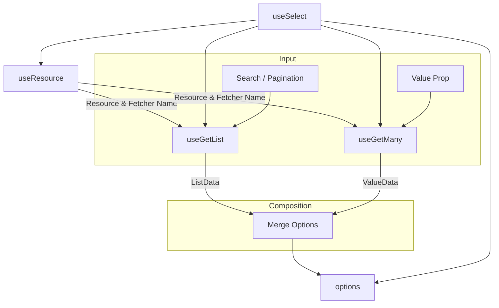

Ginjou provides high-level Composables (Controllers) like `useEdit` and `useCreate` to make CRUD operations easier. These controllers can key information like "resources" and "fetchers" for you, saving you from writing the same code over and over.

::tip
While Controllers offer a high-level API, they are built from modular Data Composables (like `useCreateOne`, `useGetOne`) and remain fully customizable.
::

## Data Operations

This section introduces the main Composables for standard data actions: creating, updating, getting, and deleting records.

### Create

`useCreate` is a high-level composable for create pages. It handles data creation and also manages the whole page flow, including finding the resource and navigation.

**Key Differences:**
- `useCreateOne`: Focuses only on the API request to create a record.
- `useCreate`: Works as a complete page controller. It combines `useResource` (context), `useCreateOne` (mutation), and `useNavigateTo` (navigation) into one easy-to-use hook.

**Composition:**
- **Data Hook**: Uses `useCreateOne` to run the creation logic.
- **Controller Action**: The `save` method starts the mutation.
- **Mutation On Success**: `useCreateOne` handles extra tasks like refreshing the list data.
- **Controller On Success**: `save` waits for the mutation to finish, then sends the user to the list page via `useNavigateTo`.



::code-group
---
sync: guide-example
---

```vue [vue]
<script setup lang="ts">
import { useCreate } from '@ginjou/vue'
import { reactive } from 'vue'

const { save } = useCreate({
	resource: 'posts',
})

const formData = reactive({
	title: '',
	status: 'draft',
})
</script>

<template>
	<form @submit.prevent="save(formData)">
		<input v-model="formData.title">
		<select v-model="formData.status">
			<option value="draft">
				Draft
			</option>
			<option value="published">
				Published
			</option>
		</select>
		<button type="submit">
			Submit
		</button>
	</form>
</template>
```

```svelte [svelte]
<!-- WIP -->
<script>
  // ...
</script>
```

::

### Edit

`useEdit` is for edit pages. It handles both getting the existing data and updating it. It also manages resource identification and navigation.

**Key Differences:**
- `useGetOne`: Gets a single record.
- `useUpdateOne`: Updates existing data.
- `useEdit`: Combines `useGetOne` and `useUpdateOne`. It ensures data is loaded when the page opens and updated when saved. It also handles loading states (`isLoading`) and navigation.

**Composition:**
- **Data Hooks**: Uses `useGetOne` to get data and `useUpdateOne` to update it.
- **Controller Action**: The `save` method starts the update mutation.
- **Mutation On Success**: `useUpdateOne` handles extra tasks like refreshing the data.
- **Controller On Success**: `save` waits for the mutation to finish, then sends the user to the list page via `useNavigateTo`.



::code-group
---
sync: guide-example
---

```vue [vue]
<script setup lang="ts">
import { useEdit } from '@ginjou/vue'
import { reactive, watch } from 'vue'

const { record, save } = useEdit({
	resource: 'posts',
	id: '123'
})

const formData = reactive({})

watch(record, (val) => {
	Object.assign(formData, val)
})
</script>
```

```svelte [svelte]
<!-- WIP -->
<script>
  // ...
</script>
```

::

### Show

`useShow` is for detailed view pages (Show pages). Its main job is to find the correct ID and get the record's details.

**Key Differences:**
- `useGetOne`: Simply gets data.
- `useShow`: Adds logic to automatically find the `id` from the URL or props. It combines this with the resource context (`useResource`) to know exactly what to fetch.

**Composition:**
- **ID Resolution**: Automatically finds the resource ID.
- **Data Hook**: Uses `useGetOne` to get the record details.



::code-group
---
sync: guide-example
---

```vue [vue]
<script setup lang="ts">
import { useShow } from '@ginjou/vue'

const { record } = useShow({
	resource: 'posts',
	id: '123'
})
</script>

<template>
	<div>
		<h1>{{ record?.title }}</h1>
		<p>{{ record?.content }}</p>
	</div>
</template>
```

```svelte [svelte]
<!-- WIP -->
<script>
  // ...
</script>
```

::

### Delete

`useDeleteOne` is a mutation composable for deleting data. It does more than just a simple API call by working with other system features.

::caution
`useDeleteOne` performs a destructive action. Ensure that you implement proper user confirmation (e.g., a modal) before triggering this mutation.
::

**Composition:**
- **Data Hook**: Runs the delete API request.
- **Mutation On Success**: Sends a success message and updates real-time data.
- **Mutation On Error**: Sends an error message and checks for errors.

::code-group
---
sync: guide-example
---

```vue [vue]
<script setup lang="ts">
import { useDeleteOne } from '@ginjou/vue'

const { mutate: deleteOne } = useDeleteOne()

function handleDelete(id: string) {
	deleteOne({
		resource: 'posts',
		id,
	})
}
</script>
```

```svelte [svelte]
<!-- WIP -->
<script>
  // ...
</script>
```

::

## Fields

Beyond basic data operations, this section covers specialized Composables for specific form fields, such as handling related data in select inputs.

### Select

`useSelect` is a powerful composable for managing select menu options. It handles common challenges like pagination and keeping selected values correct. It supports both single-value and multi-value `<select>` inputs.

When a select menu has paginated options, the currently selected value(s) might not be on the current page. `useSelect` cleverly handles two data requests to solve this:
1. `useGetList`: Gets the available options for the dropdown (supports search and pagination).
2. `useGetMany`: Gets the specific data for the currently selected `value` (or values). This ensures the label shows correctly, even if the item isn't on the current page.

Finally, `useSelect` combines these results into a single `options` list for your UI.



::code-group
---
sync: guide-example
---

```vue [vue]
<script setup lang="ts">
import { useSelect } from '@ginjou/vue'
import { ref } from 'vue'

const value = ref()
const { options } = useSelect({
	resource: 'categories',
	value,
})
</script>

<template>
	<select v-model="value">
		<option v-for="opt in options" :key="opt.data.id" :value="opt.value">
			{{ opt.label }}
		</option>
	</select>
</template>
```

```svelte [svelte]
<!-- WIP -->
<script>
  // ...
</script>
```

::
