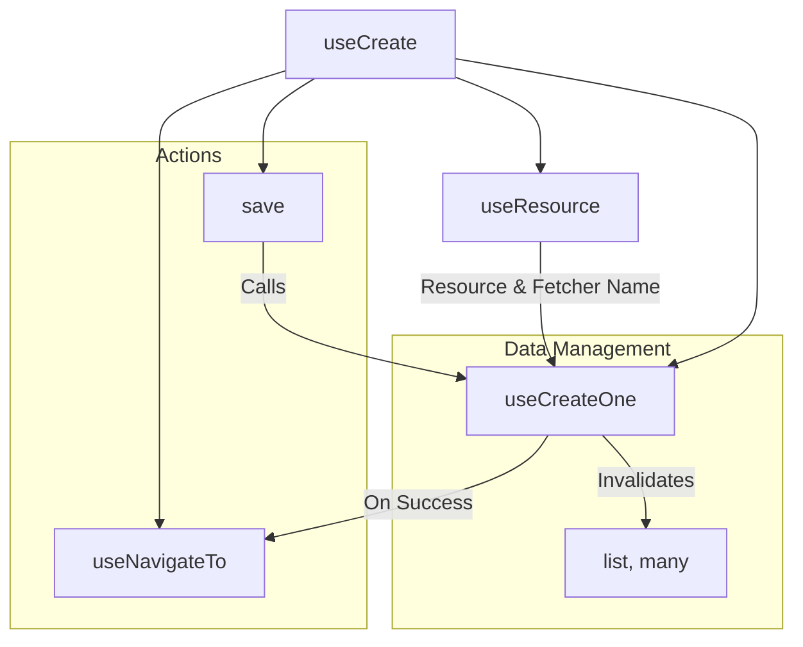
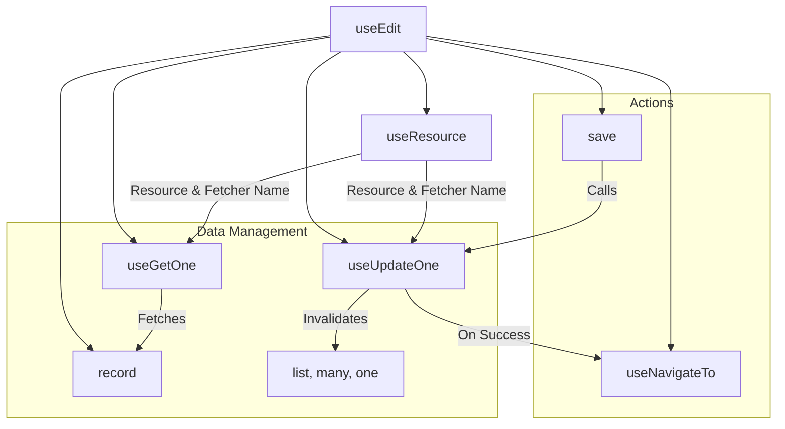
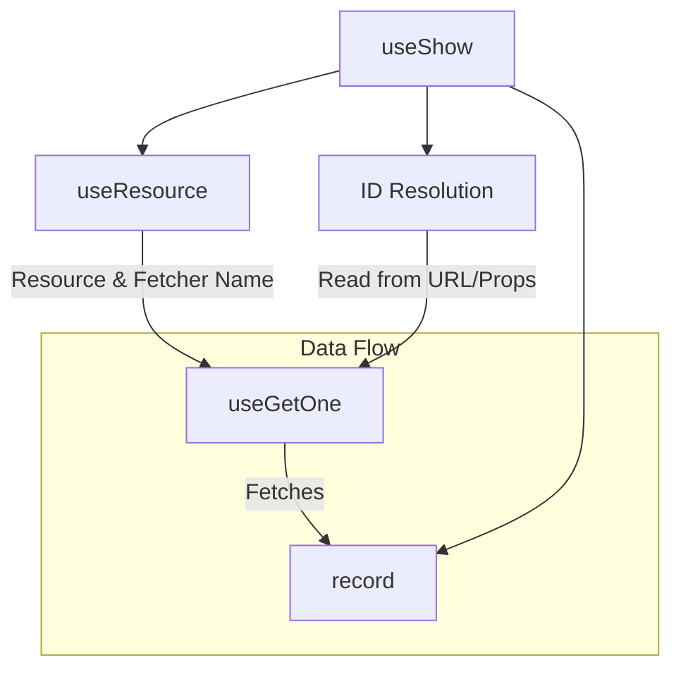
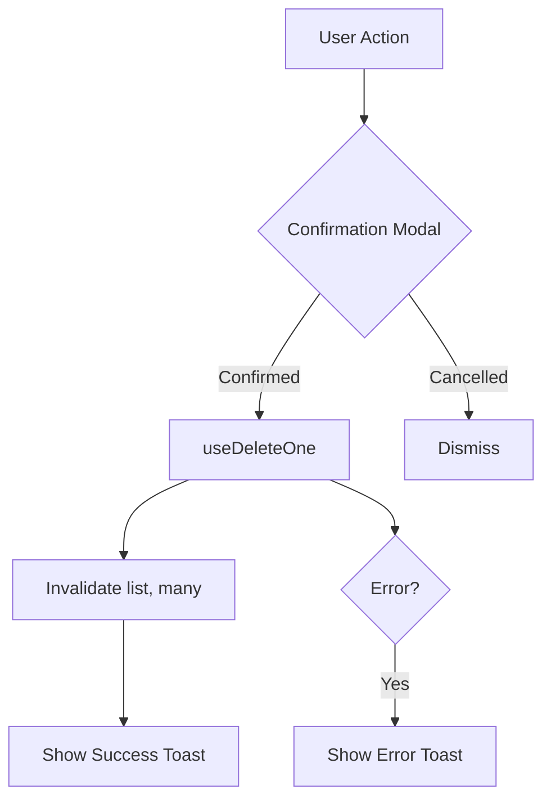
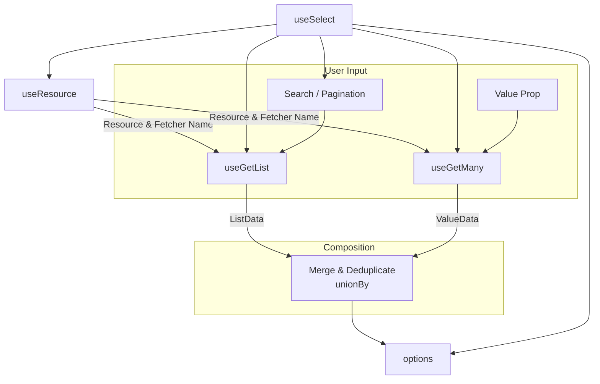

Ginjou provides high-level Controllers that simplify building forms and handling CRUD operations. Controllers manage complex page logic automatically: fetching data, tracking loading states, handling mutations, and navigating after success.

The main difference between Controllers and lower-level Data Composables is automation. Controllers orchestrate multiple composables and inject context automatically, letting you focus on the UI.

::tip
Controllers are built from modular Data Composables like `useCreateOne`, `useUpdateOne`, and `useGetOne`. You can always customize them or use lower-level composables for specialized needs.
::

## CRUD Operations

This section introduces Controllers for standard data operations: creating, updating, fetching, and deleting records.

### Create

`useCreate` is a Controller for create pages. It handles data creation and manages the entire page flow, including resource identification and navigation.

**Compared to Lower-Level Composables:**
- `useCreateOne`: Handles only the API request to create a record
- `useCreate`: Complete page Controller that combines `useResource` (context), `useCreateOne` (mutation), and `useNavigateTo` (navigation)

**Composition:**
- **Data Composable:** Uses `useCreateOne` to execute the creation logic
- **Controller Action:** The `save` method triggers the mutation
- **Mutation On Success:** `useCreateOne` automatically invalidates related caches (`list` and `many` queries) so that list pages display the new record
- **Controller On Success:** `save` waits for the mutation to complete, then navigates the user to the list page

**Mutation Modes:**

The `save` function accepts an options object with a `mode` parameter that controls when navigation happens:

- **Pessimistic (default):** Waits for the server to confirm the record was created before navigating. This is safe but may feel slower.
- **Optimistic:** Navigates immediately and sends the request in the background. The UI updates instantly even if the server request is still pending.
- **Undoable:** Navigates immediately but displays a toast notification with an "undo" button. If the user clicks undo within the window, the creation is cancelled.



::code-group
---
sync: guide-example
---

```vue [vue]
<script setup lang="ts">
import { useCreate } from '@ginjou/vue'
import { reactive } from 'vue'

const { save, isLoading } = useCreate({
	resource: 'posts',
})

const formData = reactive({
	title: '',
	status: 'draft',
})

async function handleSubmit() {
	// Use pessimistic mode (waits for server before navigating)
	await save(formData, { mode: 'pessimistic' })
	// Or optimistic mode for instant navigation:
	// await save(formData, { mode: 'optimistic' })
}
</script>

<template>
	<form @submit.prevent="handleSubmit">
		<input v-model="formData.title" placeholder="Post title">
		<select v-model="formData.status">
			<option value="draft">
				Draft
			</option>
			<option value="published">
				Published
			</option>
		</select>
		<button type="submit" :disabled="isLoading">
			{{ isLoading ? 'Creating...' : 'Create Post' }}
		</button>
	</form>
</template>
```

```svelte [svelte]
<!-- WIP -->
<script>
  // ...
</script>
```

::

### Edit

`useEdit` is a Controller for edit pages. It handles fetching existing data and updating it, while managing resource identification and navigation.

**Compared to Lower-Level Composables:**
- `useGetOne`: Fetches a single record
- `useUpdateOne`: Updates existing data
- `useEdit`: Combines `useGetOne` and `useUpdateOne` to provide complete page functionality. It automatically fetches data when the page opens and waits for the update mutation to complete before navigating

**Composition:**
- **Data Composables:** Uses `useGetOne` to fetch data and `useUpdateOne` to update it
- **Loading State:** Exposes `isLoading` that reflects both the fetch and mutation states
- **Controller Action:** The `save` method triggers the update mutation
- **Mutation On Success:** `useUpdateOne` automatically invalidates affected caches (`list`, `many`, and `one` queries) so that the updated record displays everywhere
- **Controller On Success:** `save` waits for the mutation to complete, then navigates the user to the list page

**Mutation Modes:**

Like `useCreate`, the `save` function supports different modes for when navigation occurs:

- **Pessimistic (default):** Waits for the server to confirm the update before navigating
- **Optimistic:** Navigates immediately while the update request runs in the background
- **Undoable:** Navigates immediately but displays an undo button in case the update fails

**Form Synchronization:**

When the record data loads, you typically copy it into reactive form state. Use a `watch` to sync:

```typescript
watch(record, (newValue) => {
	Object.assign(formData, newValue)
}, { immediate: true })
```



::code-group
---
sync: guide-example
---

```vue [vue]
<script setup lang="ts">
import { useEdit } from '@ginjou/vue'
import { reactive, watch } from 'vue'

const { record, save, isLoading } = useEdit({
	resource: 'posts',
	id: '123'
})

const formData = reactive({
	title: '',
	content: '',
	status: 'draft',
})

// Sync form data when record loads
watch(record, (newRecord) => {
	if (newRecord) {
		Object.assign(formData, newRecord)
	}
}, { immediate: true })

async function handleSubmit() {
	await save(formData, { mode: 'pessimistic' })
}
</script>

<template>
	<form v-if="record" @submit.prevent="handleSubmit">
		<input v-model="formData.title" placeholder="Post title">
		<textarea v-model="formData.content" placeholder="Post content" />
		<select v-model="formData.status">
			<option value="draft">
				Draft
			</option>
			<option value="published">
				Published
			</option>
		</select>
		<button type="submit" :disabled="isLoading">
			{{ isLoading ? 'Saving...' : 'Save Changes' }}
		</button>
	</form>
	<div v-else>
		Loading...
	</div>
</template>
```

```svelte [svelte]
<!-- WIP -->
<script>
  // ...
</script>
```

::

### Show

`useShow` is a Controller for detail view pages. It automatically resolves the record ID from your routing context and fetches the record details.

**Compared to Lower-Level Composables:**
- `useGetOne`: Fetches data for a given ID (requires you to manage the ID)
- `useShow`: Automatically resolves the record ID from URL parameters or route props, then combines it with the resource context to fetch the correct record

**When to Use:**

Use `useShow` when displaying a single record on a dedicated detail page. It handles the common pattern of reading the ID from the URL and fetching the corresponding record.

Use `useGetOne` directly when you need more control over which record to fetch or when the ID comes from a different source than route parameters.

**ID Resolution:**

`useShow` automatically reads the ID from your routing context. In most frameworks, this is the URL parameter (e.g., `/posts/123` extracts `123`). If the automatic resolution doesn't match your routing structure, you can pass the ID explicitly:

```vue [vue]
const { record } = useShow({
  resource: 'posts',
  id: '123' // Optional: explicitly set the ID
})
```



::code-group
---
sync: guide-example
---

```vue [vue]
<script setup lang="ts">
import { useShow } from '@ginjou/vue'

// Automatically reads ID from URL (e.g., /posts/123)
const { record, isLoading } = useShow({
	resource: 'posts'
	// ID is read from route parameters automatically
})
</script>

<template>
	<div v-if="record" class="post-detail">
		<h1>{{ record.title }}</h1>
		<p>{{ record.content }}</p>
		<span class="status" :class="`status-${record.status}`">
			{{ record.status }}
		</span>
	</div>
	<div v-else-if="isLoading">
		Loading...
	</div>
	<div v-else>
		Record not found
	</div>
</template>
```

```svelte [svelte]
<!-- WIP -->
<script>
  // ...
</script>
```

::

### Delete

`useDeleteOne` is a mutation composable for deleting records. It integrates with your notification system and cache management to provide a complete deletion experience.

::caution
`useDeleteOne` performs a destructive, permanent action. Always implement proper user confirmation (such as a modal dialog) before triggering this mutation. Users expect to confirm destructive actions.
::

**Composition:**
- **Data Composable:** Executes the delete API request
- **Mutation On Success:** Displays a success notification and invalidates the `list` and `many` queries so the deleted record no longer appears
- **Mutation On Error:** Displays an error notification with error details

**Confirmation Pattern:**

Always show a confirmation modal before calling the delete mutation. This pattern protects users from accidental data loss:

```typescript
function handleDeleteClick(id: string) {
	if (confirm('Are you sure you want to delete this post? This action cannot be undone.')) {
		deleteOne({ resource: 'posts', id })
	}
}
```

For a better UX, use a modal dialog component instead of the browser's native `confirm()`.



::code-group
---
sync: guide-example
---

```vue [vue]
<script setup lang="ts">
import { useDeleteOne } from '@ginjou/vue'
import { ref } from 'vue'

const { mutate: deleteOne, isLoading } = useDeleteOne()
const showConfirmModal = ref(false)
const pendingDeleteId = ref<string | null>(null)

function openDeleteConfirm(id: string) {
	pendingDeleteId.value = id
	showConfirmModal.value = true
}

function confirmDelete() {
	if (pendingDeleteId.value) {
		deleteOne({
			resource: 'posts',
			id: pendingDeleteId.value,
		})
		showConfirmModal.value = false
		pendingDeleteId.value = null
	}
}

function cancelDelete() {
	showConfirmModal.value = false
	pendingDeleteId.value = null
}
</script>

<template>
	<div>
		<!-- Your content here -->
		<button class="btn-danger" @click="openDeleteConfirm('123')">
			Delete
		</button>

		<!-- Confirmation Modal -->
		<div v-if="showConfirmModal" class="modal-overlay">
			<div class="modal">
				<h2>Delete Post?</h2>
				<p>This action cannot be undone.</p>
				<div class="modal-actions">
					<button :disabled="isLoading" class="btn-danger" @click="confirmDelete">
						{{ isLoading ? 'Deleting...' : 'Delete' }}
					</button>
					<button :disabled="isLoading" @click="cancelDelete">
						Cancel
					</button>
				</div>
			</div>
		</div>
	</div>
</template>
```

```svelte [svelte]
<!-- WIP -->
<script>
  // ...
</script>
```

::

## Form Fields

This section covers specialized Composables for specific form field patterns, such as managing related data in select inputs.

### Select

`useSelect` is a composable for managing select input options. It solves the common challenge of displaying selected values that may not exist on the current dropdown page.

**The Problem:**

When a select dropdown has many options and uses pagination, the currently selected value might not appear on the current page. For example, if a user selects "Category #500" but the dropdown only shows categories 1-50 on the first page, the label won't display correctly until the user navigates to the right page.

**The Solution:**

`useSelect` makes two coordinated requests:

1. **`useGetList`:** Fetches available options for the dropdown (supports search, filtering, and pagination)
2. **`useGetMany`:** Fetches the specific data for the currently selected value(s), ensuring the label displays correctly

`useSelect` merges these results into a single `options` array for your UI.

**Pagination & Search:**

The composable exposes `currentPage`, `perPage`, and `search` properties that you control:

```typescript
const { options, search, currentPage, perPage } = useSelect({
	resource: 'categories',
	value, // Reactive ref with selected ID(s)
})

// User types in search box
search.value = 'electronics'

// User clicks "next page"
currentPage.value = 2

// User changes items per page
perPage.value = 25
```

**Custom Search Function:**

By default, `useSelect` passes the search text as a filter. Some backends require custom search logic. Use `searchToFilters` to convert search text to your backend's filter format:

```typescript
const { options } = useSelect({
	resource: 'products',
	value,
	searchToFilters: searchText => ({
		// Convert search text to your backend's filter format
		name_icontains: searchText, // Example: Supabase syntax
	}),
})
```



::code-group
---
sync: guide-example
---

```vue [vue]
<script setup lang="ts">
import { useSelect } from '@ginjou/vue'
import { computed, ref } from 'vue'

const selectedCategoryId = ref()

const {
	options,
	search,
	currentPage,
	perPage,
} = useSelect({
	resource: 'categories',
	value: selectedCategoryId,
})

// For backends that need custom search syntax
const {
	options: productOptions,
	search: productSearch,
} = useSelect({
	resource: 'products',
	value: ref(),
	searchToFilters: searchText => ({
		// Map search text to your backend's filter format
		// This example uses Supabase's filter syntax
		name_icontains: searchText,
	}),
})
</script>

<template>
	<div class="form-group">
		<!-- Simple Select -->
		<label>Category</label>
		<select v-model="selectedCategoryId">
			<option :value="undefined">
				-- Select a category --
			</option>
			<option v-for="opt in options" :key="opt.data.id" :value="opt.value">
				{{ opt.label }}
			</option>
		</select>

		<!-- Select with Search -->
		<label>Product (with search)</label>
		<input
			v-model="productSearch"
			placeholder="Search products..."
			class="search-input"
		>
		<select>
			<option :value="undefined">
				-- Select a product --
			</option>
			<option v-for="opt in productOptions" :key="opt.data.id" :value="opt.value">
				{{ opt.label }}
			</option>
		</select>

		<!-- Pagination Controls -->
		<div class="pagination">
			<button :disabled="currentPage === 1" @click="currentPage--">
				Previous
			</button>
			<span>Page {{ currentPage }} - {{ perPage }} per page</span>
			<button @click="currentPage++">
				Next
			</button>
		</div>
	</div>
</template>
```

```svelte [svelte]
<!-- WIP -->
<script>
  // ...
</script>
```

::
