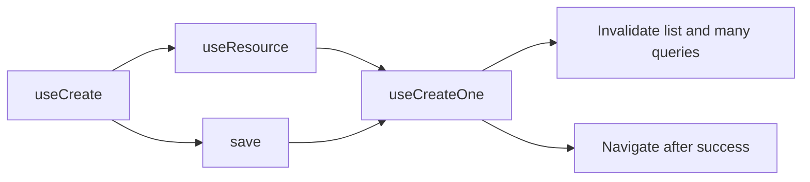
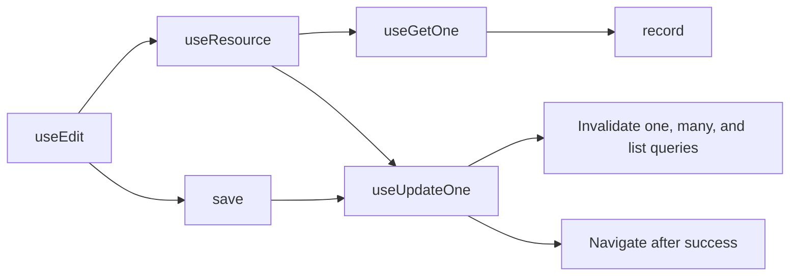

Ginjou controllers are pre-composed page flows. They do not replace the underlying data composables. They assemble the common pieces of CRUD screens so you can focus on form state, validation, and UI behavior.

## Why Use Controllers

Controllers help when the page needs more than one backend action.

| Controller | Built From | Best For |
| :--- | :--- | :--- |
| `useCreate` | `useResource`, `useCreateOne`, navigation helpers | Create pages |
| `useEdit` | `useResource`, `useGetOne`, `useUpdateOne`, navigation helpers | Edit pages |
| `useShow` | `useResource`, `useGetOne` | Read-only detail pages |

If the page needs a very custom success flow, unusual routing, or multiple coordinated mutations, drop down to the lower-level composables and wire the flow yourself.

## Create Pages

`useCreate` prepares a save action for a new record and resolves the current resource and fetcher from context.

### Composition

- Data composable: `useCreateOne`
- Action: `save(values, options)`
- Mutation on success: invalidates related queries
- Controller on success: navigates after the chosen mutation strategy completes


```mermaid
flowchart LR
    A[useCreate] --> B[useResource]
    B --> C[useCreateOne]
    A --> D[save]
    D --> C
    C --> E[Invalidate list and many queries]
    C --> F[Navigate after success]
```

### Example

::code-group

```vue [Vue]
<script setup lang="ts">
import { useCreate } from '@ginjou/vue'
import { reactive } from 'vue'

const { save, isLoading } = useCreate({
	resource: 'posts',
})

const formData = reactive({
	title: '',
	status: 'draft',
	content: '',
})

async function submit() {
	await save({
		title: formData.title,
		status: formData.status,
		content: formData.content,
	}, { mode: 'pessimistic' })
}
</script>

<template>
	<form class="stack" @submit.prevent="submit">
		<input v-model="formData.title" placeholder="Title">
		<select v-model="formData.status">
			<option value="draft">
				Draft
			</option>
			<option value="published">
				Published
			</option>
		</select>
		<textarea v-model="formData.content" placeholder="Content" />
		<button type="submit" :disabled="isLoading">
			{{ isLoading ? 'Creating...' : 'Create post' }}
		</button>
	</form>
</template>
```

::

That example is intentionally plain. In a real app you would usually swap the HTML inputs for your own form components and validation layer.

## Edit Pages

`useEdit` reads the current record and prepares the save action for updates.

### Composition

- Data composables: `useGetOne` and `useUpdateOne`
- Action: `save(values, options)`
- Mutation on success: invalidates related queries
- Controller on success: navigates after the update flow finishes


```mermaid
flowchart LR
    A[useEdit] --> B[useResource]
    B --> C[useGetOne]
    B --> D[useUpdateOne]
    C --> E[record]
    A --> F[save]
    F --> D
    D --> G[Invalidate one, many, and list queries]
    D --> H[Navigate after success]
```

### Form State And Server State

Keep the fetched record and the editable form state separate.

This separation matters because `record` represents server state, while `formData` represents user edits that may not be saved yet.

::code-group

```vue [Vue]
<script setup lang="ts">
import { useEdit } from '@ginjou/vue'
import { reactive, watch } from 'vue'

const { record, save, isLoading } = useEdit({
	resource: 'posts',
	id: '42',
})

const formData = reactive({
	title: '',
	content: '',
	status: 'draft',
})

watch(record, (value) => {
	if (value) {
		Object.assign(formData, {
			title: value.title,
			content: value.content,
			status: value.status,
		})
	}
}, { immediate: true })

async function submit() {
	await save({
		title: formData.title,
		content: formData.content,
		status: formData.status,
	}, { mode: 'pessimistic' })
}
</script>

<template>
	<form v-if="record" class="stack" @submit.prevent="submit">
		<input v-model="formData.title" placeholder="Title">
		<textarea v-model="formData.content" placeholder="Content" />
		<select v-model="formData.status">
			<option value="draft">
				Draft
			</option>
			<option value="published">
				Published
			</option>
		</select>
		<button type="submit" :disabled="isLoading">
			{{ isLoading ? 'Saving...' : 'Save changes' }}
		</button>
	</form>
	<div v-else>
		Loading...
	</div>
</template>
```

::

## Show Pages

`useShow` is the read-only controller for detail pages.

### Composition

- Resource resolution: `useResource`
- Data composable: `useGetOne`
- Output: `record`, loading state, error state

### Example

Use `useShow` when the page behaves like a route-aware detail screen. Use `useGetOne` directly when the ID comes from somewhere else.

::code-group

```vue [Vue]
<script setup lang="ts">
import { useShow } from '@ginjou/vue'

const { record, isLoading } = useShow({
	resource: 'posts',
})
</script>

<template>
	<div v-if="record">
		<h1>{{ record.title }}</h1>
		<p>{{ record.content }}</p>
		<small>Status: {{ record.status }}</small>
	</div>
	<div v-else-if="isLoading">
		Loading...
	</div>
	<div v-else>
		Record not found.
	</div>
</template>
```

::

## Validation Belongs To The Form Layer

Ginjou does not impose a form library or validation library. That boundary is intentional.

In practice, a create or edit page usually looks like this split:

1. `useCreate` or `useEdit` owns backend flow and post-success navigation.
2. Your form layer owns validation, dirty state, touched state, and field-level UX.
3. The submit handler passes already-valid values into `save()`.

That keeps controllers useful without turning them into a form framework.

## Mutation Modes

`save` supports three modes.

| Mode | Behavior | Good For |
| :--- | :--- | :--- |
| `pessimistic` | Wait for the server response, then navigate. | Forms where backend validation or returned IDs matter immediately. |
| `optimistic` | Navigate immediately and let the mutation continue in the background. | Fast internal tools where brief inconsistency is acceptable. |
| `undoable` | Delay the final mutation until the undo window closes. | User-facing destructive or risky actions. |

`undoable` depends on a notification provider because the undo interaction is surfaced through the notification UI.

## When To Skip Controllers

Controllers are convenient, but they are still compositions. When the page stops looking like a standard CRUD route, wire the flow yourself.

Example: an editor page that autosaves metadata, publishes separately, and updates related resources at the same time.

::code-group

```vue [Vue]
<script setup lang="ts">
import { useGetOne, useUpdateOne } from '@ginjou/vue'
import { reactive } from 'vue'

const query = useGetOne({ resource: 'posts', id: '42' })
const updatePost = useUpdateOne({ resource: 'posts', id: '42' })

const formData = reactive({
	title: '',
	content: '',
})

async function saveDraft() {
	await updatePost.mutateAsync({
		params: {
			title: formData.title,
			content: formData.content,
			status: 'draft',
		},
	})
}
</script>
```

::

This is still a valid Ginjou page. It just uses the lower-level parts directly.

## Practical Rule

Use controllers when the page matches a common CRUD route. Use the lower-level composables when the page is a workflow, dashboard, wizard, or multi-step editor.

## Where To Go Next

- Read [List](/guides/list) when the same resource also needs a searchable or paginated index page.
- Read [Resources](/guides/resources) and [Router](/guides/router) when form pages should resolve resource and action from the current route.
- Read [Notifications](/guides/notifications) when save and delete flows need stronger user feedback.
- Read [Data](/guides/data) when the page no longer fits a standard controller and you need to compose the lower-level pieces yourself.
