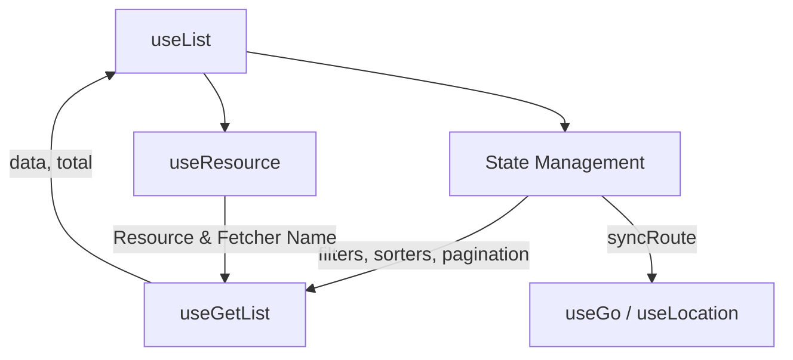
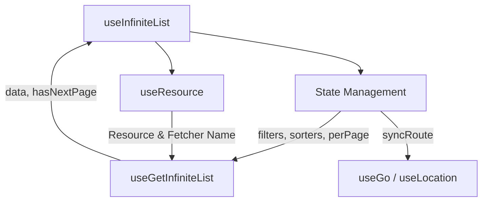

Displaying data in lists is a core feature of most applications. Ginjou provides `useList` and `useInfiniteList` to make this easy.

## useList

`useList` is the go-to composable for fetching lists of data.

**Composition:**
- **State Management**: Manages `currentPage`, `perPage`, `filters`, and `sorters`.
- **Data Hook**: Uses `useGetList` to fetch data based on the current state.
- **Router Sync**: Uses `useGo` and `useLocation` to sync state with the URL (if enabled).



::code-group
---
sync: guide-example
---

```vue [vue]
<script setup lang="ts">
import { useList } from '@ginjou/vue'

const { records, isFetching } = useList({
	resource: 'posts',
})
</script>

<template>
	<div v-if="isFetching">
		Loading...
	</div>
	<ul v-else>
		<li v-for="record in records" :key="record.id">
			{{ record.id }} - {{ record.title }}
		</li>
	</ul>
</template>
```

```svelte [svelte]
<!-- WIP -->
<script>
  // ...
</script>
```

::

## useInfiniteList

For "Load More" or Infinite Scroll interfaces, use `useInfiniteList`.

**Composition:**
- **State Management**: Manages `perPage` (or limit), `filters`, and `sorters`. Note it does NOT use standard page-based pagination state like `useList` in the same way.
- **Data Hook**: Uses `useGetInfiniteList`.



::code-group
---
sync: guide-example
---

```vue [vue]
<script setup lang="ts">
import { useInfiniteList } from '@ginjou/vue'

const {
	records, // Note: This is a nested array of pages -> records
	hasNextPage,
	fetchNextPage,
	isFetching,
} = useInfiniteList({
	resource: 'posts',
	pagination: {
		perPage: 10,
	},
})
</script>

<template>
	<div v-for="(page, i) in records" :key="i">
		<div v-for="item in page" :key="item.id">
			{{ item.title }}
		</div>
	</div>

	<button
		v-if="hasNextPage"
		:disabled="isFetching"
		@click="fetchNextPage()"
	>
		{{ isFetching ? 'Loading...' : 'Load More' }}
	</button>
</template>
```

```svelte [svelte]
<!-- WIP -->
<script>
  // ...
</script>
```

::

## Pagination

`useList` provides `currentPage`, `perPage`, and `pageCount` refs.

### Modes

You can control where pagination happens using `pagination.mode`:

- `'server'` (Default): Parameters are sent to the API.
- `'client'`: All data is expected to be available (or fetched once), and Ginjou slices the array in the browser.
- `'off'`: Pagination is disabled.

::code-group
---
sync: guide-example
---

```vue [vue]
<script setup lang="ts">
import { useList } from '@ginjou/vue'

const {
	records,
	currentPage,
	perPage,
	pageCount,
	total,
} = useList({
	resource: 'posts',
	pagination: {
		current: 1,
		perPage: 10,
		mode: 'server', // or 'client', 'off'
	}
})
</script>

<template>
	<!-- List rendering... -->

	<div class="pagination">
		<button :disabled="currentPage === 1" @click="currentPage--">
			Prev
		</button>
		<span>{{ currentPage }} / {{ pageCount }}</span>
		<button :disabled="currentPage === pageCount" @click="currentPage++">
			Next
		</button>
	</div>
</template>
```

```svelte [svelte]
<!-- WIP -->
<script>
  // ...
</script>
```

::

## Filters

Updates to the `filters` array trigger data refetches (or client-side filtering).

### Modes

Controlled by `filters.mode`:

- `'server'` (Default): Filters are sent to the API.
- `'off'`: Filters are ignored/disabled.

*(Note: Client-side filtering logic for `useList` is typically handled by the developer or specific helpers if `mode: 'client'` logic is needed, but the primary supported modes for the prop are server/off for API interaction)*

::code-group
---
sync: guide-example
---

```vue [vue]
<script setup lang="ts">
import { FilterOperator } from '@ginjou/core'
import { useList } from '@ginjou/vue'
import { reactive, unref, watch } from 'vue'

const { records, filters } = useList({
	resource: 'posts',
	filters: {
		mode: 'server',
	}
})

// ... form logic to update filters ...
</script>
```

```svelte [svelte]
<!-- WIP -->
<script>
  // ...
</script>
```

::

## Sorters

Modify `sorters` to change order.

### Modes

Controlled by `sorters.mode`:

- `'server'` (Default): Sort params sent to API.
- `'off'`: Sorting disabled.

::code-group
---
sync: guide-example
---

```vue [vue]
<script setup lang="ts">
import { useList } from '@ginjou/vue'

const { records, sorters } = useList({
	resource: 'posts',
	sorters: {
		mode: 'server',
		value: [
			{ field: 'created_at', order: 'desc' },
		],
	}
})
</script>
```

```svelte [svelte]
<!-- WIP -->
<script>
  // ...
</script>
```

::

## Sync With Route

`syncRoute` keeps your state in sync with the URL.

::tip
Enabling `syncRoute` is highly recommended for list pages, as it allows users to bookmark or share specific search results and pagination states.
::

::code-group
---
sync: guide-example
---

```vue [vue]
<script setup lang="ts">
const { records } = useList({
	resource: 'posts',
	syncRoute: true,
})
// URL becomes: ?current=1&perPage=10...
</script>
```

```svelte [svelte]
<!-- WIP -->
<script>
  // ...
</script>
```

::

### Custom Sync

You can configure each part individually.

**Disable Pagination Sync:**

```ts
useList({
	syncRoute: {
		currentPage: false,
		perPage: false,
	}
})
```

**Custom Filter Sync:**

```ts
useList({
	syncRoute: {
		filters: {
			field: 'q', // use ?q=... instead of ?filters=...
			// You can also provide custom parse/stringify functions
		}
	}
})
```

## Permanent Filters & Sorters

Use `permanent` to enforce constraints that users cannot remove.

::code-group
---
sync: guide-example
---

```vue [vue]
<script setup lang="ts">
import { FilterOperator } from '@ginjou/core'
import { useList } from '@ginjou/vue'

const { records } = useList({
	resource: 'posts',
	filters: {
		permanent: [
			{
				field: 'status',
				operator: FilterOperator.eq,
				value: 'published',
			}
		],
		value: []
	}
})
</script>
```

```svelte [svelte]
<!-- WIP -->
<script>
  // ...
</script>
```

::
