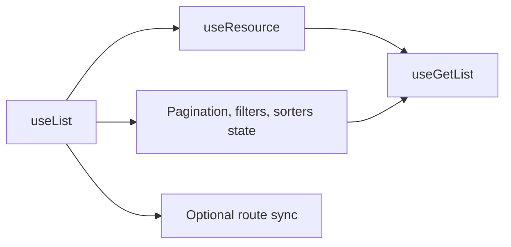

List pages are one of the main reasons controllers exist in Ginjou. A real list screen is usually more than one query. It also owns pagination state, filters, sorters, URL sync, and sometimes infinite loading.

## useList Or useGetList?

Use `useList` when the page wants one controller to own filters, sorters, pagination, and optional route sync.

Use `useGetList` when the page already has its own state model and only needs the low-level query.

| API | Best For | You Manage |
| :--- | :--- | :--- |
| `useList` | Standard list pages | Mostly UI rendering |
| `useGetList` | Custom dashboards or bespoke list logic | All page state explicitly |

## useList

`useList` is the controller for standard index pages.

### Composition

- Resource resolution: `useResource`
- Data composable: `useGetList`
- State: pagination, filters, sorters
- Optional routing: `useGo` and `useLocation`


```mermaid
flowchart LR
    A[useList] --> B[useResource]
    A --> C[Pagination, filters, sorters state]
    B --> D[useGetList]
    C --> D
    A --> E[Optional route sync]
```

### Example

The example below shows a search input, a status filter, server-side sorting, and server-side pagination in one place.

::code-group

```vue [Vue]
<script setup lang="ts">
import { useList } from '@ginjou/vue'
import { ref } from 'vue'

const search = ref('')
const status = ref<'draft' | 'published'>('published')

const {
	records,
	isFetching,
	currentPage,
	perPage,
	pageCount,
	total,
	filters,
	sorters,
} = useList({
	resource: 'posts',
	pagination: {
		current: 1,
		perPage: 10,
	},
	filters: {
		value: [
			{ field: 'status', operator: 'eq', value: status },
		],
	},
	sorters: {
		value: [
			{ field: 'created_at', order: 'desc' },
		],
	},
	syncRoute: true,
})

function applySearch() {
	filters.value = [
		{ field: 'status', operator: 'eq', value: status.value },
		...(search.value
			? [{ field: 'title', operator: 'contains', value: search.value }]
			: []),
	]
	currentPage.value = 1
}

function sortByTitle() {
	sorters.value = [{ field: 'title', order: 'asc' }]
}
</script>

<template>
	<section class="stack">
		<div class="toolbar">
			<input v-model="search" placeholder="Search title">
			<select v-model="status" @change="applySearch">
				<option value="draft">
					Draft
				</option>
				<option value="published">
					Published
				</option>
			</select>
			<button @click="applySearch">
				Apply filters
			</button>
			<button @click="sortByTitle">
				Sort by title
			</button>
		</div>

		<div v-if="isFetching">
			Loading...
		</div>
		<div v-else>
			<p>{{ total }} results</p>
			<ul>
				<li v-for="post in records" :key="post.id">
					{{ post.title }}
				</li>
			</ul>

			<div class="pagination">
				<button :disabled="currentPage <= 1" @click="currentPage -= 1">
					Prev
				</button>
				<span>{{ currentPage }} / {{ pageCount }}</span>
				<button :disabled="currentPage >= pageCount" @click="currentPage += 1">
					Next
				</button>
				<select v-model="perPage">
					<option :value="10">
						10
					</option>
					<option :value="25">
						25
					</option>
					<option :value="50">
						50
					</option>
				</select>
			</div>
		</div>
	</section>
</template>
```

::

That is the main reason to use `useList`: one controller owns the moving parts that would otherwise be spread across the page.

## Searching And Filtering

List search usually becomes one of two patterns:

- one global search input mapped to a single filter such as `q` or `title`
- multiple independent filter controls that are merged into one filter array

`useList` works well for both because the filter state stays local to the page controller.

Use `permanent` filters for business rules that should always apply, such as tenant scope, store scope, or soft-delete rules. Use editable filters for anything the user should be able to change.

## Sorting And Pagination

Sorting and pagination live beside the list data because they are part of the same server conversation.

- `sorters` describe ordered field and direction pairs.
- `currentPage` and `perPage` decide what slice of the resource the backend should return.
- `pageCount` and `total` are derived from the fetcher response.

That means you can keep the view logic small even when the list screen has a lot of table controls.

## Route Sync

Set `syncRoute: true` when the current list state should be reflected in the URL.

This is useful when users need shareable filtered views, predictable back-button behavior, or a refresh-safe admin table.

Ginjou handles the list-level synchronization through its router abstraction. If your application needs custom URL rules beyond that, keep `syncRoute` off and use the framework router directly.

## useInfiniteList

`useInfiniteList` is the controller for load-more and infinite-scroll pages.

### Composition

- Resource resolution: `useResource`
- Data composable: `useGetInfiniteList`
- State: page size, filters, sorters
- Optional routing: the same route-sync model used by `useList`

### Example

::code-group

```vue [Vue]
<script setup lang="ts">
import { useInfiniteList } from '@ginjou/vue'
import { computed } from 'vue'

const { records, hasNextPage, fetchNextPage, isFetching } = useInfiniteList({
	resource: 'posts',
	pagination: {
		perPage: 20,
	},
	filters: {
		mode: 'server',
		value: [
			{ field: 'status', operator: 'eq', value: 'published' },
		],
	},
})

const posts = computed(() => records.value.flat())
</script>

<template>
	<ul>
		<li v-for="post in posts" :key="post.id">
			{{ post.title }}
		</li>
	</ul>
	<button v-if="hasNextPage" :disabled="isFetching" @click="fetchNextPage()">
		Load more
	</button>
</template>
```

::

The raw `records` value is page-shaped by design. Keep it when page boundaries matter. Flatten it only when the UI wants a continuous feed.

## Loading, Empty, And Error States

Treat the list state as three separate concerns:

- loading: the page is waiting for the backend
- empty: the request succeeded, but nothing matched the current filters
- error: the request failed and the user needs retry or recovery guidance

Do not hide those cases behind one fallback paragraph. Lists are the screens users refresh and revisit the most.

## Pagination

The `pagination` option controls how list pages move through large collections. It decides whether paging happens on the backend or in the browser, what page is active, how many records belong to each page, and what fallback page should be used when the screen starts.

### `mode`

`mode` decides where pagination happens.

| Mode | Meaning | Use it when |
| :--- | :--- | :--- |
| `server` | Ginjou sends `current` and `perPage` to the fetcher. | The backend supports paginated queries. This is the default choice for admin lists. |
| `client` | Ginjou keeps page state locally and slices the loaded records in the controller. | The full dataset is already available in memory and you only want local paging in the UI. |
| `off` | Ginjou does not build pagination params for the query. | The page should render the whole collection without paging controls. |

Use `server` by default. Choose `client` only when loading the full result set is intentional. Choose `off` for small collections or screens that should always show everything.

### `current`

`current` is the current active page.

- It tells `useList` which page to request or display.
- When `syncRoute` is enabled, the route value can override the prop value.
- It is useful when the page should open on a specific page number, or when another part of the UI controls the list.

### `perPage`

`perPage` is the page size.

- It defines how many records belong to one page.
- In `server` mode it is passed to the fetcher.
- In `client` mode it is used to slice the local result set.
- It is useful for tables that offer page-size controls such as `10`, `25`, or `50` rows.

### `init`

`init` is the fallback initial page.

- It is used when `current` is not provided.
- It is also the page that `useList` resets to when filters, sorters, or page size change.
- It is useful when the first meaningful page is not `1`, or when a screen should always reset to a custom starting point.

::code-group

```vue [Vue]
<script setup lang="ts">
import { useList } from '@ginjou/vue'

const list = useList({
	resource: 'posts',
	pagination: {
		mode: 'server',
		current: 2,
		perPage: 20,
		init: 1,
	},
})
</script>
```

::

## Filters

The `filters` option controls which records are visible in a list. It can send filter rules to the backend, keep fixed constraints applied at all times, and define how user changes update the current filter set.

### `mode`

`mode` decides whether filters are included in the query.

| Mode | Meaning | Use it when |
| :--- | :--- | :--- |
| `server` | Ginjou sends filters to the fetcher. | The backend knows how to filter data. This is the default choice. |
| `off` | Ginjou does not include filters in the query. | The current screen should ignore list filters, or filtering happens elsewhere. |

Use `server` for most resource lists. Use `off` when the list should not translate UI filters into backend query parameters.

### `value`

`value` is the user-controlled filter state.

- It represents the active filters that change as the user searches, toggles status, or chooses a date range.
- In `useList`, the `filters` result is reactive, so the page can read and update it directly.
- It is useful for search forms, sidebars, quick filters, and toolbar controls.

When `syncRoute` is enabled, filters can also be restored from the URL.

### `permanent`

`permanent` is the fixed filter set.

- It is always appended to the effective filters.
- It is not meant to be removed by normal user interactions.
- It is useful for tenant scoping, role-based visibility, soft-delete exclusions, or any business rule that must always apply.

### `behavior`

`behavior` controls how a new filter value is combined with the previous filter state.

| Behavior | Meaning | Use it when |
| :--- | :--- | :--- |
| `merge` | Ginjou merges the new filters with the previous filters, then resolves them together with `permanent`. This is the default. | The page has multiple independent filter controls, such as search, status, and date range, that should accumulate. |
| `replace` | Ginjou replaces the current user-controlled filters with the new filters, then resolves them together with `permanent`. | A single form submit or preset should define the full active filter state at once. |

You can set a default behavior in `filters.behavior`, and you can also override it per update with `setFilters(value, behavior)`.

This is useful because different screens want different interaction models. Toolbar chips and incremental controls usually work better with `merge`. Advanced search forms usually work better with `replace`.

::code-group

```vue [Vue]
<script setup lang="ts">
import { useList } from '@ginjou/vue'

const list = useList({
	resource: 'posts',
	filters: {
		mode: 'server',
		behavior: 'merge',
		value: [
			{ field: 'status', operator: 'eq', value: 'published' },
		],
		permanent: [
			{ field: 'tenant_id', operator: 'eq', value: 'team-1' },
		],
	},
})

function resetToDraftOnly() {
	list.setFilters([
		{ field: 'status', operator: 'eq', value: 'draft' },
	], 'replace')
}
</script>
```

::

## Sorters

The `sorters` option controls record ordering. It decides whether sort rules are sent to the backend, which order the user currently wants, and which ordering rules must always remain applied.

### `mode`

`mode` decides whether sorters are included in the query.

| Mode | Meaning | Use it when |
| :--- | :--- | :--- |
| `server` | Ginjou sends sorters to the fetcher. | The backend can sort records. This is the default choice. |
| `off` | Ginjou does not include sorters in the query. | The list should keep backend default ordering or sorting happens elsewhere. |

### `value`

`value` is the user-controlled sorter state.

- It represents the current ordering chosen by the page, such as newest first or title ascending.
- In `useList`, the `sorters` result is reactive, so the page can update it from table headers or toolbar actions.
- It is useful for sortable table columns and explicit sort menus.

### `permanent`

`permanent` is the fixed sorter set.

- It is always included in the effective sorters.
- It stays outside normal user control.
- It is useful for stable secondary ordering, such as always adding `id desc` after a primary user-selected sorter.

::code-group

```vue [Vue]
<script setup lang="ts">
import { useList } from '@ginjou/vue'

const list = useList({
	resource: 'posts',
	sorters: {
		mode: 'server',
		value: [
			{ field: 'created_at', order: 'desc' },
		],
		permanent: [
			{ field: 'id', order: 'desc' },
		],
	},
})
</script>
```

::

## Sync With Route

`syncRoute` keeps list state in the URL so a list can survive refreshes, be shared with other users, and restore its state when the page is reopened.

### Default Behavior

When you set `syncRoute: true`, Ginjou syncs these fields by default:

- `currentPage` to `current`
- `perPage` to `perPage`
- `filters` to `filters`
- `sorters` to `sorters`

::code-group

```vue [Vue]
<script setup lang="ts">
import { useList } from '@ginjou/vue'

const list = useList({
	resource: 'posts',
	syncRoute: true,
})
</script>
```

::

### Field-Level Control

You can choose which parts of the list state should sync.

- Set a field to `false` to keep it local.
- Set a field to `true` to keep the default behavior.
- Use this when some state should be shareable in the URL, but other state should remain private to the current page session.

::code-group

```vue [Vue]
<script setup lang="ts">
import { useList } from '@ginjou/vue'

const list = useList({
	resource: 'posts',
	syncRoute: {
		currentPage: true,
		perPage: true,
		filters: false,
		sorters: true,
	},
})
</script>
```

::

### Custom Query Field Names

Each synced field can define a custom query key through `field`.

- This is useful when the URL should match an existing app convention.
- It also helps when you want shorter or more domain-specific query names.

::code-group

```vue [Vue]
<script setup lang="ts">
import { useList } from '@ginjou/vue'

const list = useList({
	resource: 'posts',
	syncRoute: {
		currentPage: { field: 'page' },
		perPage: { field: 'pageSize' },
		filters: { field: 'where' },
		sorters: { field: 'orderBy' },
	},
})
</script>
```

::

### Parse And Stringify

`filters` and `sorters` can also customize how values move between controller state and query strings.

- `parse` transforms the query string into filters or sorters.
- `stringify` transforms filters or sorters back into the query string.
- By default, Ginjou uses `JSON.parse` and `JSON.stringify`.
- This is useful when the app already has a custom URL format.

::code-group

```vue [Vue]
<script setup lang="ts">
import { useList } from '@ginjou/vue'

const list = useList({
	resource: 'posts',
	syncRoute: {
		filters: {
			field: 'where',
			parse: value => JSON.parse(decodeURIComponent(value)),
			stringify: value => encodeURIComponent(JSON.stringify(value)),
		},
		sorters: {
			field: 'orderBy',
			parse: value => JSON.parse(decodeURIComponent(value)),
			stringify: value => encodeURIComponent(JSON.stringify(value)),
		},
	},
})
</script>
```

::

## useList V.S useGetList

This distinction matters.

- `useGetList` gives you the query only.
- `useList` gives you the query plus page state, filter state, sorter state, and optional URL synchronization.

Choose `useGetList` for dashboard widgets and embedded panels. Choose `useList` for full list screens.

## Practical Rule

- Use `useList` for tables, standard index pages, and any screen that needs page numbers or route-aware state.
- Use `useInfiniteList` for feeds, mobile-first lists, or progressive loading screens.
- Use `useGetList` directly when the page is not really a list controller and only needs the query.

## Where To Go Next

- Read [Resources and Routing](/guides/resources) when the list should resolve its resource from the current route.
- Read [Create, Edit, and Show](/guides/form) when the next page flow is create, edit, or detail.
- Read [Realtime Subscriptions](/guides/realtime) when lists should stay fresh automatically.
