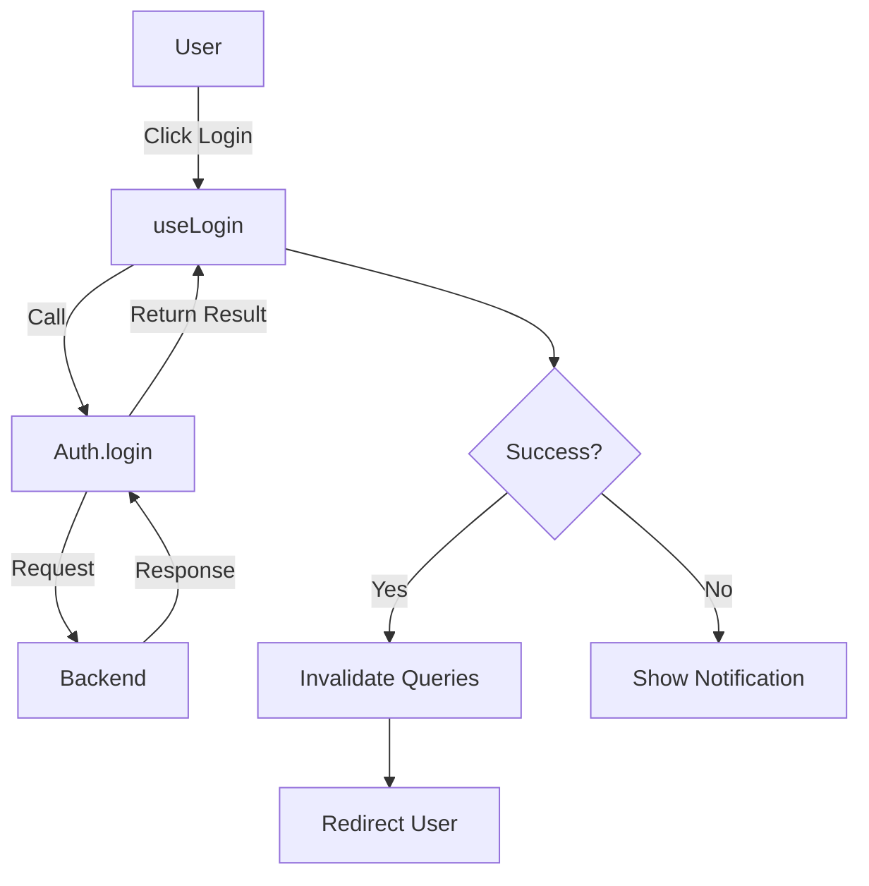

## Auth Provider

Use an `Auth` provider to communicate with your backend. This provider handles login, logout, user identity, and session checks.

The `Auth` interface defines the contract:

```typescript
interface Auth {
	// Sign in the user
	login: (params?: any) => Promise<LoginResult | void>
	// Sign out the user
	logout: (params?: any) => Promise<LogoutResult | void>
	// Check if the user is authenticated
	check: (params?: any) => Promise<CheckAuthResult>
	// Handle API errors (e.g. 401 Unauthorized)
	checkError: (error: any) => Promise<CheckAuthErrorResult>
	// Get user identity (optional)
	getIdentity?: (params?: any) => Promise<GetIdentityResult>
}
```

## Login

Use `useLogin` to handle the sign-in process. This composable manages the mutation state and side effects like redirection.

### Usage

```vue
<script setup lang="ts">
import { useLogin } from '@ginjou/vue'

const { mutate: login, isPending } = useLogin()

function handleSubmit(credentials) {
	login(credentials)
}
</script>
```

### Composition

`useLogin` composes data composables and actions to provide a complete flow.

-   **Data Composables**: Uses `useMutation` (TanStack Query) to manage the request state.
-   **Actions**: Calls `auth.login` from your provider.
-   **Success Flow**:
    -   **Mutation On Success**: Invalidates the `auth` query to update the UI.
    -   **Composable On Success**: Redirects the user to the dashboard or the page they were trying to access.



## Logout

Use `useLogout` to sign out the user.

### Usage

```vue
<script setup lang="ts">
import { useLogout } from '@ginjou/vue'

const { mutate: logout } = useLogout()
</script>
```

### Composition

-   **Data Composables**: Uses `useMutation`.
-   **Actions**: Calls `auth.logout`.
-   **Success Flow**:
    -   **Mutation On Success**: Clears user data from the cache.
    -   **Composable On Success**: Redirects the user to the login page.

## Check Auth

Use `useAuthenticated` to check if the current user is logged in. This is often used to protect routes or show/hide UI elements.

### Usage

```vue
<script setup lang="ts">
import { useAuthenticated } from '@ginjou/vue'

const { data, isLoading } = useAuthenticated()
</script>
```

### Composition

-   **Data Composables**: Uses `useQuery` to fetch authentication status.
-   **Actions**: Calls `auth.check`.

::note
Authentication status is cached using TanStack Query. This ensures that repeated checks (e.g., across multiple components or route guards) do not trigger redundant API requests.
::

## Identity

Use `useGetIdentity` to fetch the current user's profile information (e.g. name, avatar, rules).

### Usage

```vue
<script setup lang="ts">
import { useGetIdentity } from '@ginjou/vue'

const { data: identity } = useGetIdentity()
</script>
```

### Composition

-   **Data Composables**: Uses `useQuery` to fetch identity data.
-   **Actions**: Calls `auth.getIdentity`.

## Check Error

Use `useCheckError` to automatically handle API errors. This is usually triggered when an API returns an error (like 401 Unauthorized) to determine if the user should be logged out.

### Usage

```vue
<script setup lang="ts">
import { useCheckError } from '@ginjou/vue'

const { mutate: checkError } = useCheckError()

// Example usage within a query error handler
function handleQueryError(error) {
	checkError({ error })
}
</script>
```

### Composition

-   **Data Composables**: Uses `useMutation`.
-   **Actions**: Calls `auth.checkError`.
-   **Success Flow**:
    -   **Composable On Success**: If the error confirms the session is invalid, it may trigger `logout` automatically.
