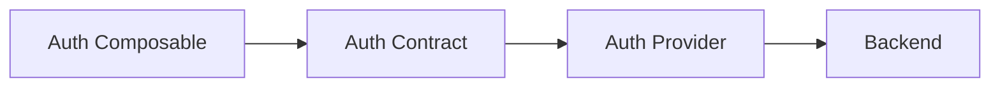

Ginjou can work with almost any authentication system, whether it is session-based, JWT-based, or backed by a third-party service.

The only requirement is an auth provider that implements the auth contract.


```mermaid
flowchart LR
	A[Auth Composable] --> B[Auth Contract]
	B --> C[Auth Provider]
	C --> D[Backend]
```

## Auth Context

Auth context is the entry point for all auth composables.

It provides one auth object for the app, and that object follows the Ginjou auth contract. Once the provider is registered, the rest of the app can stay on the normal Ginjou hooks instead of calling the auth backend directly.

### Interface

::code-group

```ts [Auth]
interface Auth {
	login: (params?: any) => Promise<{
		redirectTo?: false | string | { to: string, type?: string }
		ignoreInvalidate?: boolean
	} | void>

	logout: (params?: any) => Promise<{
		redirectTo?: false | string | { to: string, type?: string }
		ignoreInvalidate?: boolean
	} | void>

	check: (params?: any) => Promise<{
		authenticated: boolean
	}>

	checkError: (error: unknown) => Promise<{
		redirectTo?: false | string | { to: string, type?: string }
		logout?: boolean
		error?: unknown
	}>

	getIdentity?: (params?: any) => Promise<unknown | null>
}
```

::

### Methods

| Method | Required | What it does |
| --- | --- | --- |
| `login` | Yes | Sign in the user. |
| `logout` | Yes | Sign out the user. |
| `check` | Yes | Return the current authentication state. |
| `checkError` | Yes | Turn request errors into auth decisions such as logout or redirect. |
| `getIdentity` | No | Return the current user identity. |

A simple app can start with mock logic or local storage and switch to a real backend later.

::code-group

```vue [Vue]
<script setup lang="ts">
import { defineAuth } from '@ginjou/core'
import { defineAuthContext } from '@ginjou/vue'

defineAuthContext(defineAuth({
	async login(params?: { email: string, password: string }) {
		localStorage.setItem('token', 'demo-token')
		return {
			redirectTo: '/',
		}
	},
	async logout() {
		localStorage.removeItem('token')
		return {
			redirectTo: '/login',
		}
	},
	async check() {
		return {
			authenticated: !!localStorage.getItem('token'),
		}
	},
	async checkError(error: any) {
		if (error?.status === 401) {
			return {
				logout: true,
				error,
			}
		}

		return {}
	},
	async getIdentity() {
		return {
			id: 1,
			name: 'Demo User',
		}
	},
}))
</script>
```

::

## Login

`useLogin` is the mutation composable for `auth.login`.

Use it for sign-in forms and any flow that creates a session.

It returns `useMutation` of TanStack Query with some extra.

| Extra | Meaning |
| --- | --- |
| `mutate` | Wrapped login trigger with provider-defined params. |
| `mutateAsync` | Async login trigger with provider-defined params. |

The params shape is intentionally open, so each provider can define its own login input.

### Result

The auth result can return these fields.

| Result field | Meaning |
| --- | --- |
| `redirectTo` | Where to go after success. The default is `/`. Use `false` to skip the redirect. |
| `ignoreInvalidate` | Skip automatic auth query invalidation. |

By default, successful login invalidates auth-related queries and then redirects with `replace` navigation to `/`.

### Error Handler

If `auth.login` throws an error, `useLogin` shows the normal login error notification. If that error object contains `redirectTo`, Ginjou also runs a redirect. This flow does not call `checkError`, because a failed sign-in belongs to the login flow, not to session recovery.

::code-group

```vue [Vue]
<script setup lang="ts">
import { useLogin } from '@ginjou/vue'
import { reactive } from 'vue'

const formData = reactive({
	email: '',
	password: '',
})

const { mutateAsync } = useLogin<{ email: string, password: string }>()

async function submit() {
	await mutateAsync({
		email: formData.email,
		password: formData.password,
	})
}
</script>

<template>
	<form @submit.prevent="submit">
		<input v-model="formData.email" type="email">
		<input v-model="formData.password" type="password">
		<button :disabled="isPending">
			{{ isPending ? 'Signing in...' : 'Login' }}
		</button>
	</form>
</template>
```

::

## Logout

`useLogout` is the mutation composable for `auth.logout`.

Use it when the page or layout should actively end the current session.

It returns `useMutation` of TanStack Query with some extra.

| Extra | Meaning |
| --- | --- |
| `mutate` | Wrapped logout trigger with provider-defined params. |
| `mutateAsync` | Async logout trigger with provider-defined params. |

Its params shape is open for the same reason as login.

### Result

The auth result can return these fields.

| Result field | Meaning |
| --- | --- |
| `redirectTo` | Where to go after success. The default is `/login`. Use `false` to skip the redirect. |
| `ignoreInvalidate` | Skip automatic auth query invalidation. |

The default logout redirect uses a push navigation to `/login`.

### Error Handler

If `auth.logout` throws an error, `useLogout` shows the normal logout error notification. If that error object contains `redirectTo`, Ginjou also runs a redirect. This flow also does not call `checkError`.

::code-group

```vue [Vue]
<script setup lang="ts">
import { useLogout } from '@ginjou/vue'

const { mutateAsync, isPending } = useLogout()

async function submit() {
	await mutateAsync()
}
</script>

<template>
	<button :disabled="isPending" @click="submit">
		{{ isPending ? 'Signing out...' : 'Logout' }}
	</button>
</template>
```

::

## Authenticated

`useAuthenticated` wraps `auth.check`.

Use it when the page only needs to know whether the user is signed in. It fits guards, protected layouts, and app boot flows.

It returns `useQuery` of TanStack Query.

| Field | Meaning |
| --- | --- |
| `data?.authenticated` | Whether the current session is valid. |

In most cases, `data?.authenticated` is the only value the page needs. This hook only calls `auth.check`. It does not load identity data, and it does not use `checkError`.

::code-group

```vue [Vue]
<script setup lang="ts">
import { useAuthenticated } from '@ginjou/vue'

const { isLoading, data } = useAuthenticated()
</script>

<template>
	<div v-if="isLoading">
		Checking session...
	</div>
	<div v-else-if="data?.authenticated">
		Signed in
	</div>
	<div v-else>
		Signed out
	</div>
</template>
```

::

## Error Handling

`useCheckError` wraps `auth.checkError`.

Use it when a request fails and you need to know whether the problem is really an auth problem, such as an expired session or an invalid token.

The auth result can return these fields.

| Result field | Meaning |
| --- | --- |
| `logout` | Log the user out. |
| `redirectTo` | Redirect to another route. Use `false` to stay on the current page. |
| `error` | Return an error payload from the provider. |

If `auth.checkError` returns `logout: true`, Ginjou logs the user out. If it returns `redirectTo`, Ginjou navigates there. If it returns neither, the request stays in the normal error flow.

Most built-in data query and mutation composables already call `useCheckError` for you. You usually call it yourself only when you are making a custom request outside those hooks.

::code-group

```vue [Vue]
<script setup lang="ts">
import { useCheckError } from '@ginjou/vue'

const { mutateAsync } = useCheckError()

async function loadCustomData() {
	try {
		throw new ResponseError({ status: 401 })
	}
	catch (error) {
		await mutateAsync(error)
	}
}
</script>
```

::

## Identity

`useGetIdentity` wraps `auth.getIdentity`.

Use it when the UI needs current user data, such as a header menu, avatar, or profile card. `useAuthenticated` tells you whether a valid session exists. `useGetIdentity` tells you who that session belongs to.

It returns `useQuery` of TanStack Query.

| Field | Meaning |
| --- | --- |
| `data` | Current user data returned by `auth.getIdentity`. |

This hook only calls `auth.getIdentity`. It does not use `checkError`. Because `getIdentity` is optional in the auth contract, the query only runs when the provider implements it.

::code-group

```vue [Vue]
<script setup lang="ts">
import { useGetIdentity } from '@ginjou/vue'

const { isLoading, data } = useGetIdentity<{ id: number, name: string }>()
</script>

<template>
	<div v-if="isLoading">
		Loading profile...
	</div>
	<div v-else-if="data">
		{{ data.name }}
	</div>
</template>
```

::

## Official Adapters

Backend packages connect real services to the same auth contract.

If your backend already matches one of the official adapters, start there before writing a custom auth provider.

:::card-group

::card
---
title: Directus
icon: i-simple-icons-directus
to: /backend/directus
---
`@ginjou/with-directus` connects Directus Auth to Ginjou's auth contract.
::

::card
---
title: Supabase
icon: i-logos-supabase-icon
to: /backend/supabase
---
`@ginjou/with-supabase` connects Supabase Auth to Ginjou's auth contract.
::

:::
