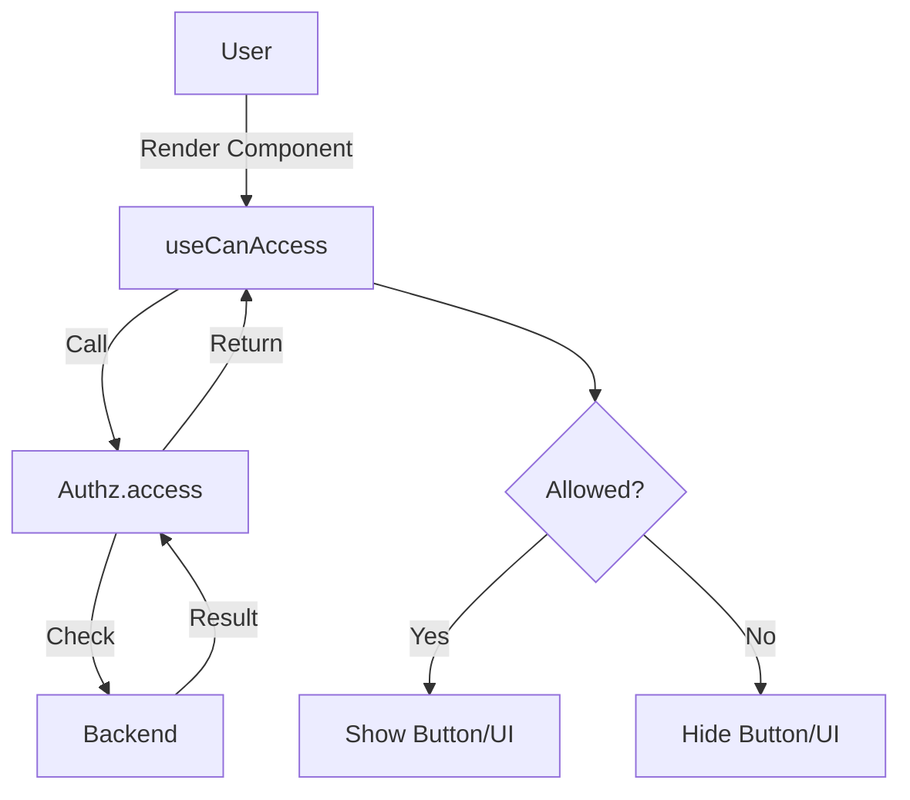
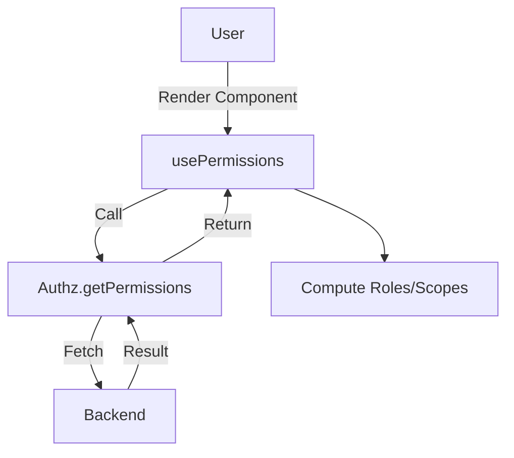

## Authz Provider

The `Authz` (Authorization) provider defines and enforces the access control policies for your application. It manages both fine-grained action checks and high-level permission retrieval.

The `Authz` interface defines the contract:

```typescript
interface Authz {
	// Check if an action is allowed
	access?: (params: AccessCanParams) => Promise<AccessCanResult>
	// Get all permissions (optional)
	getPermissions?: (params?: any) => Promise<GetPermissionsResult>
}
```

## Can Access

Use `useCanAccess` to check if the current user is allowed to perform a specific action on a resource. This is useful for conditionally rendering UI elements like "Edit" or "Delete" buttons.

### Usage

```vue
<script setup lang="ts">
import { useCanAccess } from '@ginjou/vue'

const { data: canAccess } = useCanAccess({
	resource: 'posts',
	action: 'edit',
	params: { id: 1 }
})
</script>

<template>
	<button v-if="canAccess?.can">
		Edit Post
	</button>
</template>
```

### Composition

-   **Data Composables**: Uses `useQuery` to fetch the access result.
-   **Actions**: Calls `authz.access`.



## Permissions

Use `usePermissions` to fetch the raw list of permissions (e.g. roles, scopes) associated with the current user.

### Usage

```vue
<script setup lang="ts">
import { usePermissions } from '@ginjou/vue'

const { data: permissions, isLoading } = usePermissions<string[]>()
</script>

<template>
	<template v-if="permissions == null || isLoading">
		Loading ...
	</template>
	<template v-else>
		Permissions: {{ permissions }}
	</template>
</template>
```

### Composition

-   **Data Composables**: Uses `useQuery` to fetch permissions.
-   **Actions**: Calls `authz.getPermissions`.


