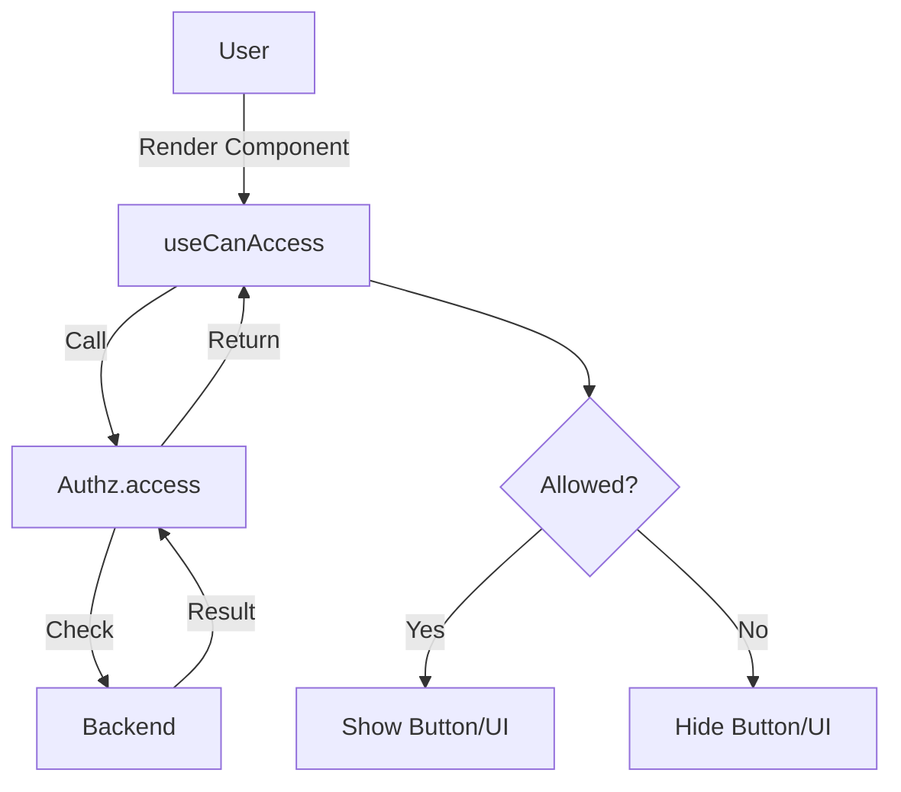
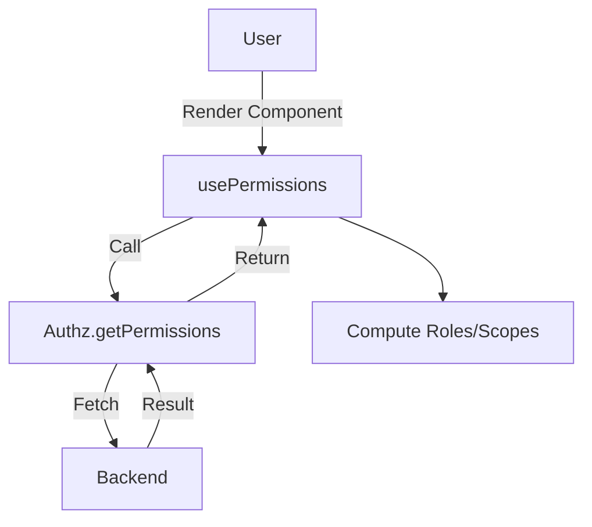

## Authz Provider

The `Authz` (Authorization) provider defines and enforces the access control policies for your application. It manages both fine-grained action checks and high-level permission retrieval.

The `Authz` interface defines the contract:

```typescript
interface Authz {
	// Check if an action is allowed
	access?: (params: AccessCanParams) => Promise<AccessCanResult>
	// Get all permissions (optional)
	getPermissions?: (params?: any) => Promise<GetPermissionsResult>
}
```

## Can Access

Use `useCanAccess` to check if the current user is allowed to perform a specific action on a resource. This is useful for conditionally rendering UI elements like "Edit" or "Delete" buttons.

### Usage

```vue
<script setup lang="ts">
import { useCanAccess } from '@ginjou/vue'

const { data: canAccess } = useCanAccess({
	resource: 'posts',
	action: 'edit',
	params: { id: 1 }
})
</script>

<template>
	<button v-if="canAccess?.can">
		Edit Post
	</button>
</template>
```

### Composition

-   **Data Composables**: Uses `useQuery` to fetch the access result.
-   **Actions**: Calls `authz.access`.



### Understanding `params`

The `params` object passed to `useCanAccess` provides context for the access check:

| Param | Type | Purpose | Example |
|-------|------|---------|---------|
| `resource` | `string` | The resource being accessed | `'posts'`, `'users'` |
| `action` | `string` | The action to perform | `'edit'`, `'delete'`, `'create'` |
| `params` | `object` | Context-specific parameters | `{ id: 1, userId: 2 }` |

**Common param patterns:**

```typescript
// Resource + ID (most common)
useCanAccess({ resource: 'posts', action: 'edit', params: { id: 123 } })

// Multiple context parameters
useCanAccess({
	resource: 'comments',
	action: 'edit',
	params: { id: 1, postId: 5, authorId: 2 }
})

// Ownership check (does current user own this resource?)
useCanAccess({
	resource: 'posts',
	action: 'delete',
	params: { id: 123, ownerId: currentUser.id }
})
```

### Authorization Patterns

**Pattern 1: Role-Based Access Control (RBAC)**

```typescript
const authz = {
	access: async ({ resource, action, params }) => {
		const user = await getCurrentUser()
		const permissions = {
			admin: ['create', 'read', 'edit', 'delete'],
			editor: ['create', 'read', 'edit'],
			viewer: ['read'],
		}
		return {
			can: permissions[user.role]?.includes(action),
		}
	},
}
```

**Pattern 2: Permission-Based Access Control (PBAC)**

```typescript
const authz = {
	access: async ({ resource, action, params }) => {
		const user = await getCurrentUser()
		const requiredPermission = `${resource}:${action}`
		return {
			can: user.permissions.includes(requiredPermission),
		}
	},
}
```

**Pattern 3: Resource-Ownership Check**

```typescript
const authz = {
	access: async ({ resource, action, params }) => {
		if (resource === 'posts' && action === 'edit') {
			const post = await getPost(params.id)
			const user = await getCurrentUser()
			return {
				can: post.authorId === user.id,
			}
		}
		return { can: false }
	},
}
```

**Pattern 4: Time-Based Access**

```typescript
const authz = {
	access: async ({ resource, action, params }) => {
		const user = await getCurrentUser()
		const businessHours = new Date().getHours() >= 9 && new Date().getHours() <= 17
		
		return {
			can: action === 'read' || (action === 'edit' && businessHours),
		}
	},
}
```

**Pattern 5: Attribute-Based Access Control (ABAC)**

```typescript
const authz = {
	access: async ({ resource, action, params }) => {
		const user = await getCurrentUser()
		const resource = await getResource(params.id)
		
		return {
			can: (
				user.department === resource.department &&
				['read', 'edit'].includes(action)
			),
		}
	},
}
```

### Combining Multiple Checks

```vue
<script setup lang="ts">
import { useCanAccess } from '@ginjou/vue'

const { data: canEdit } = useCanAccess({
	resource: 'posts',
	action: 'edit',
	params: { id: postId },
})

const { data: canDelete } = useCanAccess({
	resource: 'posts',
	action: 'delete',
	params: { id: postId },
})
</script>

<template>
	<div>
		<button v-if="canEdit?.can" @click="editPost">
			Edit
		</button>
		<button v-if="canDelete?.can" @click="deletePost">
			Delete
		</button>
	</div>
</template>
```

## Permissions

Use `usePermissions` to fetch the raw list of permissions (e.g. roles, scopes) associated with the current user.

### Usage

```vue
<script setup lang="ts">
import { usePermissions } from '@ginjou/vue'

const { data: permissions, isLoading } = usePermissions<string[]>()
</script>

<template>
	<template v-if="permissions == null || isLoading">
		Loading ...
	</template>
	<template v-else>
		Permissions: {{ permissions }}
	</template>
</template>
```

### Composition

-   **Data Composables**: Uses `useQuery` to fetch permissions.
-   **Actions**: Calls `authz.getPermissions`.


