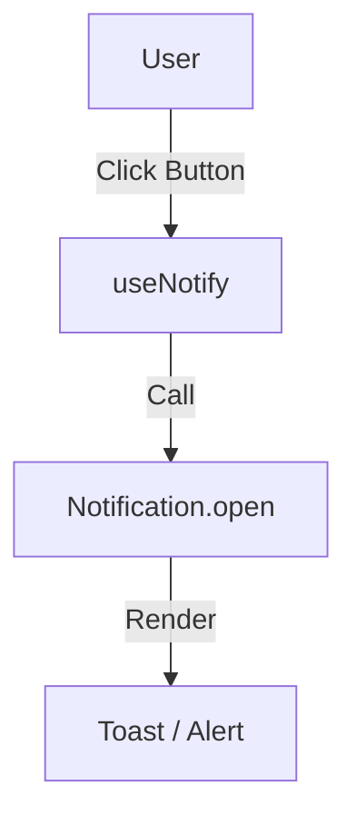

## Notification Provider

Use a `Notification` provider to show alerts and messages in your app. This provider handles opening and closing notification UI elements (like toasts or snackbars).

The `Notification` interface defines the contract:

```typescript
interface Notification {
	// Open a notification
	open: (params: OpenNotificationParams) => void
	// Close a notification by its unique key
	close: (key: string) => void
}
```

## Notify

Use `useNotify` to trigger notifications from your components. It supports different types of alerts, including success, error, and progress.

### Usage

::code-group
---
sync: guide-example
---

```vue [vue]
<script setup lang="ts">
import { useNotify } from '@ginjou/vue'

const notify = useNotify()

function handleSave() {
	notify({
		type: 'success',
		message: 'Post saved successfully!',
		description: 'Your changes are now live.',
	})
}
</script>

<template>
	<button @click="handleSave">
		Save
	</button>
</template>
```

```svelte [svelte]
<!-- WIP -->
<script>
  // ...
</script>
```

::

### Composition

-   **Actions**: Calls `notification.open` from your provider.



## Progress Notifications

Progress notifications are useful for long-running tasks. They include a timeout and callbacks for completion or cancellation.

::code-group
---
sync: guide-example
---

```vue [vue]
<script setup lang="ts">
import { useNotify } from '@ginjou/vue'

const notify = useNotify()

function startUpload() {
	notify({
		type: 'progress',
		message: 'Uploading file...',
		timeout: 5000,
		onFinish: () => console.log('Upload complete'),
		onCancel: () => console.log('Upload cancelled'),
	})
}
</script>
```

```svelte [svelte]
<!-- WIP -->
<script>
  // ...
</script>
```

::
