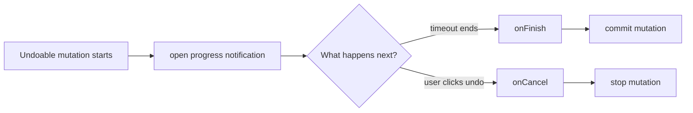

Ginjou can work with any notification UI.

The notification contract is small. You only need to open a notification and close it by key.

Once a provider is registered, auth and data composables can reuse the same API for success, error, and undoable progress messages.

Built-in auth and data composables use `notify` like this.

| Composables | Notify |
| --- | --- |
| `useLogin`, `useLogout` | Error ✅<br> Success ❌<br> Progress ❌ |
| `useCreateOne`, `useCreateMany`, `useCustomMutation` | Error ✅<br> Success ✅<br> Progress ❌ |
| `useUpdateOne`, `useUpdateMany`, `useDeleteOne`, `useDeleteMany` | Error ✅<br> Success ✅<br> Progress ✅ |
| `useGetOne`, `useGetList`, `useGetMany`, `useGetInfiniteList`, `useCustom` | Error ✅<br> Success ❌<br> Progress ❌ |

Progress notifications only appear when the mutation mode is `undoable`.

## Notification Context

Notification context is the entry point for notifications. It provides one notification object for the app, and `useNotify` uses the same contract for manual messages.

### Interface

::code-group

```ts [Notification]
interface Notification {
	open: (
		params:
			| {
				type: 'success' | 'error'
				message: string
				description?: string
				key?: string
			}
			| {
				type: 'progress'
				message: string
				description?: string
				key?: string
				timeout: number
				onFinish: () => void
				onCancel: () => void
			}
	) => void
	close: (key: string) => void
}
```

::

### Methods

| Method | When it is used | What it receives |
| --- | --- | --- |
| `open` with `success` or `error` | Show a normal final message. | `type`, `message`, optional `description`, optional `key` |
| `open` with `progress` | Show an undoable waiting message. | `type: 'progress'`, `message`, optional `description`, optional `key`, `timeout`, `onFinish`, `onCancel` |
| `close` | Remove an active notification. | `key` |

`key` connects `open` and `close`. Ginjou decides when these methods are called, and your UI library decides how the notification looks.

In most apps, `open` handles almost everything. `close` matters when the UI needs to remove a keyed notification, such as an undoable progress message.

A minimal setup can be as simple as this.

::code-group
---
sync: guide-example
---

```vue [Vue]
<script setup lang="ts">
import { defineNotification } from '@ginjou/core'
import { defineNotificationContext } from '@ginjou/vue'

defineNotificationContext(defineNotification({
	open(params) {
		console.log('open notification', params)
	},
	close(key) {
		console.log('close notification', key)
	},
}))
</script>
```

```svelte [Svelte]
<script lang="ts">
import { defineNotification } from '@ginjou/core'
import { defineNotificationContext } from '@ginjou/svelte'

defineNotificationContext(defineNotification({
	open(params) {
		console.log('open notification', params)
	},
	close(key) {
		console.log('close notification', key)
	},
}))
</script>
```

::

## Success / Error

Success notifications usually come after successful write mutations. Error notifications are used for failed auth mutations, failed data mutations, and some query errors.

For built-in data composables, auth error handling still runs first. After that, notifications become the user-facing feedback.

When you need custom text, return notification params from `successNotify` or `errorNotify`. When you need a one-off message outside built-in flows, call `useNotify` directly.

This example uses the default message.

::code-group
---
sync: guide-example
---

```vue [Vue]
<script setup lang="ts">
import { useCreateOne } from '@ginjou/vue'
import { reactive } from 'vue'

const formData = reactive({
	title: '',
})

const { mutateAsync, isPending } = useCreateOne()

async function submit() {
	await mutateAsync({
		resource: 'posts',
		params: {
			title: formData.title,
		},
	})
}
</script>

<template>
	<form @submit.prevent="submit">
		<input v-model="formData.title">
		<button :disabled="isPending">
			{{ isPending ? 'Saving...' : 'Create post' }}
		</button>
	</form>
</template>
```

```svelte [Svelte]
<script lang="ts">
import { useCreateOne } from '@ginjou/svelte'

let title = $state('')

const { mutateAsync, isPending } = useCreateOne()

async function submit(e: SubmitEvent) {
	e.preventDefault()
	await mutateAsync({
		resource: 'posts',
		params: { title },
	})
}
</script>

<form onsubmit={submit}>
	<input bind:value={title}>
	<button disabled={isPending}>
		{isPending ? 'Saving...' : 'Create post'}
	</button>
</form>
```

::

This example customizes the message.

::code-group
---
sync: guide-example
---

```vue [Vue]
<script setup lang="ts">
import { NotificationType } from '@ginjou/core'
import { useCreateOne } from '@ginjou/vue'
import { reactive } from 'vue'

const formData = reactive({
	title: '',
})

const { mutateAsync } = useCreateOne({
	successNotify(data, props) {
		return {
			type: NotificationType.Success,
			message: `Created ${props.resource}`,
			description: `New record id: ${data.id}`,
		}
	},
	errorNotify(_error, props) {
		return {
			type: NotificationType.Error,
			message: `Could not create ${props.resource}`,
			description: 'Please review the form and try again.',
		}
	},
})

async function submit() {
	await mutateAsync({
		resource: 'posts',
		params: {
			title: formData.title,
		},
	})
}
</script>
```

```svelte [Svelte]
<script lang="ts">
import { NotificationType } from '@ginjou/core'
import { useCreateOne } from '@ginjou/svelte'

let title = $state('')

const { mutateAsync } = useCreateOne({
	successNotify(data, props) {
		return {
			type: NotificationType.Success,
			message: `Created ${props.resource}`,
			description: `New record id: ${data.id}`,
		}
	},
	errorNotify(_error, props) {
		return {
			type: NotificationType.Error,
			message: `Could not create ${props.resource}`,
			description: 'Please review the form and try again.',
		}
	},
})

async function submit() {
	await mutateAsync({
		resource: 'posts',
		params: { title },
	})
}
</script>
```

::

This example uses `useNotify` directly.

::code-group
---
sync: guide-example
---

```vue [Vue]
<script setup lang="ts">
import { NotificationType } from '@ginjou/core'
import { useNotify } from '@ginjou/vue'

const notify = useNotify()

function showSavedMessage() {
	notify({
		type: NotificationType.Success,
		message: 'Draft saved',
		description: 'You can keep editing or publish later.',
	})
}
</script>

<template>
	<button @click="showSavedMessage">
		Show success message
	</button>
</template>
```

```svelte [Svelte]
<script lang="ts">
import { NotificationType } from '@ginjou/core'
import { useNotify } from '@ginjou/svelte'

const notify = useNotify()

function showSavedMessage() {
	notify({
		type: NotificationType.Success,
		message: 'Draft saved',
		description: 'You can keep editing or publish later.',
	})
}
</script>

<button onclick={showSavedMessage}>
	Show success message
</button>
```

::

## Progress / Undoable

Progress notifications are only for undoable mutations. They show the waiting window before the mutation is committed.


```mermaid
flowchart LR
	A[Undoable mutation starts] --> B[open progress notification]
	B --> C{What happens next?}
	C -- timeout ends --> D[onFinish]
	D --> E[commit mutation]
	C -- user clicks undo --> F[onCancel]
	F --> G[stop mutation]
```

This flow is used by:

- `useUpdateOne`
- `useUpdateMany`
- `useDeleteOne`
- `useDeleteMany`

This is the smallest setup. `mutationMode: MutationMode.Undoable` is enough to open the built-in progress notification and use the default `undoableTimeout`.

::code-group
---
sync: guide-example
---

```vue [Vue]
<script setup lang="ts">
import { MutationMode } from '@ginjou/core'
import { useUpdateOne } from '@ginjou/vue'

const { mutate, isPending } = useUpdateOne({
	mutationMode: MutationMode.Undoable,
})

function archivePost() {
	mutate({
		resource: 'posts',
		id: 1,
		params: {
			status: 'archived',
		},
	})
}
</script>

<template>
	<button :disabled="isPending" @click="archivePost">
		Archive with undo
	</button>
</template>
```

```svelte [Svelte]
<script lang="ts">
import { MutationMode } from '@ginjou/core'
import { useUpdateOne } from '@ginjou/svelte'

const { mutate, isPending } = useUpdateOne({
	mutationMode: MutationMode.Undoable,
})

function archivePost() {
	mutate({
		resource: 'posts',
		id: 1,
		params: {
			status: 'archived',
		},
	})
}
</script>

<button disabled={isPending} onclick={archivePost}>
	Archive with undo
</button>
```

::

Use a custom `undoableTimeout` when the user needs a longer undo window. This example changes the timeout from the default `5000` milliseconds to `8000`.

::code-group
---
sync: guide-example
---

```vue [Vue]
<script setup lang="ts">
import { MutationMode } from '@ginjou/core'
import { useUpdateOne } from '@ginjou/vue'

const { mutate, isPending } = useUpdateOne({
	mutationMode: MutationMode.Undoable,
	undoableTimeout: 8000,
})

function publishPost() {
	mutate({
		resource: 'posts',
		id: 1,
		params: {
			status: 'published',
		},
	})
}
</script>

<template>
	<button :disabled="isPending" @click="publishPost">
		Publish with undo
	</button>
</template>
```

```svelte [Svelte]
<script lang="ts">
import { MutationMode } from '@ginjou/core'
import { useUpdateOne } from '@ginjou/svelte'

const { mutate, isPending } = useUpdateOne({
	mutationMode: MutationMode.Undoable,
	undoableTimeout: 8000,
})

function publishPost() {
	mutate({
		resource: 'posts',
		id: 1,
		params: {
			status: 'published',
		},
	})
}
</script>

<button disabled={isPending} onclick={publishPost}>
	Publish with undo
</button>
```

::

Use `useNotify` directly when the progress message is not tied to a built-in mutation, but you still want the same undoable notification pattern.

::code-group
---
sync: guide-example
---

```vue [Vue]
<script setup lang="ts">
import { NotificationType } from '@ginjou/core'
import { useNotify } from '@ginjou/vue'

const notify = useNotify()

function showUndoableMessage() {
	notify({
		type: NotificationType.Progress,
		message: 'Post will be archived',
		description: 'Undo before the timer ends.',
		timeout: 5000,
		onFinish() {
			console.log('finish mutation')
		},
		onCancel() {
			console.log('cancel mutation')
		},
	})
}
</script>

<template>
	<button @click="showUndoableMessage">
		Show progress message
	</button>
</template>
```

```svelte [Svelte]
<script lang="ts">
import { NotificationType } from '@ginjou/core'
import { useNotify } from '@ginjou/svelte'

const notify = useNotify()

function showUndoableMessage() {
	notify({
		type: NotificationType.Progress,
		message: 'Post will be archived',
		description: 'Undo before the timer ends.',
		timeout: 5000,
		onFinish() {
			console.log('finish mutation')
		},
		onCancel() {
			console.log('cancel mutation')
		},
	})
}
</script>

<button onclick={showUndoableMessage}>
	Show progress message
</button>
```

::
