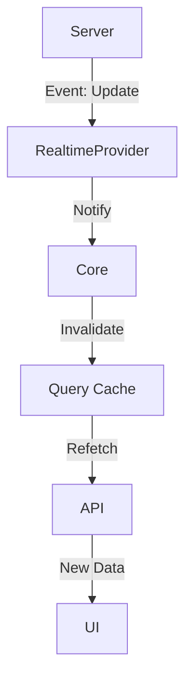
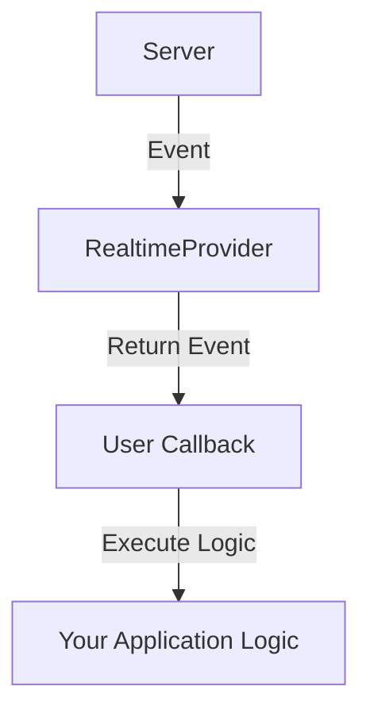

## Realtime Provider

Use a `Realtime` provider to enable instant updates in your application. This provider handles subscriptions to events (like record creation, updates, or deletions) and publishing custom events.

The `Realtime` interface defines the contract:

```typescript
interface Realtime {
	// Subscribe to updates
	subscribe: (props: SubscribeProps) => UnsubscribeFn
	// Unsubscribe from updates (optional)
	unsubscribe?: (props: UnsubscribeProps) => void
	// Publish a custom event (optional)
	publish?: (event: RealtimeEvent) => void
}
```

## Modes

There are two main ways to handle realtime events: **Auto** and **Manual**.

### Auto Mode

In `auto` mode, the framework automatically invalidates related queries when an event is received. For example, if a "post" is updated on the server, any active `useGetList` or `useGetOne` queries for that post will be refetched.



### Manual Mode

In `manual` mode, you handle the event yourself in a callback. This provides total control over how the UI responds to changes.



## Subscribe

Use `useSubscribe` to listen for events on a specific channel or resource.

### Usage

```vue
<script setup lang="ts">
import { useSubscribe } from '@ginjou/vue'

useSubscribe({
	channel: 'resources/posts',
	actions: ['created', 'updated', 'deleted'],
	callback: (event) => {
		console.log('Realtime event received:', event)
	},
})
</script>
```

### Composition

-   **Actions**: Registers a subscription via `realtime.subscribe`.

## Publish

Use `usePublish` to send custom events to other users or components.

### Usage

```vue
<script setup lang="ts">
import { usePublish } from '@ginjou/vue'

const publish = usePublish()

function handleInterraction() {
	publish({
		channel: 'collaboration',
		type: 'cursor_move',
		payload: { x: 100, y: 200 },
	})
}
</script>
```
