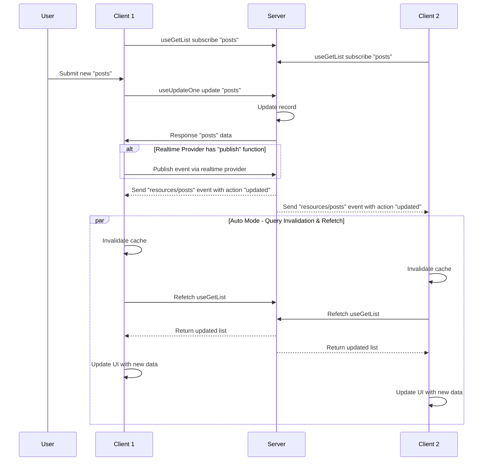

## Realtime Provider

Use a `Realtime` provider to enable instant updates in your application. This provider handles subscriptions to events (like record creation, updates, or deletions) and publishing custom events.

The `Realtime` interface defines the contract:

```typescript
interface Realtime {
	// Subscribe to updates
	subscribe: (props: SubscribeProps) => UnsubscribeFn
	// Unsubscribe from updates (optional)
	unsubscribe?: (props: UnsubscribeProps) => void
	// Publish a custom event (optional)
	publish?: (event: RealtimeEvent) => void
}
```

## Modes

There are two main ways to handle realtime events: **Auto** and **Manual**.

| Mode | How It Works | When to Use |
|------|-------------|-----------|
| **Auto** | Framework automatically invalidates queries and refetches data | Most common - reduces boilerplate code |
| **Manual** | You handle events in callbacks with full control | Complex logic - conditional updates, multiple actions |

### Auto Mode

In `auto` mode, the framework automatically invalidates related queries when an event is received. For example, if a "post" is updated on the server, any active `useGetList` or `useGetOne` queries for that post will be refetched automatically.

**Scenario:** Real-time collaborative editor where multiple users edit the same document.

::code-group
```vue [Vue]
<script setup lang="ts">
import { useGetOne } from '@ginjou/vue'

// Auto mode (default)
const { data: post } = useGetOne({
	resource: 'posts',
	id: '123',
})

// When another user updates this post on server:
// 1. Event is received
// 2. Query cache is invalidated
// 3. useGetOne automatically refetches
// 4. UI updates with latest data
</script>

<template>
	<div>
		<h1>{{ post?.title }}</h1>
		<p>Last updated: {{ post?.updatedAt }}</p>
	</div>
</template>
```
```svelte [Svelte]
<!-- WIP -->
<script>
  // ...
</script>
```
::

### Manual Mode

In `manual` mode, you handle the event yourself in a callback. This provides total control over how the UI responds to changes.

::code-group
```vue [Vue]
<script setup lang="ts">
import { GetOne, RealtimeMode } from '@ginjou/core'
import { useGetOne, useQueryClientContext } from '@ginjou/vue'

const queryClient = useQueryClientContext()
const { data: post } = useGetOne({
	resource: 'posts',
	id: '123',
	realtime: {
		mode: RealtimeMode.Manual,
		callback: (event) => {
			console.log(event) // { channel: "resources/posts", action: "updated", payload: { ids: ["123"] }, date: new Date(), meta: { fetcherName: "default" }
		},
	}
})
</script>

<template>
	<div>
		<h1>{{ post?.title }}</h1>
		<p>Last updated: {{ post?.updatedAt }}</p>
	</div>
</template>
```

```svelte [Svelte]
<!-- WIP -->
<script>
  // ...
</script>
```
::

## Integrated Data Query

The framework integrates realtime events with data queries, allowing automatic synchronization between the server and client. These hooks automatically subscribe to their resource channels and respond to realtime events based on the mode configuration.

The following sequence diagram shows how data is updated in auto mode when a record is modified:



### Get List

The `useGetList` hook automatically subscribes to the `resources/{resource}` channel and listens for all event types.

::code-group
```vue [Vue]
<script setup lang="ts">
import { useGetList } from '@ginjou/vue'

useGetList({ resource: 'posts' })
</script>
```

```svelte [Svelte]
<!-- WIP -->
<script>
  // ...
</script>
```
::

Subscribes to:

```json
{
	"channel": "resources/posts",
	"actions": ["*"],
	"params": {
		"type": "list",
		"resource": "posts",
		"pagination": {
			"current": 1,
			"perPage": 10
		},
		"sorters": [],
		"filters": [],
		"meta": {}
	}
}
```

### Get One

The `useGetOne` hook automatically subscribes to the `resources/{resource}` channel with a specific record ID.

::code-group
```vue [Vue]
<script setup lang="ts">
import { useGetOne } from '@ginjou/vue'

useGetOne({ resource: 'posts', id: '1' })
</script>
```

```svelte [Svelte]
<!-- WIP -->
<script>
  // ...
</script>
```
::

Subscribes to:

```json
{
	"channel": "resources/posts",
	"actions": ["*"],
	"params": {
		"type": "one",
		"resource": "posts",
		"id": "1",
		"meta": {}
	}
}
```

### Get Many

The `useGetMany` hook automatically subscribes to the `resources/{resource}` channel for multiple specific record IDs.

::code-group
```vue [Vue]
<script setup lang="ts">
import { useGetMany } from '@ginjou/vue'

useGetMany({ resource: 'posts', ids: ['1', '2', '3'] })
</script>
```
```svelte [Svelte]
<!-- WIP -->
<script>
  // ...
</script>
```
::

Subscribes to:

```json
{
	"channel": "resources/posts",
	"actions": ["*"],
	"params": {
		"type": "many",
		"resource": "posts",
		"ids": ["1", "2", "3"],
		"meta": {}
	}
}
```

### Create Operation

The `useCreateOne` and `useCreateMany` hooks automatically publish `created` events when records are successfully created.

::code-group
```vue [Vue]
<script setup lang="ts">
import { useCreateOne } from '@ginjou/vue'

const { mutate } = useCreateOne()

mutate({
	resource: 'posts',
	values: { title: 'New Post' },
})
</script>
```

```svelte [Svelte]
<!-- WIP -->
<script>
  // ...
</script>
```
::

Publishes:

```json
{
	"channel": "resources/posts",
	"action": "created",
	"payload": {
		"ids": ["newly-created-id"]
	},
	"date": "...ISO Date"
}
```

### Update Operation

The `useUpdateOne` and `useUpdateMany` hooks automatically publish `updated` events when records are successfully updated.

::code-group
```vue [Vue]
<script setup lang="ts">
import { useUpdateOne } from '@ginjou/vue'

const { mutate } = useUpdateOne()

mutate({
	resource: 'posts',
	id: '1',
	values: { title: 'Updated Title' },
})
</script>
```

```svelte [Svelte]
<!-- WIP -->
<script>
  // ...
</script>
```
::

Publishes:

```json
{
	"channel": "resources/posts",
	"action": "updated",
	"payload": {
		"ids": ["1"]
	},
	"date": "...ISO Date"
}
```

### Delete Operation

The `useDeleteOne` and `useDeleteMany` hooks automatically publish `deleted` events when records are successfully deleted.

::code-group
```vue [Vue]
<script setup lang="ts">
import { useDeleteOne } from '@ginjou/vue'

const { mutate } = useDeleteOne()

mutate({
	resource: 'posts',
	id: '1',
})
</script>
```

```svelte [Svelte]
<!-- WIP -->
<script>
  // ...
</script>
```
::

Publishes:

```json
{
	"channel": "resources/posts",
	"action": "deleted",
	"payload": {
		"ids": ["1"]
	},
	"date": "...ISO Date"
}
```

## Subscribe

Use `useSubscribe` to listen for events on a specific channel or resource.

::code-group
```vue [Vue]
<script setup lang="ts">
import { useSubscribe } from '@ginjou/vue'

useSubscribe({
	channel: 'resources/posts',
	actions: ['created', 'updated', 'deleted'],
	callback: (event) => {
		console.log('Realtime event received:', event)
	},
})
</script>
```
```svelte [Svelte]
<!-- WIP -->
<script>
  // ...
</script>
```
::

## Publish

Use `usePublish` to send custom events to other users or components.

::code-group
```vue [Vue]
<script setup lang="ts">
import { usePublish } from '@ginjou/vue'

const publish = usePublish()

function handleInteraction() {
	// Publish custom event
	publish({
		channel: 'resources/posts',
		action: 'updated',
		payload: {
			ids: ['1234'],
			otherAttrs: 'ya',
		},
	})
}
</script>

<template>
	<button @click="handleInteraction">
		Move cursor
	</button>
</template>
```
```svelte [Svelte]
<!-- WIP -->
<script>
  // ...
</script>
```
::
