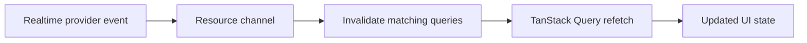

Realtime support in Ginjou is optional and provider-driven. In practice, it is used mainly through the data layer: query composables subscribe to backend events, and mutation composables can publish events after successful changes.

## Mental Model

Realtime in Ginjou is built around invalidation, not direct state replacement.

1. The realtime provider defines how subscriptions and publishes work.
2. Query composables opt into realtime through their `realtime` option.
3. When an event arrives, Ginjou invalidates the matching query scope.
4. TanStack Query refetches the affected data.
5. `useSubscribe` and `usePublish` are available when a feature needs a channel outside the data layer.

That means Ginjou realtime is different from the common mental model of "the server pushes the final state into the component." The server pushes an event. Ginjou reacts by invalidating matching queries. TanStack Query then decides when and how the fresh data is loaded.


```mermaid
flowchart LR
    A[Realtime provider event] --> B[Resource channel]
    B --> C[Invalidate matching queries]
    C --> D[TanStack Query refetch]
    D --> E[Updated UI state]
```

## Realtime Contract

```ts
interface Realtime {
	subscribe: (props: SubscribeProps) => UnsubscribeKey
	unsubscribe?: (key: UnsubscribeKey) => void
	publish?: (event: RealtimeEvent) => void
	options?: {
		mode?: RealtimeModeValue
		callback?: SubscribeCallbackFn
		params?: Record<string, unknown>
	}
}
```

`subscribe` is required. `unsubscribe`, `publish`, and `options` are optional.

## Setup

::code-group

```vue [Vue]
<script setup lang="ts">
import { RealtimeMode } from '@ginjou/core'
import { defineRealtimeContext } from '@ginjou/vue'

defineRealtimeContext({
	subscribe({ channel, callback }) {
		socketManager.subscribe(channel, callback)
		return channel
	},
	unsubscribe(key) {
		socketManager.unsubscribe(key)
	},
	publish(event) {
		console.log('publish event', event)
	},
	options: {
		mode: RealtimeMode.Auto,
		params: {
			tenant: 'team-1',
		},
	},
})
</script>
```

::

## Where Realtime Is Already Integrated

Realtime is designed to be attached to the data layer first.

Query composables that subscribe:

- `useGetList`
- `useGetInfiniteList`
- `useGetOne`
- `useGetMany`

Mutation composables that can publish on success when the provider implements `publish`:

- `useCreateOne`
- `useCreateMany`
- `useUpdateOne`
- `useUpdateMany`
- `useDeleteOne`
- `useDeleteMany`
- `useCustomMutation`

Controllers built from these composables inherit the same behavior indirectly. For example, route-aware list or edit controllers benefit because they are composed on top of realtime-aware data hooks.

## Auto Mode

In auto mode, a query subscribes to the relevant channel and invalidates the matching resource scope when an event arrives.

::code-group

```vue [Vue]
<script setup lang="ts">
import { useGetList } from '@ginjou/vue'

const { records } = useGetList({
	resource: 'orders',
	realtime: {
		mode: 'auto',
	},
})
</script>
```

::

This is the right default for lists, detail screens, and dashboards that only need fresh data.

## Manual Mode

In manual mode, Ginjou gives you the event and leaves the response strategy to your code.

::code-group

```vue [Vue]
<script setup lang="ts">
import { RealtimeMode } from '@ginjou/core'
import { useGetOne } from '@ginjou/vue'

const query = useGetOne({
	resource: 'shipments',
	id: 'shipment-42',
	realtime: {
		mode: RealtimeMode.Manual,
		callback(event) {
			if (event.action === 'updated') {
				query.refetch()
			}
		},
	},
})
</script>
```

::

Use manual mode when the page needs to inspect the payload before deciding whether to refetch, patch local state, or show a warning.

## Custom Channel And Params

When the provider needs a different channel name or provider-specific subscription params, set them on the data composable.

::code-group

```vue [Vue]
<script setup lang="ts">
import { useGetOne } from '@ginjou/vue'

const query = useGetOne({
	resource: 'orders',
	id: 'order-42',
	realtime: {
		channel: 'tenant/orders',
		params: {
			tenant: 'team-1',
		},
	},
})
</script>
```

::

## Options

Data composables use a `realtime` option to control how they interact with the provider.

| Option | Meaning |
| :--- | :--- |
| `mode` | `off`, `auto`, or `manual` |
| `channel` | Override the default `resources/${resource}` channel |
| `callback` | Inspect the event after invalidation or handle it manually |
| `params` | Provider-specific subscription metadata |

## useSubscribe

Use `useSubscribe` when a component needs a channel that is not already modeled by a data query.

::code-group

```vue [Vue]
<script setup lang="ts">
import { useSubscribe } from '@ginjou/vue'

useSubscribe({
	channel: 'resources/orders',
	actions: ['created', 'updated', 'deleted'],
	callback(event) {
		console.log('event', event)
	},
})
</script>
```

::

`useSubscribe` returns a `stop()` function. That is useful when a feature needs to opt out of a channel before the component is destroyed.

## usePublish

Use `usePublish` when you want to send a custom event.

::code-group

```vue [Vue]
<script setup lang="ts">
import { usePublish } from '@ginjou/vue'

const publish = usePublish()

function announceCursorMove() {
	publish({
		channel: 'presence/editor-42',
		action: 'updated',
		payload: { cursor: 120 },
	})
}
</script>
```

::

This is most useful for collaboration or presence signals that do not map to ordinary CRUD mutations.

## When Realtime Helps

Realtime is most useful when users are already looking at query-backed data that can be safely refetched.

- order queues that should refresh when status changes
- shipment dashboards that react to warehouse events
- collaborative admin screens where list freshness matters more than direct payload patching

It is less useful for application-specific local workflow state such as carts, multi-step checkout forms, or draft editors that are not naturally modeled as query invalidation.

## Where To Go Next

- Read [Data](/guides/data) for the query and mutation hooks that realtime attaches to.
- Read [List](/guides/list) when list pages should sync to the URL and still react to backend changes.
- Read [Notifications](/guides/notifications) when backend events should also create user-facing feedback.
