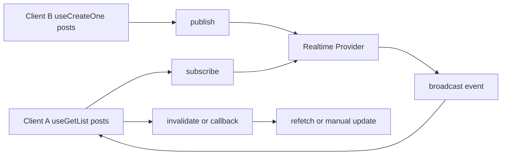

Ginjou can work with any realtime tool.

This layer is not a full live-sync data engine. It only sends subscribe and publish notifications. After an event arrives, Ginjou either invalidates active queries or passes the event to your callback.

There is no official backend realtime package in this repo today. This page focuses on the contract and how it connects to the data layer.


```mermaid
flowchart LR
	A[Client A useGetList posts] --> B[subscribe]
	B --> C[Realtime Provider]
	D[Client B useCreateOne posts] --> E[publish]
	E --> C
	C --> F[broadcast event]
	F --> A
	A --> G[invalidate or callback]
	G --> H[refetch or manual update]
```

## Realtime Context

Realtime context is the entry point for subscriptions and publish events.

It provides one realtime object for the app.

### Interface

::code-group

```ts [Realtime]
interface Realtime {
	subscribe: (props: {
		channel: string
		actions: string[]
		callback: (event: RealtimeEvent<any>) => void
		params?: Record<string, any>
		meta?: Record<string, any>
	}) => string

	unsubscribe?: (key: string) => void

	publish?: (event: RealtimeEvent<any>) => void

	options?: {
		mode?: 'off' | 'auto' | 'manual'
		callback?: (event: RealtimeEvent<any>) => void
		params?: Record<string, unknown>
	}
}

interface RealtimeEvent<TPayload = unknown> {
	channel: string
	action: string
	payload: TPayload
	date: Date
	meta?: Record<string, any>
}
```

::

### Methods

| Method or field | What it does |
| --- | --- |
| `subscribe` | Start one subscription and return an unsubscribe key. |
| `unsubscribe` | Clean up one subscription by key. |
| `publish` | Emit one realtime event. |
| `options.mode` | Set the default subscription behavior. |
| `options.callback` | Add a shared callback for subscription events. |
| `options.params` | Add shared provider-specific params to subscriptions. |

Global realtime options only include `mode`, `callback`, and `params`.

`channel` is still chosen per subscription.

### Example

::code-group
---
sync: guide-example
---

```vue [Vue]
<script setup lang="ts">
import { defineRealtime, RealtimeMode } from '@ginjou/core'
import { defineRealtimeContext } from '@ginjou/vue'

const subscriptions = new Map<string, () => void>()
const socketClient = createSocketClient()

defineRealtimeContext(defineRealtime({
	subscribe({ channel, callback }) {
		const key = `${channel}-${Date.now()}`
		const off = socketClient.subscribe(channel, callback)

		subscriptions.set(key, off)
		return key
	},
	unsubscribe(key) {
		subscriptions.get(key)?.()
		subscriptions.delete(key)
	},
	publish(event) {
		socketClient.publish(event.channel, event)
	},
	options: {
		mode: RealtimeMode.Auto,
		params: {
			tenantId: 'team-a',
		},
	},
}))
</script>
```

```svelte [Svelte]
<script lang="ts">
import { defineRealtime, RealtimeMode } from '@ginjou/core'
import { defineRealtimeContext } from '@ginjou/svelte'

const subscriptions = new Map<string, () => void>()
const socketClient = createSocketClient()

defineRealtimeContext(defineRealtime({
	subscribe({ channel, callback }) {
		const key = `${channel}-${Date.now()}`
		const off = socketClient.subscribe(channel, callback)

		subscriptions.set(key, off)
		return key
	},
	unsubscribe(key) {
		subscriptions.get(key)?.()
		subscriptions.delete(key)
	},
	publish(event) {
		socketClient.publish(event.channel, event)
	},
	options: {
		mode: RealtimeMode.Auto,
		params: {
			tenantId: 'team-a',
		},
	},
}))
</script>
```

::

## Subscribe

Subscribe is the read side of the realtime contract.

It is used internally by these query composables: `useGetOne`, `useGetList`, `useGetMany`, `useGetInfiniteList`, and `useCustom`.

For resource queries, Ginjou builds standard subscribe params for you.

| Param type | Used by | Main fields |
| --- | --- | --- |
| `list` | `useGetList`, `useGetInfiniteList` | `resource`, `pagination`, `sorters`, `filters`, `meta` |
| `one` | `useGetOne` | `resource`, `id`, `meta` |
| `many` | `useGetMany` | `resource`, `ids`, `meta` |

`useCustom` only subscribes when you pass `realtime.channel`, and it forwards `realtime.params` as-is.

If you do not pass `actions`, Ginjou subscribes with `RealtimeAction.Any`.

| Result | Meaning |
| --- | --- |
| `stop()` | Stop the watcher and run unsubscribe cleanup. |

### Auto / Manual Mode

Realtime mode decides what happens after an event reaches a query composable.

In `auto` mode, Ginjou invalidates active queries for the current resource and then runs the callback. In `manual` mode, Ginjou skips invalidation and only runs the callback. The default mode is `auto`.

Mode can come from global realtime options or from the composable `realtime` prop. The local `realtime.mode` value overrides the global one.

Callbacks are combined instead of replaced. Shared `params` are merged too.

::code-group
---
sync: guide-example
---

```vue [Vue]
<script setup lang="ts">
import { RealtimeMode } from '@ginjou/core'
import { useGetOne } from '@ginjou/vue'
import { ref } from 'vue'

const lastEvent = ref<unknown>()

const orderQuery = useGetOne({
	resource: 'orders',
	id: 1,
	realtime: {
		mode: RealtimeMode.Manual,
		callback(event) {
			lastEvent.value = event
		},
	},
})
</script>
```

```svelte [Svelte]
<script lang="ts">
import { RealtimeMode } from '@ginjou/core'
import { useGetOne } from '@ginjou/svelte'

let lastEvent = $state<unknown>()

const orderQuery = useGetOne({
	resource: 'orders',
	id: 1,
	realtime: {
		mode: RealtimeMode.Manual,
		callback(event) {
			lastEvent = event
		},
	},
})
</script>
```

::

### Channel

`channel` decides which realtime stream the subscription listens to.

For resource queries, the default channel is `resources/${resource}`. You can override it per composable when your provider needs a more specific channel name.

Global realtime options do not include `channel`, so channel selection stays local to each subscription.

::code-group
---
sync: guide-example
---

```vue [Vue]
<script setup lang="ts">
import { RealtimeAction } from '@ginjou/core'
import { useSubscribe } from '@ginjou/vue'

useSubscribe({
	channel: 'tenant-a/orders',
	actions: [RealtimeAction.Updated],
	params: {
		type: 'one',
		resource: 'orders',
		id: 1,
	},
	callback(event) {
		console.log('channel event', event)
	},
})
</script>
```

```svelte [Svelte]
<script lang="ts">
import { RealtimeAction } from '@ginjou/core'
import { useSubscribe } from '@ginjou/svelte'

useSubscribe({
	channel: 'tenant-a/orders',
	actions: [RealtimeAction.Updated],
	params: {
		type: 'one',
		resource: 'orders',
		id: 1,
	},
	callback(event) {
		console.log('channel event', event)
	},
})
</script>
```

::

### Params

`params` adds provider-specific data to the subscribe call.

This is useful for values such as tenant id, workspace id, or other server-side routing hints. For built-in resource queries, Ginjou starts with the standard `list`, `one`, or `many` params and then spreads `realtime.params` on top.

Global `options.params` and local `realtime.params` are merged, with local values taking priority when keys overlap.

::code-group
---
sync: guide-example
---

```vue [Vue]
<script setup lang="ts">
import { useSubscribe } from '@ginjou/vue'

useSubscribe({
	channel: 'resources/orders',
	params: {
		type: 'one',
		resource: 'orders',
		id: 1,
		tenantId: 'team-a',
		workspaceId: 'sales',
	},
	callback(event) {
		console.log('params event', event)
	},
})
</script>
```

```svelte [Svelte]
<script lang="ts">
import { useSubscribe } from '@ginjou/svelte'

useSubscribe({
	channel: 'resources/orders',
	params: {
		type: 'one',
		resource: 'orders',
		id: 1,
		tenantId: 'team-a',
		workspaceId: 'sales',
	},
	callback(event) {
		console.log('params event', event)
	},
})
</script>
```

::

### Unsubscribe

`subscribe` returns an unsubscribe key.

If the provider implements `unsubscribe`, Ginjou uses that key during cleanup. When you call `useSubscribe`, the returned `stop()` function stops the watcher and runs that cleanup for you.

::code-group
---
sync: guide-example
---

```vue [Vue]
<script setup lang="ts">
import { useSubscribe } from '@ginjou/vue'

const subscription = useSubscribe({
	channel: 'resources/orders',
	params: {
		type: 'one',
		resource: 'orders',
		id: 1,
	},
	callback(event) {
		console.log('realtime event', event)
	},
})

function stopRealtime() {
	subscription.stop()
}
</script>

<template>
	<button @click="stopRealtime">
		Stop subscription
	</button>
</template>
```

```svelte [Svelte]
<script lang="ts">
import { useSubscribe } from '@ginjou/svelte'

const subscription = useSubscribe({
	channel: 'resources/orders',
	params: {
		type: 'one',
		resource: 'orders',
		id: 1,
	},
	callback(event) {
		console.log('realtime event', event)
	},
})

function stopRealtime() {
	subscription.stop()
}
</script>

<button onclick={stopRealtime}>
	Stop subscription
</button>
```

::

## Publish

Publish is the write side of the realtime contract.

These mutation composables already publish events for you:

- `useCreateOne`, `useCreateMany`: publish create events after success
- `useUpdateOne`, `useUpdateMany`: publish update events after success
- `useDeleteOne`, `useDeleteMany`: publish delete events after success
- `useCustomMutation`: can publish a custom event through its mutation flow

Standard resource mutations publish this payload shape:

```ts [payload.ts]
interface PublishPayload {
	ids: Array<string | number> | undefined
}
```

For one-record mutations, Ginjou prefers `data.data.id` from the fetcher response and falls back to the mutation `id` prop. For many-record mutations, Ginjou combines ids from returned records with the mutation `ids` prop and removes duplicates.

The event `meta` contains the mutation `meta` fields and the resolved `fetcherName`.

A successful `useCreateOne` mutation already emits the create event.

::code-group
---
sync: guide-example
---

```vue [Vue]
<script setup lang="ts">
import { useCreateOne } from '@ginjou/vue'
import { reactive } from 'vue'

const formData = reactive({
	title: '',
})

const { mutateAsync, isPending } = useCreateOne()

async function submit() {
	await mutateAsync({
		resource: 'posts',
		params: {
			title: formData.title,
		},
	})
}
</script>

<template>
	<form @submit.prevent="submit">
		<input v-model="formData.title">
		<button :disabled="isPending">
			{{ isPending ? 'Creating...' : 'Create post' }}
		</button>
	</form>
</template>
```

```svelte [Svelte]
<script lang="ts">
import { useCreateOne } from '@ginjou/svelte'

let title = $state('')

const { mutateAsync, isPending } = useCreateOne()

async function submit(e: SubmitEvent) {
	e.preventDefault()
	await mutateAsync({
		resource: 'posts',
		params: { title },
	})
}
</script>

<form onsubmit={submit}>
	<input bind:value={title}>
	<button disabled={isPending}>
		{isPending ? 'Creating...' : 'Create post'}
	</button>
</form>
```

::

Use `publish` on `useCustomMutation` when the endpoint is not one of the standard CRUD methods.

::code-group
---
sync: guide-example
---

```ts [Vue]
import { RealtimeAction } from '@ginjou/core'
import { useCustomMutation } from '@ginjou/vue'

const publishPost = useCustomMutation({
	url: '/posts/1/publish',
	method: 'post',
})

await publishPost.mutateAsync({
	payload: {
		publishedAt: new Date().toISOString(),
	},
	publish(props) {
		return {
			channel: 'resources/posts',
			action: RealtimeAction.Updated,
			payload: props.payload,
			meta: {
				fetcherName: props.fetcherName,
			},
		}
	},
})
```

```ts [Svelte]
import { RealtimeAction } from '@ginjou/core'
import { useCustomMutation } from '@ginjou/svelte'

const publishPost = useCustomMutation({
	url: '/posts/1/publish',
	method: 'post',
})

await publishPost.mutateAsync({
	payload: {
		publishedAt: new Date().toISOString(),
	},
	publish(props) {
		return {
			channel: 'resources/posts',
			action: RealtimeAction.Updated,
			payload: props.payload,
			meta: {
				fetcherName: props.fetcherName,
			},
		}
	},
})
```

::

Use `usePublish` when you want to emit an event yourself. If `publish` is missing, the emit function becomes a safe no-op. When you omit `date`, Ginjou fills it with the current time.

::code-group
---
sync: guide-example
---

```vue [Vue]
<script setup lang="ts">
import { RealtimeAction } from '@ginjou/core'
import { usePublish } from '@ginjou/vue'

const publish = usePublish<{ ids: number[] }>()

function notifyPostCreated() {
	publish({
		channel: 'resources/posts',
		action: RealtimeAction.Created,
		payload: {
			ids: [1],
		},
		meta: {
			fetcherName: 'default',
		},
	})
}
</script>

<template>
	<button @click="notifyPostCreated">
		Publish event
	</button>
</template>
```

```svelte [Svelte]
<script lang="ts">
import { RealtimeAction } from '@ginjou/core'
import { usePublish } from '@ginjou/svelte'

const publish = usePublish<{ ids: number[] }>()

function notifyPostCreated() {
	publish({
		channel: 'resources/posts',
		action: RealtimeAction.Created,
		payload: {
			ids: [1],
		},
		meta: {
			fetcherName: 'default',
		},
	})
}
</script>

<button onclick={notifyPostCreated}>
	Publish event
</button>
```

::
