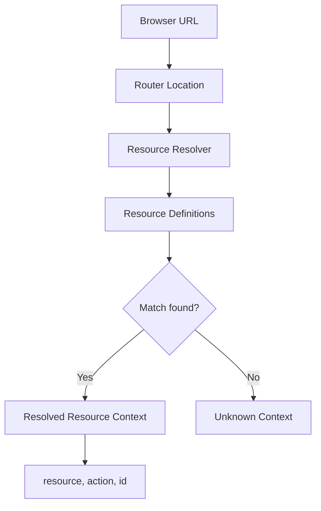

## Resource Provider

Use a `Resource` provider to define the structural entities of your application and how they map to browser URLs. This central definition allows the framework to automatically handle routing and context resolution.

A resource is defined by a name and a set of action patterns:

```typescript
interface ResourceDefinition {
	name: string
	// Action patterns (can be a string path or a custom parse function)
	list?: string | ResourceActionParse
	create?: string | ResourceActionParse
	edit?: string | ResourceActionParse
	show?: string | ResourceActionParse
	meta?: {
		parent?: string
		hide?: boolean
		[key: string]: any
	}
}
```

## Route (Action Patterns)

Each resource action is associated with a URL pattern. These patterns use `regexparam` syntax, allowing for dynamic parameters like `:id`.

Common patterns include:
- **list**: `/posts`
- **create**: `/posts/new`
- **edit**: `/posts/:id/edit`
- **show**: `/posts/:id`

When the browser URL matches one of these patterns, the framework identifies the corresponding resource and action.

## Location & Resolution

The framework determines the current resource context by resolving the browser's location against your resource definitions.

- **Location**: Provided by the router, containing the current `path`, `query`, and `params`.
- **Resolution**: The process of matching the current `path` against all defined resource patterns. When a match is found, the framework extracts the `resource`, the `action`, and any parameters like `id`.



## useResource

Use `useResource` to access the currently resolved resource context in your components. This composable reactively tracks the browser location and provides you with the matched resource definition, the current action, and the record ID if applicable.

### Usage

```vue
<script setup lang="ts">
import { useResource } from '@ginjou/vue'

const resolved = useResource()

// resolved.value will contain:
// - resource: The matched ResourceDefinition
// - action: 'list' | 'create' | 'edit' | 'show'
// - id: The record ID (for 'edit' or 'show' actions)
</script>

<template>
	<div>
		<h1>Current Resource: {{ resolved?.resource.name }}</h1>
		<p>Action: {{ resolved?.action }}</p>
		<p v-if="resolved?.id">
			ID: {{ resolved.id }}
		</p>
	</div>
</template>
```

### Composition

- **Data Composables**: Uses `useLocation` to track the current path and `resolveResource` to match it against the provided definitions.
