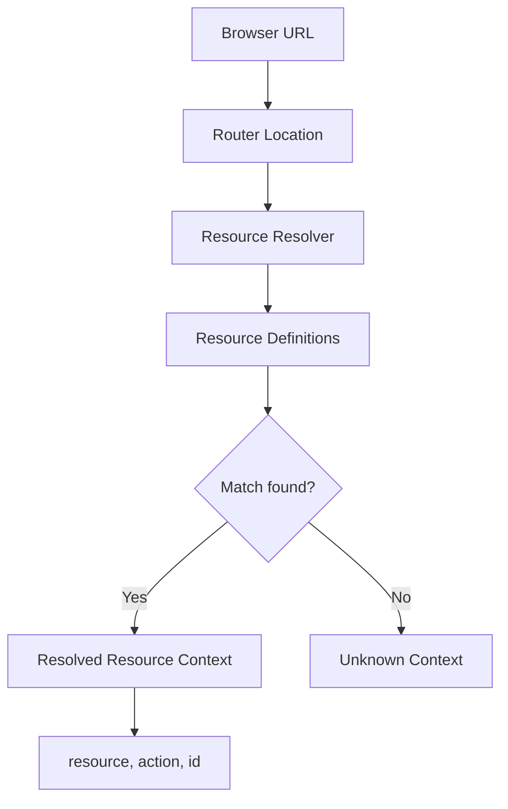

## Resource Provider

Use a `Resource` provider to define the structural entities of your application and how they map to browser URLs. This central definition allows the framework to automatically handle routing and context resolution.

A resource is defined by a name and a set of action patterns:

```typescript
interface ResourceDefinition {
	name: string
	// Action patterns (can be a string path or a custom parse function)
	list?: string | ResourceActionParse
	create?: string | ResourceActionParse
	edit?: string | ResourceActionParse
	show?: string | ResourceActionParse
	meta?: {
		parent?: string
		hide?: boolean
		[key: string]: any
	}
}
```

## URL Patterns & Resolution

Each resource action is associated with a URL pattern. These patterns follow the [regexparam](https://github.com/lukeed/regexparam) syntax, supporting dynamic segments like `:id`.

Common patterns include:
- **list**: `/posts`
- **create**: `/posts/new`
- **edit**: `/posts/:id/edit`
- **show**: `/posts/:id`

When the browser URL matches one of these patterns, the framework identifies the corresponding resource and action.



## Flat Resources

Define simple resources with standard URL patterns:

```typescript
const resources = [
	{
		name: 'posts',
		list: '/posts',
		create: '/posts/new',
		edit: '/posts/:id/edit',
		show: '/posts/:id',
	},
	{
		name: 'comments',
		list: '/comments',
		create: '/comments/new',
		edit: '/comments/:id/edit',
		show: '/comments/:id',
	},
]
```

Once defined, the framework automatically resolves URLs:

| Browser URL | Resource | Action | ID |
|---|---|---|---|
| `/posts` | `posts` | `list` | `undefined` |
| `/posts/new` | `posts` | `create` | `undefined` |
| `/posts/123` | `posts` | `show` | `123` |
| `/posts/123/edit` | `posts` | `edit` | `123` |

Access the resolved context in your components:

::code-group
---
sync: guide-example
---

```vue [vue]
<script setup lang="ts">
import { useResource } from '@ginjou/vue'

const resolved = useResource()
// resolved.value = { resource, action, id }
</script>

<template>
	<h1>{{ resolved?.resource.name }} - {{ resolved?.action }}</h1>
</template>
```

```svelte [svelte]
<!-- WIP -->
<script>
  // ...
</script>
```

::

## Hierarchical Resources

For nested resources (like comments belonging to posts), use the `meta.parent` property:

```typescript
const resources = [
	{
		name: 'posts',
		list: '/posts',
		show: '/posts/:id',
	},
	{
		name: 'post-comments',
		list: '/posts/:postId/comments',
		show: '/posts/:postId/comments/:id',
		meta: {
			parent: 'posts',
		},
	},
	{
		name: 'team-members',
		list: '/organizations/:orgId/teams/:teamId/members',
		show: '/organizations/:orgId/teams/:teamId/members/:id',
		meta: {
			parent: 'organization-teams',
		},
	},
]
```

When accessing `/posts/123/comments/456`, the framework resolves:
- `resource`: `'post-comments'`
- `action`: `'show'`
- `id`: `'456'`

You can use `meta.parent` to build breadcrumbs or determine navigation hierarchy:

::code-group
---
sync: guide-example
---

```vue [vue]
<script setup lang="ts">
import { useResource } from '@ginjou/vue'

const resolved = useResource()

function buildBreadcrumbs() {
	const crumbs = []
	let current = resolved.value?.resource

	while (current) {
		crumbs.unshift(current.name)
		// Look up parent resource
		current = resourceMap.get(current.meta?.parent)
	}

	return crumbs
}
</script>

<template>
	<nav class="breadcrumbs">
		<span v-for="crumb in buildBreadcrumbs()" :key="crumb">
			{{ crumb }}
		</span>
	</nav>
</template>
```

```svelte [svelte]
<!-- WIP -->
<script>
  // ...
</script>
```

::

## Custom URL Parsing

For non-standard URL patterns, provide a `ResourceActionParse` object with a custom `parse` function:

```typescript
const resources = [
	{
		name: 'posts',
		list: '/posts',
		show: {
			pattern: '/posts/:uuid',
			parse: (location) => {
				const uuid = location.path.replace('/posts/', '')
				const isValidUUID = /^[0-9a-f]{8}-[0-9a-f]{4}-[0-9a-f]{4}-[0-9a-f]{4}-[0-9a-f]{12}$/.test(uuid)

				if (isValidUUID) {
					return { action: 'show', id: uuid }
				}
				return undefined
			},
		},
	},
]
```

## Multiple Fetchers

When your application uses multiple data sources (e.g., REST API and GraphQL), specify which fetcher to use for each resource via `meta.fetcherName`:

```typescript
const resources = [
	{
		name: 'posts',
		list: '/posts',
		show: '/posts/:id',
		meta: {
			fetcherName: 'rest-api', // Use REST fetcher
		},
	},
	{
		name: 'analytics',
		list: '/analytics',
		show: '/analytics/:id',
		meta: {
			fetcherName: 'graphql', // Use GraphQL fetcher
		},
	},
]
```

When `useGetList`, `useGetOne`, or other data composables are called for a resource, they automatically use the specified fetcher. If `fetcherName` is not provided, the default fetcher is used.

Example with multiple configured fetchers:

```typescript
defineResourceContext({
	resources, // As mentioned before
})
// Setup multiple fetchers
defineFetchersContext({
	'rest-api': restFetcher(),
	'graphql': graphqlFetcher(),
})

// In components, controller automatically use the correct fetcher
const { records } = useList({
	resource: 'posts', // Uses 'rest-api' fetcher
})

const { data } = useList({
	resource: 'analytics', // Uses 'graphql' fetcher
})
```
