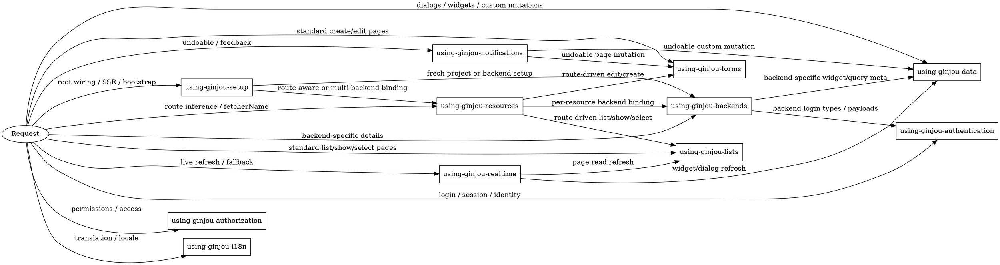

# Using Ginjou Root

## Overview

This skill is a strict dispatcher for Ginjou usage work.

Do not implement from this file directly. Route to one or more focused sub-skills first, then follow those sub-skills.

When a prompt spans domains, load the smallest complete skill set instead of forcing a single winner.

## Routing Priority

1. Increase focused skill usage first: if a concrete Ginjou symptom matches any child skill, route to that child skill instead of answering from root.
2. Preserve execution quality second: once at least one child skill is loaded, add only the extra skills needed to cover the full flow and its guard rails.
3. Prefer explicit routing over clever inference. If a known high-frequency pattern appears, use the matching child skill chain even if a broader route also fits.

## Primary Routing Map

| User intent or symptom | First skill |
| --- | --- |
| App-root registration, provider wiring, moving setup out of feature pages, Vue or Nuxt setup, SSR read composables | `using-ginjou-setup` |
| Backend choice, backend-specific auth, backend-specific `meta` syntax, backend capabilities (REST API, Supabase, Directus) | `using-ginjou-backends` |
| Resource definitions, route-action mapping, route-derived resource inference, nested resources, `meta.fetcherName` | `using-ginjou-resources` |
| Standard list pages, detail pages, pagination, filters, sorters, infinite list, select/autocomplete option loading | `using-ginjou-lists` |
| Standard create/edit pages, form save flow, delete confirmation, page-level mutation mode | `using-ginjou-forms` |
| Non-page queries/mutations, dialogs, widgets, inline side panels, batch operations, custom endpoints | `using-ginjou-data` |
| Login, logout, session checks, identity loading, auth error checks | `using-ginjou-authentication` |
| Access checks, role-based UI, permission loading, action access | `using-ginjou-authorization` |
| Notification provider wiring, `useNotify`, undoable progress and feedback UX | `using-ginjou-notifications` |
| Realtime subscriptions, automatic invalidation, manual realtime behavior, polling fallback | `using-ginjou-realtime` |
| Translation, locale switching, i18n provider integration | `using-ginjou-i18n` |

## Skill Flow

## Composite Pairing Rules

| Prompt pattern | Load order | Why |
| --- | --- | --- |
| Pure backend comparison without setup, root wiring, or multi-backend structure cues | `using-ginjou-backends` | Keep backend-choice questions narrow so the backend skill gets called reliably. |
| Fresh project, root refactor, or provider registration plus backend selection | `using-ginjou-setup` -> `using-ginjou-backends` | Root wiring must be established before backend-specific details matter. |
| SSR or app-root setup plus per-resource backend selection | `using-ginjou-setup` -> `using-ginjou-resources` -> `using-ginjou-backends` | Register named fetchers first, bind them per resource, then apply backend-specific rules. |
| Multi-backend app with `meta.fetcherName`, nested routes, or per-area backend binding | `using-ginjou-setup` -> `using-ginjou-resources` -> `using-ginjou-backends` | This is the default composite path for multi-backend routing. Do not stop at setup or resources; backend-specific rules still apply at the end of the chain. |
| Route-driven detail, show, list, or select behavior | `using-ginjou-resources` -> `using-ginjou-lists` | Route mapping and read-side controller behavior must be read together. |
| Route-driven edit or create page behavior | `using-ginjou-resources` -> `using-ginjou-forms` | Route mapping and page-level mutation behavior must be read together. |
| Route-driven detail and edit pages, or prompts about current-resource inference across both read and edit flows | `using-ginjou-resources` -> `using-ginjou-lists` -> `using-ginjou-forms` | If the prompt spans both read and edit page behavior, load both controller domains instead of choosing one. |
| Backend-specific login types or auth payload shapes | `using-ginjou-backends` -> `using-ginjou-authentication` | Backend adapters define payload types; auth skill defines the lifecycle surface. |
| Backend-specific aggregate/query options inside widgets or custom data flows | `using-ginjou-backends` -> `using-ginjou-data` | Backend `meta` rules and low-level query usage must be combined. |
| Root wiring plus router-aware admin state in Vue | `using-ginjou-setup` | Start with setup. Add `using-ginjou-resources` only if the same prompt also depends on route-derived resource, action, id, or `meta.fetcherName`. |
| Realtime refresh for standard pages, list refresh, table refresh, or show-page reads | `using-ginjou-realtime` -> `using-ginjou-lists` | Realtime invalidation and fallback strategy need the page read/controller context. |
| Realtime refresh for dialogs, widgets, or custom queries | `using-ginjou-realtime` -> `using-ginjou-data` | Realtime fallback rules depend on the non-page data surface. |
| Realtime fallback or subscription viability without a clearly stated UI surface | `using-ginjou-realtime` | Start with realtime. Add `using-ginjou-lists` or `using-ginjou-data` only when the read surface is explicit. |
| Undoable save/delete in standard page flows | `using-ginjou-notifications` -> `using-ginjou-forms` | Undoable page mutations require both feedback wiring and form mutation rules. |
| Undoable save/delete in dialogs, widgets, or inline custom flows | `using-ginjou-notifications` -> `using-ginjou-data` | Undoable custom flows require both feedback wiring and low-level mutation rules. |
| Undoable delete or destructive-action prerequisites without a clearly stated page flow | `using-ginjou-notifications` -> `using-ginjou-data` | Destructive actions default to direct mutation mechanics unless the prompt clearly says standard page form behavior. |
| Undoable feasibility or notification prerequisites without a clearly stated mutation surface | `using-ginjou-notifications` | Start with notifications. Add `using-ginjou-forms` or `using-ginjou-data` only when the mutation surface is explicit. |

## High-Frequency Guard Rails

| Prompt cue | Required route | Guard rail |
| --- | --- | --- |
| `useSelect` vs `useList`, autocomplete, remote option loading, current selection missing from latest results | `using-ginjou-lists` | Treat this as option-loading guidance, not a normal resource list page and not arbitrary custom data unless the prompt explicitly says widget/dialog orchestration. |
| Row action, each row, custom confirmation modal, side panel, inline panel, dashboard widget mutation | `using-ginjou-data` | Treat this as a non-page mutation flow. Do not default to page CRUD abstractions. |
| Undo window, undoable, destructive action, no toast system, no feedback system | `using-ginjou-notifications` first | Do not assume undoable is safe before notification wiring exists. List the hard prerequisites first, then add `using-ginjou-data` for row/modal/custom flows and `using-ginjou-forms` for standard page flows. |
| Realtime fallback, backend cannot emit events, list refresh, table refresh, auto-refresh | `using-ginjou-realtime` plus the read-surface skill | Add `using-ginjou-lists` for page/table/show/select reads and `using-ginjou-data` for widget/dialog/custom reads. |
| Route-driven detail plus edit inference in the same prompt | `using-ginjou-resources` -> `using-ginjou-lists` -> `using-ginjou-forms` | Load both controller domains when the prompt spans read and edit inference together. |

## Ambiguity Gates

Ask one clarifying question only when routing is ambiguous.

1. `lists` vs `data`
- If the UI is a standard page with pagination, filters, sorters, show state, or select/autocomplete option loading, load `using-ginjou-lists`.
- If the UI is a dialog, widget, side panel, or arbitrary fetch/mutation orchestration, load `using-ginjou-data`.
- If the prompt mixes both and the dominant UI surface is unclear, ask whether the flow is page-driven or custom UI-driven.

2. `forms` vs `data`
- If the flow is standard create/edit page behavior with `save()`, including page-level delete and `undoable` mutation mode, load `using-ginjou-forms`.
- If the flow is custom mutation orchestration with `mutateAsync`, dialogs, widgets, side panels, or dynamic mutation targets, load `using-ginjou-data`.

3. `authentication` vs `authorization`
- Identity, session, login, logout, and identity-loading concerns load `using-ginjou-authentication`.
- Permission, role, and action-access concerns load `using-ginjou-authorization`.

4. `resources` vs explicit local arguments
- If the question depends on route-derived resource, action, id, nested route metadata, or `meta.fetcherName`, load `using-ginjou-resources`.
- If resource and id are already explicit and local, skip `using-ginjou-resources`.

5. `setup` vs downstream feature skills
- If the user is moving provider wiring out of feature pages, asks where global setup should live, or the setup status is unclear, load `using-ginjou-setup` first.
- Add downstream skills after setup when the same prompt also asks about backend, resource, realtime, auth, or controller behavior.

6. `realtime` alone vs `realtime` plus read-surface skill
- If the prompt is only about whether subscriptions, polling fallback, or invalidation are available, load `using-ginjou-realtime` first.
- Add `using-ginjou-lists` when the refreshed surface is a list page, list refresh, show page, table, or select/autocomplete flow.
- Add `using-ginjou-data` when the refreshed surface is a widget, dialog, side panel, or custom query.

7. `notifications` alone vs `notifications` plus mutation-surface skill
- If the prompt is only about whether `undoable` is safe, or what feedback system must exist first, load `using-ginjou-notifications` first.
- Add `using-ginjou-data` when the prompt is about destructive actions, row actions, dialogs, widgets, side panels, bulk actions, or custom mutation flow.
- Add `using-ginjou-forms` when the mutation surface is a standard create/edit/delete page flow.
- If both page-level and custom mutation cues appear, ask which surface owns the mutation behavior.

8. high-frequency guard rail override
- If a prompt matches a High-Frequency Guard Rail row, apply that route before broader category matching.
- Use the guard rail to increase child-skill invocation frequency without expanding into unrelated skills.

## Routing Process

1. Detect framework context (Vue or Nuxt) from dependencies, app structure, and existing setup.
2. Detect backend context (REST API, Supabase, Directus, or mixed) from fetcher and auth setup.
3. Detect structural cues before routing: fresh project, root refactor, route-derived context, multi-backend binding, page versus custom UI surface, realtime-only fallback, and undoable-only prerequisite checks.
4. Pick the first skill from the primary routing map.
5. Apply any matching High-Frequency Guard Rail first.
6. Apply the first matching composite pairing rule that fully fits the prompt. Match more specific rules before more general rules. If a composite rule matches, load its whole chain before considering smaller edges.
7. Walk the digraph and add any remaining downstream skill whose edge condition is still explicitly present in the prompt.
8. Ask one clarifying question only if competing branches remain after steps 3-7.
9. State which sub-skill(s) guided the final implementation.

## Rules

- Do not answer from memory when a sub-skill applies.
- Route first, then implement.
- Prefer the smallest complete skill set, not the smallest single skill.
- Use multiple sub-skills whenever a composite pairing rule or digraph edge applies.
- Use a focused child skill whenever a recognizable trigger appears, even if the root skill could answer at a high level.
- Setup is first for root wiring, SSR bootstrap, and fresh project structure changes.
- Resources is required for route-driven inference and per-resource backend binding.
- If a composite pairing rule matches, do not downgrade to a narrower single-skill answer.
- For realtime-only fallback questions and undoable-only prerequisite questions, start with the cross-cut skill first and add read or mutation skills only when the surface is explicit.
- Keep framework differences inside the selected sub-skill references; do not create framework-specific routing branches here.

## Source Anchors

- Local sub-skill references: `skills/using-ginjou-*/references/*.md`
- Guides: `https://ginjou.pages.dev/raw/guides/*.md`
- Integrations: `https://ginjou.pages.dev/raw/integrations/*.md`
- Backends: `https://ginjou.pages.dev/raw/backend/*.md`
- Usage examples: `stories/vue/src/*.stories.ts`
