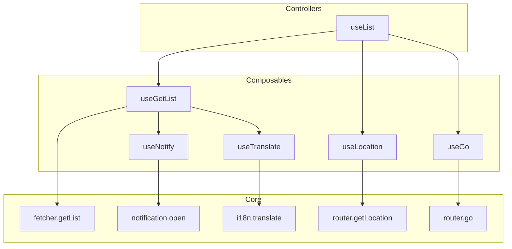

import { Meta } from '@storybook/addon-docs/blocks'

<Meta title="Conception" />

# Conception

The core design concepts of Ginjou are **Flexibility** and **Composition**.

This means Ginjou can be used in various scenarios. It provides functions with different levels of integration, allowing you to build solutions that fit your needs from the ground up, like stacking LEGO bricks.

## Levels of Integration

You can choose different levels of API based on your project's complexity and customization needs:

- **Shallow Integration**:
  - **Single Purpose**: Each function focuses on doing one thing well, like `fetcher.getList` or `router.getLocation`.
  - **High Flexibility**: You have full control but need to handle state management, side effects, etc., on your own.
  - **Use Cases**: Ideal for situations requiring high customization or integration with existing complex systems.

- **Deep Integration**:
  - **Complex Functionality**: These are composed of multiple shallow functions and come with default behaviors for common use cases, like `useList`.
  - **Rapid Development**: Provides out-of-the-box solutions that greatly simplify common CRUD operations.
  - **Use Cases**: Suitable for quickly developing standard data management interfaces, such as list and form pages in an admin panel.

## Component Composition

Ginjou's strength lies in its composability. High-level Controller components are built by combining multiple low-level Query components and helper utilities.

Here is a diagram showing the integration relationship from **shallow to deep**:

### Relationship Explained

1.  **Core**:
    - This is the lowest level, providing pure asynchronous data operations like `fetcher.getList` and `router.getLocation`.
    - They are platform-agnostic and focus only on data logic.
    - They require user-provided implementations; Ginjou only provides the abstraction layer.

2.  **Composables**:
    - Wrapped with Tanstack Query to provide data, caching, and state management.
    - Implements features related to data operations (e.g., updating the `getOne` data for the same resource when a `getList` call succeeds).

3.  **Controllers**:
    - This is the deepest level of integration, offering complete solutions for specific CRUD scenarios.
    - **`useList`**: This is a superset of `useGetList`. It not only fetches list data but also integrates features like pagination, sorting, filtering, and route state synchronization, allowing you to quickly build a full-featured list page.

### Example: Composition of `useList`

`useList` is a perfect example of the "composition" concept. It is composed of the following parts:

- **`useGetList`**: Handles the core data fetching.
- **`useResource`**: Gets the current resource (e.g., "posts") from the route or props.
- **`useGo`**: Syncs state like pagination and filters to the URL for a better user experience.
- **`useLocation`**: Gets the current route state.
- **`useNotify`**: Automatically shows notification messages on success or failure.
- **`useTranslate`**: Handles internationalization (i18n) for UI text.

You can choose to use `useList` directly to get work done quickly, or if `useList` doesn't meet your needs, you can use `useGetList` with other utilities to compose your own custom solution.

This design gives Ginjou ultimate flexibility, allowing developers to freely choose between **development efficiency** and **level of customization**.
