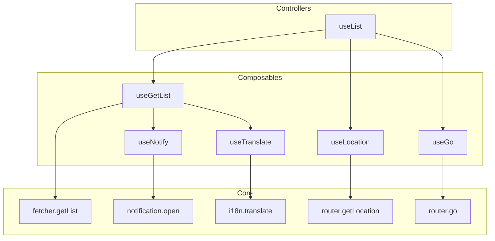

import { Meta } from '@storybook/addon-docs/blocks'

<Meta title="Conception" />

# Conception

The core design concepts of Ginjou are **Flexibility** and **Composition**.

This means Ginjou can be used in various scenarios. It provides functions with different levels of integration, allowing you to build solutions that fit your needs from the ground up, like stacking LEGO bricks.

## Levels of Integration

You can choose different levels of API based on your project's complexity and customization needs:

- **Shallow Integration**:
  - **Single Purpose**: Each function focuses on doing one thing well, like `fetcher.getList` or `router.getLocation`.
  - **High Flexibility**: You have full control but need to handle state management, side effects, etc., on your own.
  - **Use Cases**: Ideal for situations requiring high customization or integration with existing complex systems.

- **Deep Integration**:
  - **Complex Functionality**: These are composed of multiple shallow functions and come with default behaviors for common use cases, like `useList`.
  - **Rapid Development**: Provides out-of-the-box solutions that greatly simplify common CRUD operations.
  - **Use Cases**: Suitable for quickly developing standard data management interfaces, such as list and form pages in an admin panel.

## Component Composition

Ginjou's strength lies in its composability. High-level Controller components are built by combining multiple low-level Query components and helper utilities.

Here is a diagram showing the integration relationship from **shallow to deep**:



### Relationship Explained

1.  **Core**:
    - This is the lowest level, providing pure asynchronous data operations like `fetcher.getList` and `router.getLocation`.
    - They are platform-agnostic and focus only on data logic.
    - They require user-provided implementations; Ginjou only provides the abstraction layer.

2.  **Composables**:
    - Wrapped with Tanstack Query to provide data, caching, and state management.
    - Implements features related to data operations (e.g., updating the `getOne` data for the same resource when a `getList` call succeeds).

3.  **Controllers**:
    - This is the deepest level of integration, offering complete solutions for specific CRUD scenarios.
    - **`useList`**: This is a superset of `useGetList`. It not only fetches list data but also integrates features like pagination, sorting, filtering, and route state synchronization, allowing you to quickly build a full-featured list page.

### Example: Composition of `useList`

`useList` is a perfect example of the "composition" concept. It is composed of the following parts:

- **`useGetList`**: Handles the core data fetching.
- **`useResource`**: Gets the current resource (e.g., "posts") from the route or props.
- **`useGo`**: Syncs state like pagination and filters to the URL for a better user experience.
- **`useLocation`**: Gets the current route state.
- **`useNotify`**: Automatically shows notification messages on success or failure.
- **`useTranslate`**: Handles internationalization (i18n) for UI text.

You can choose to use `useList` directly to get work done quickly, or if `useList` doesn't meet your needs, you can use `useGetList` with other utilities to compose your own custom solution.

This design gives Ginjou ultimate flexibility, allowing developers to freely choose between **development efficiency** and **level of customization**.

## Resource Concept

In Ginjou, a **resource** is a central concept representing an **entity**, which ties together various aspects of your application.

It typically refers to a data entity, like `products`, `blogPosts`, or `orders`.

Resource definitions allow you to manage your application in a structured way, abstracting complex operations into simpler actions through various **providers** and **hooks**.

A typical resource definition looks like this:

```tsx
// title=App.tsx
import { Ginjou } from "@ginjou/core";

export const App = () => {
  return (
    <Ginjou
      resources={[
        {
          name: "products",
          list: "/my-products",
          show: "/my-products/:id",
          edit: "/my-products/:id/edit",
          create: "/my-products/new",
        },
      ]}
    >
      {/* ... */}
    </Ginjou>
  );
};
```

## Provider Concept

Providers are the building blocks of Ginjou, used to manage different aspects of your application, such as data fetching, routing, access control, and more.

They are pluggable, which means you can use the **built-in providers** or **create your own**. This allows you to customize the behavior of your application to suit your needs.

- **Data Provider**: Communication with the backend data source, handling data operations such as fetching, creating, updating, deleting records, caching, and invalidation.
- **Authentication Provider**: Manages user authentication and authorization processes. Handles redirection, error cases.
- **Access Control Provider**: Handles authorization and access control. Used to hide/disable buttons and menu items, or to protect routes and components.
- **Notification Provider**: Enables notification features like showing notification after successful mutations or errors.
- **I18n Provider**: Enables i18n features such as rendering translated menu items, button texts, table columns, page titles, and more.
- **Live Provider**: Enables real-time updates to your application. For example, when a user creates a new record, other users can see the new record in the list page without refreshing the page.
- **Router Provider**: Matches routes to resources, enables navigation features like breadcrumbs, automatic redirections after CRUD operations, rendering menu items.
- **Audit Log Provider**: Handles sending Audit Logs for CRUD operations.

## Hook Concept

Ginjou adopts a hook-based architecture, a modern and powerful pattern in Vue/React development, which significantly enhances the development experience and application performance.

Ginjou's hooks are **headless**, which means they are library agnostic, provides **a unified interface** for your needs regardless of your library or framework of your choice.

For example, we have different built-in router providers for **Vue Router**, **React Router**, **Next.js**, **Nuxt** that handles routing in your application.

But we have a single `useGo` hook, exported from `@ginjou/core` package, can be used to navigate to a specific resource's page in your application **regardless of your routing solution**.

This is just one example, we have many other hooks for data fetching, authentication, access control, notifications, i18n and more.

They are all **headless**, **library agnostic**, and **unified**.

For instance, you may be using different backends or API patterns, we have a single `useList` hook to fetch list data from your backend regardless of your data source.

Or you may prefer either Vue I18n or React i18next for i18n, we have a single `useTranslate` hook to handle translation.

## Headless Concept

Instead of being limited to a set of pre-styled components, **Ginjou** provides collections of helper `hooks`, `components` and `providers` and more. Since business logic and UI are completely decoupled, you can customize UI without constraints.

It means, **Ginjou** just works _seamlessly_ with any _custom designs_ or _UI frameworks_. Thanks to its headless architecture, you can use popular CSS frameworks like [TailwindCSS](https://tailwindcss.com/) or even create your own styles from scratch.

Ginjou provides integrations with Vue 3 and Nuxt 3 to get you started quickly. These libraries are adapters which are nicely integrated with headless `@ginjou/core` package.

## Meta Concept

`meta` is a special property that can be used to provide additional information to **providers** and **UI integrations**.

There are multiple ways to populate meta, they all will be **merged into a single meta property** and will be available to **providers** and **UI integrations**.

### Example Use Cases

- **Global filters**: pass a filter to your **data provider**.
- **Multi-tenancy**: make current tenant available to providers.
- **Advanced Access Control**: configuration per resource.
- **Customize UI**: manage sidebar label and icon per resource.

These are some but not all examples of how you can use the `meta` property.

## Data Fetching, Caching, and State Management

Ginjou leverages **TanStack Query** for data fetching and caching, which enhances the performance and user experience of applications. TanStack Query provides efficient data synchronization between your server and UI, making it easier to handle background updates, cache management, and data invalidation.

### Data Fetching, Cache Management and Deduplication

Ginjou uses structured keys to identify and cache server responses for queries and mutations. These keys also help optimize performance by reusing cached data when needed. Using composable structured keys also allows for automatic deduplication of queries, which means that if there are multiple calls for the same query, only one request will be made and shared across all subscribers.

By default, Ginjou has 5 minutes of cache time and 0 seconds of stale time for queries. This means that if a query is re-used in 5 minutes, it will be populated with cached data and in the meantime, it will be refetched in the background. If the query is not re-used in 5 minutes, it will be refetched immediately.

### Invalidation and Refetching

Structured key based state management of Ginjou also help with invalidation of related queries when a mutation occurs. For example, when a user creates a new record, Ginjou will automatically invalidate the related queries meaning that the data your users interact with is always fresh and consistent with the backend.

By default, invalidation is done for every related query of a mutation but refetching is done only for the queries that are currently in use, this means that if a user is not on the list page of a resource, the list query will not be refetched but will be invalidated so that when the user navigates to the list page, the data will be freshly fetched. Invalidation and refetching behavior can be customized by providing an `invalidates` property to the mutation or globally via configuration.

### Optimistic Updates and Rollbacks

It's almost crucial to provide instant feedback to your users when they perform a mutation. Ginjou allows you to do this by providing **optimistic updates**. When a mutation occurs, Ginjou will automatically update the related queries with the new data, this means that your users will see the changes instantly. If the mutation fails, Ginjou will automatically rollback the changes and re-fetch the related queries.

Ginjou offers multiple mutation modes including **pessimistic** and **optimistic** modes. Optimistic updates will be performed for **optimistic** mode. Additionally, your users can undo the changes they made for a certain period of time by showing a notification.

By default:

- **Update** mutations will perform optimistic updates to the related list and detail queries of the target resource.
- **Create** mutations will perform optimistic updates to the related list queries of the target resource.
- **Delete** mutations will perform optimistic updates to the related list queries of the target resource.

You can customize the optimistic update behavior and mutation modes through `optimisticUpdateMap` and `mutationMode` properties of the hooks or globally via configuration.

### Key Structure

Keys are used to identify and cache server responses for queries and mutations. Ginjou uses a structured key format which can be re-composed with the same parameters to get the same key. This allows Ginjou users to have full control over the cache and invalidation behavior of their applications. All the query cache and mutations can be tracked and managed by using these keys.
